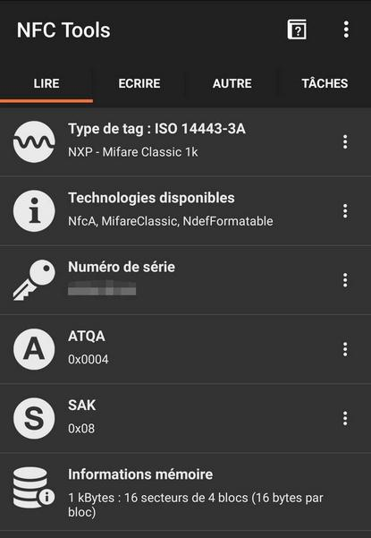
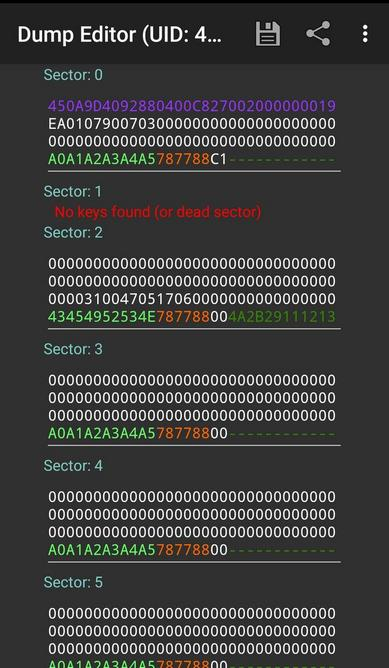
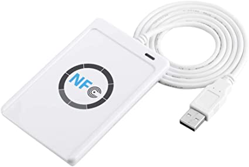
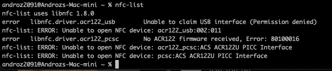
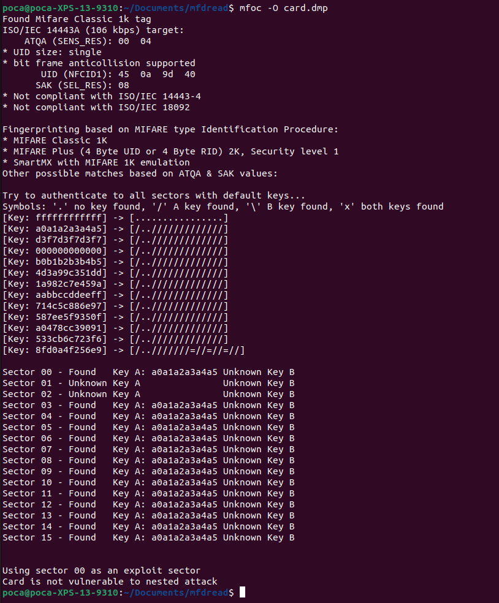
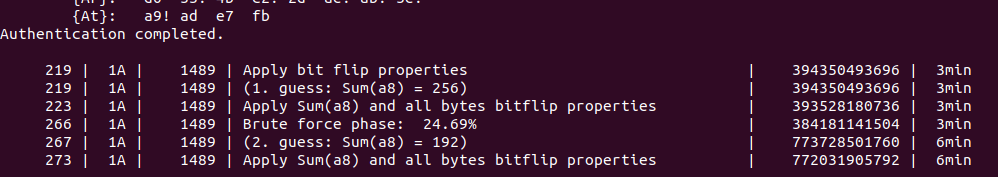
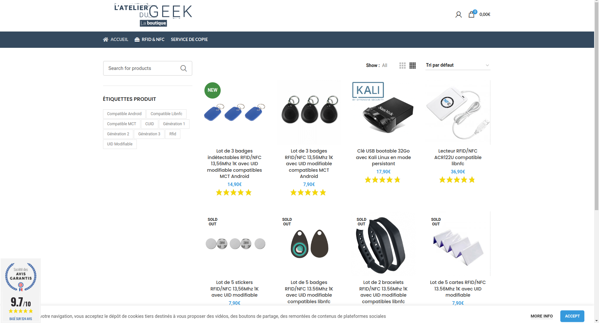
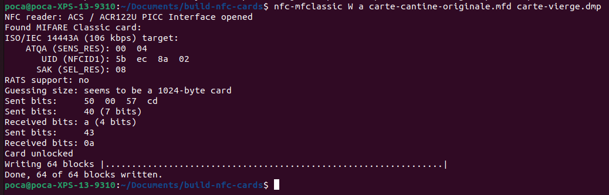

La technologie NFC (Near Field Communication) est omniprésente dans notre quotidien. Payer par carte bleue sans contact (ou via son smartphone), valider un ticket de métro, biper sa carte de cantine... tout cela est possible grâce au NFC.

Si vous souhaitez en apprendre plus sur cette technologie (ou suivre mes galères dans mon expérience :), vous êtes au bon endroit !

Est-il possible de dupliquer sa carte de cantine pour en faire un double ? Et si oui, comment ? C'est ce que je me suis demandé il y a 6 mois maintenant 😄

Pour commencer, je récupère quelques informations sur ma carte sur mon téléphone avec l'application `NFC Tools`.

## Essai #1 : via un smartphone Android

Je découvre alors qu'il s'agit d'une carte NFC produite par la société Mifare. Le modèle exact de la carte est Mifare Classic 1k.

Après quelques recherches, je tombe sur [cet article](https://www.latelierdugeek.fr/tag/mifare-classic/), qui explique comment dupliquer un badge d'immeuble Mifare directement avec son smartphone Android et l'application [Mifare Classic Tool](https://play.google.com/store/apps/details?id=de.syss.MifareClassicTool).

Pour cela, il faut donc passer par trois étapes :
* acheter une carte NFC vierge
* lire les données de la carte de cantine
* les écrire sur la nouvelle carte NFC vierge

Or... même en suivant exactement les étapes listées dans l'article ci-dessus, l'appli ne fonctionne pas avec ma carte. et voilà pourquoi ci-dessous :)

## Carte NFC Mifare Classic 1k 

Une carte NFC Mifare, c'est une puce qui stocke des chiffres (au format hexadécimal).

* Chaque **carte** dispose de 752 octets de stockage répartis sur **16 secteurs** numérotés de 0 à 15.
* Chaque **secteur** dispose de **3 blocks** (de 16 octets) numérotés de 0 à 2 pour stocker des données.

> Exemple de contenu de carte NFC Mifare Classic 1k (déchiffrée car les clefs A et B de chaque secteur sont visibles)

### Blocks d'authentification

Seulement, comme vous pouvez le voir sur la capture d'écran, chaque secteur dispose en réalité d'un **4ème block**, qui sert à protéger les données du secteur. Celui-ci stocke **une clef A** et **une clef B**, auxquelles nous n'avons pas accès facilement. Et sans celles-ci, impossible d'accéder aux 3 autres blocks.

Or, [en 2008, a été découverte une faille](https://fr.wikipedia.org/wiki/Mifare#S%C3%A9curit%C3%A9) pour tenter trouver les clefs d'une carte Mifare sans être un lecteur approuvé. C'est ce que tente de faire Mifare Classic Tool.

Cependant, comme vous pouvez le voir ici, seule la clef A est trouvée par l'application mobile (et même aucune sur le secteur 1). Après plusieurs essais, il faut s'y résoudre, cette simple application ne suffiera pas pour hacker les clefs ma carte de cantine... !

### Block UID verrouillé

Après ce premier problème de blocks d'authentification, nous en avons un second.

Vous avez peut-être remarqué que 16 secteurs \* 3 blocks de stockage \* 16 octets = 768... et non 752 ? En effet, **le block 0 du secteur 0** est utilisé pour stocker **l'identifiant unique de la carte**. Celui-ci est **verrouillé** et ne peut pas être modifié une fois hors de l'usine.

C'est donc un autre problème. Si on veut créer un clone parfait, il va nous falloir une carte Mifare Classic 1k spéciale, avec un UID modifiable.

## Essai #2 : lecteur NFC et cartes chinoises

Voici ce qui m'a permis de parvenir à résoudre ces problèmes.

### Lecture de la carte via bruteforce

Si la carte ne peut pas être hackée via un smartphone, il va nous falloir lire les données avec un autre appareil, comme un ordinateur.

En effet, nous pourrons alors faire tourner LibNFC, un logiciel qui permet de faire des millions de tentatives jusqu'à trouver les bonnes clefs de la carte (attaque bruteforce).

Pour cela, il m'a fallu acheter un [lecteur NFC ACR122U](https://boutique.latelierdugeek.fr/produit/rfid-nfc-lecteur-rfid-nfc-acr122u-compatible-libnfc/) :

Maintenant... il nous faut un ordinateur capable d'exécuter LibNFC. Je ne disposais que d'un ordi portable peu puissant sous Windows et d'un Mac M1. Je tente d'abord d'utiliser LibNFC sur mon Mac. Or, j'obtiens en boucle cette erreur lors de l'exécution :

En fait, macOS tente de lire le lecteur NFC comme un périphérique USB, ce qui a pour conséquence de bloquer l'accès en lecture au lecteur à LibNFC. Pour désactiver ce comportement de l'OS, il faut modifier un fichier de configuration... présent sur un disque en readonly depuis la dernière mise à jour macOS. Autant oublier de suite.

S'ensuit une série de tentatives toutes plus alambiquées les unes que les autres pour lire la carte sur un ordinateur. Dual-boot du portable pour le lancer sous Linux, utilisation d'USB over network, de machines virtuelles,... aucune solution ne fonctionne vraiment, soit par manque de performance, soit par incompatibilité.

Mais 6 mois plus tard, je décide d'acheter un portable, et de prendre un laptop sous Linux. Le projet peut reprendre!

J'installe LibNFC sans problème, ainsi que `mfoc`, qui permet de lancer le processus de bruteforce. Et là...

Un joli Card is not vulnerable to nested attack s'affiche 🙂

Au moins, on comprend pourquoi Mifare Classic Tool ne fonctionnait pas, la carte n'est pas vulnérable à l'attaque "nested" (celle utilisée par l'appli mobile). Heureusement, il existe également une attaque "hardnested". Celle-ci est beaucoup plus lourde, mais pourrait parvenir à trouver les clefs.

La nuit passe... et pendant ce temps `mfoc-hardnested` craque un par un les 16 secteurs de la carte. Et le lendemain matin... tout est terminé ! 🎉

La carte est entièrement lue et les clefs A et B de chaque secteur sont disponibles ! Nous pouvons maintenant procéder à l'étape 2, l'écriture sur la fausse carte.

### Ecriture de la carte sur une copie chinoise

Maintenant se pose encore un problème, l'UID qui ne peut pas être modifié sur une carte Mifare standard. Pour cela, nous pouvons passer par des copies chinoises. En effet, celles-ci sont conçues pour fonctionner exactement comme une carte Mifare Classic 1k, en autorisant cependant l'écriture du block 0 du secteur 0 !

Des copies de Mifare de bonnes qualités sont disponibles sur le site de [L'atelier du geek](https://boutique.latelierdugeek.fr/).

Il faut d'abord lire la carte chinoise pour récupérer les clefs A et B qui me permettront de modifier ses blocs. Un simple `mfoc -O carte-vierge.mfd` suffit, car les clefs par défaut de la carte chinoise sont toutes égales à `ffffffffffff` par défaut.

Pour écrire sur la carte chinoise, j'essaie d'abord d'utiliser la commande `nfc-mfclassic`, avec les options basiques, `W` pour écrire les 16 secteurs, et `a` pour afficher les erreurs s'il y en a.

Aucune erreur, tout semble parfaitement fonctionner... mais en lisant de nouveau la carte chinoise, les données ne sont pas les bonnes (les données ne sont pas égales à la carte originale). 🥲

Après une longue soirée à passer à debugger et à chercher, je découvre enfin où est le problème. La commande qui fonctionne est en fait `nfc-mfclassic W a u carte-cantine-originale.mfd carte-vierge.mfd f`.

L'utilisation du paramètre `f` permet de confirmer l'écriture sur la carte chinoise de données contenant un UID différent (forcément, la copie chinoise ne disposait pas du bon UID avant l'écriture).
L'utilisation du paramètre `u` permet de confirmer que nfc-mfclassic doit utiliser l'UID de la carte de cantine originale.

Et voilà !

Dans la journée, un test avec la copie chinoise suffit à me confirmer que tout fonctionne correctement, le tourniquet de la cantine n'y voit que du feu 🔥

## Merci <3

Même si j'ai d'abord commencé ce projet seul, je tiens à remercier énormément Romain, qui a passé de longues heures à m'aider pour trouver des solutions aux différents problèmes que j'ai pu rencontrer !

Merci également à la communauté [Techcord](https://discord.com/invite/YaM7BwX) qui m'a aidé à choisir un bon ordi (et m'aide toujours au quotidien :).

Et enfin, un grand merci à vous d'être resté jusqu'au bout de cet article. Ce sont des notions un peu complexes et même si j'ai fait de mon mieux pour tout condenser et expliquer clairement, je me doute que ce n'est pas l'article le plus simple à comprendre de ce blog! N'hésitez pas à m'envoyer vos questions [sur Twitter](https://twitter.com/androz2091).

*Cet article se concentre principalement sur mon expérience avec les cartes Mifare et les difficultés que j'ai pu rencontrer personnellement. Si vous souhaitez aller plus loin et en apprendre plus sur le fonctionnement général de la RFID, je vous conseille [ce très bon article](https://sbedirect.com/fr/blog/article/comprendre-la-rfid-en-10-points.html).* 
