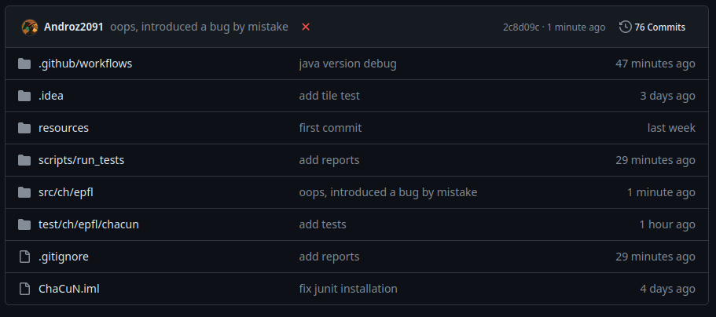
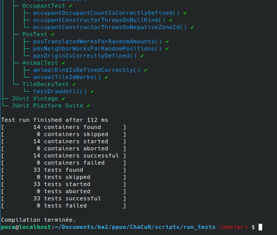

Ce tutoriel s'adresse aux étudiants du cours CS-108 de Michel Schinz à l'EPFL.

Ce cours de programmation orienté objet est en partie tourné vers les tests unitaires. Utiles pour tester l'état de son projet, nous avons appris jusqu'ici à les lancer manuellement de temps en temps.

Alors, pourquoi vouloir exécuter ses tests à chaque push sur le repository ?

* moins de charge mentale - plus de *"hé, on a pensé à lancer les tests ?"*
* moins de temps perdu - plus de *"bon, je lance les 33 tests et je passe à la suite"*
* une meilleure compréhension des outils de compilation de Java
* une bonne initiation au CI/CD

Et sans même parler de son utilité, l'automatisation de ces processus est souvent amusante et satisfaisante.

CI/CD fait référence à intégration/déploiement continu (utilisé dans quasiment tous les gros projets). Allons-y!

> Un grand merci à [Nico](https://t.me/nico_4153) qui a entièrement écrit l'intégration GitLab, et à [Tom De La Gravière](https://people.epfl.ch/tom.massiasjuriendelagraviere) et [Alessandro](https://t.me/ahl1204) qui après avoir intégrer la pipeline à leur projet ont donné des feedbacks.



> Une petite croix s'affiche automatiquement à côté du commit quand les tests ne passent pas

## GitHub ou GitLab EPFL ?

L'EPFL ne fournissant pas de serveur permettant de run des scripts de CD/CI, j'utiliserai GitHub dans ce tutoriel.
Notez qu'il est possible de lancer un GitLab Runner sur un serveur cloud si vous en possédez un, n'hésitez pas à me DM si vous avez besoin d'aide.

**Quel que soit le choix de la plateforme, veillez à ce que votre repository soit privé, pour éviter tout problème de plagiat**.

## TL;DR

Si vous n'avez pas envie de passer du temps à lire l'explication, voilà comment setup l'intégration :
* téléchargez le fichier [scripts.zip](./scripts.zip)
* dézippez le fichier et déplacez-le dans votre projet
* (GitHub) téléchargez le fichier [run_tests.yml](./run_tests.yml)
* (GitLab) téléchargez le fichier [run_tests_gitlab.yml](./run_tests_gitlab.yml)
* déplacez-le dans un dossier nommé `.github/workflows`
* voilà !

## Exécuter les tests via le terminal

Avant même de parler de CI/CD, on doit pouvoir exécuter les tests dans le terminal, parce que c'est ce que devra faire notre script.
Pour cela, nous allons devoir suivre 3 étapes :
* compiler le projet
* lancer les tests
* vérifier l'état des tests

### Compiler le projet

Pour compiler le projet, nous allons devoir utilisé la commande `javac`, qui fait partie du Java Development Kit.

Cette commande va prendre tous les fichiers source du projet, les compiler en fichiers `.class` que la commande `java` pourra exécuter.

* `javac -d out/production/classes src/ch/epfl/chacun/*.java`

De même, on veut compiler les fichiers de tests:

* `javac -d out/test/classes -classpath out/production/classes test/ch/epfl/chacun/*.java`

Pour cela, on doit fournir à `javac` la liste des classes qui sont utilisées par nos tests (comme `PlacedTile.class`, ou `Tile.class`), c'est-à-dire `out/production/classes`.

**Cependant, il reste un problème** : nous n'avons pas importé la librairie Junit. Les méthodes `assertEquals` ou le décorateur `@Test` ne sont pas disponibles.
Pour régler cela, nous devons aussi fournir à `javac` les fichiers `.jar` compilés de Junit, soit le fichier `junit-platform-console-standalone-1.10.2.jar` disponible sur [ce site](https://repo1.maven.org/maven2/org/junit/platform/junit-platform-console-standalone/).

Ainsi, la commande devient :

* `javac -d out/test/classes -classpath out/production/classes:junit-platform-console-standalone-1.10.2.jar test/ch/epfl/chacun/*.java`

Félicitations, votre projet est compilé!

### Lancer les tests

Maintenant, nous devons lancer les tests via la console, également sans passer par l'interface d'IntelliJ.

En précisant les classes de production (donc `Animal.class`, `PlacedTile.class`, etc.) et les classes de tests (donc `AnimalTest.class` par exemple), nous pouvons lancer les tests !

* `java -jar junit-platform-console-standalone-1.10.2.jar execute -cp out/production/classes:out/test/classes: --select-package ch.epfl.chacun --reports-dir reports`

Notez que nous précisons également un dossier `reports` pour lire le résultat des tests automatiquement plus tard.



### Analyser les résultats

Pour analyser les résultats, une solution assez simple est de vérifier la présence de `failures: 0` dans le fichier de reports généré par Junit. Ce n'est pas une solution extrêmement satisfaisante mais Junit ne propose pas d'API simple pour vérifier combien de tests ont échoué.

Cela peut être fait automatiquement via la commande suivante :

* `grep -q "failures=\"0\"" reports/TEST-junit-jupiter.xml || exit 1`

Cette commande fait également en sorte que si un test échoue, notre script renvoie un code d'erreur compréhensible par GitHub et GitLab comme un cas d'échec.

## (GitHub) Créer le workflow CI/CD

Pour cela, je vais donc me baser sur le format attendu par GitHub même si j'aurais préféré que l'EPFL mette à notre disposition des serveurs pour nous apprendre à utiliser ces outils.

```yml
name: Run tests

on: [push]

jobs:
  run_tests_job:
    runs-on: ubuntu-latest
    steps:
      - name: Checkout code
        uses: actions/checkout@v3

      - name: Set up JDK 21
        uses: actions/setup-java@v3
        with:
          java-version: '21'
          distribution: 'temurin'

      - name: Run tests
        working-directory: ./scripts/run_tests
        run: |
          ./run_tests.sh
```

Voilà à quoi ressemble l'action.

Celle-ci créé une machine virtuelle (un Docker) basé sur l'image de la distribution Ubuntu. Ce n'est pas la plus légère mais elle sera facile à modifier et pour débuter c'est la plus simple.

Ensuite :

* l'étape `checkout` permet de récupérer le code de votre projet dans l'action
* l'étape `setup JDK` permet de télécharger et d'exposer `java` et `javac`, les outils de développement pour Java (compiler + exécuter les tests)
* l'étape `run tests` permet d'exécuter les tests et d'afficher une icône rouge ou verte en fonction du statut des tests !

## (GitLab) Créer le workflow CI/CD

```yml
stages:
  - test

run_tests_job:
  stage: test
  image: ubuntu:latest
  before_script:
    - apt-get update && apt-get install -y openjdk-21-jdk-devel unzip
  script:
    - cd ./scripts/run_tests
    - ./run_tests.sh
```

Et voilà ! N'hésitez pas à me DM si vous avez besoin d'aide concernant l'installation.
