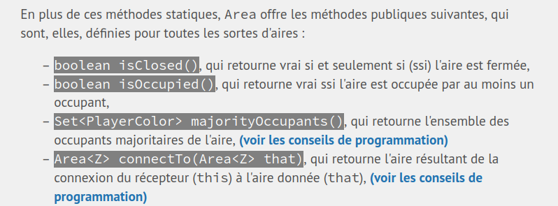

Hello, nouveau tutoriel pour le cours CS-108 de Michel Schinz.

L'objectif ici est d'améliorer un peu la lisibilité des consignes en réglant deux problèmes :
* les conseils de programmation sont toujours **après** la définition de la méthode
* souvent, le nom des méthode à créer n'est pas assez mis en avant à mon goût

Pour cela, nous allons devoir modifier le style de la page dynamiquement avec un userscript (un script JavaScript écrit par un utilisateur pour modifier le comportement d'un site).



> Le résultat final nous permettra de mettre en avant les méthodes, et d'ajouter un lien pour jumper aux conseils **spécifique à chaque méthode** sans attendre

Il existe des dizaines d'extensions permettant de mettre en place ces `userscripts`. Nous allons ici utiliser `ViolentMonkey`, open source et bien maintenu.

**[TL;DR le lien du script final](./script.js)** (à importer dans ViolentMonkey)

## Détection des définitions de méthodes

Dans un premier temps, il nous faut détecter les méthodes présentes dans la consigne. Cela peut se faire à l'aide de l'instruction suivante :

```js
const methods = new Set();

const listItems = document.querySelectorAll('li');
for (listItem of listItems) {

    const firstCode = listItem.querySelector('code:first-of-type');
    if (firstCode) {
        firstCode.style.backgroundColor = '#808080';
        firstCode.style.color = 'white';

        console.log('[METHODE] définition de méthode trouvée, ' + firstCode.innerText);
        methods.add(firstCode);
    }
}
```

Pour cela, on a donc pris le premier élément formatté comme du code dans chaque liste. Nous appliquons un background gris et modifions la couleur du texte.

Nous stockons également la méthode dans un `Set`, qui nous servira plus tard.

## Détection des conseils de programmation

Dans un second temps, nous voulons détecter les conseils de programmation. Nous pouvons utiliser notre code précédent vérifiant si le titre de la section est "Conseils de programmation".

```js
const listItems = document.querySelectorAll('li');
for (listItem of listItems) {
    // are we in a conseils de programmation ? :)
    const parentDiv = listItem.parentNode.parentNode;
    const isConseilsDeProg = parentDiv.id.includes('outline-container') && parentDiv.children[0].innerHTML.includes('Conseils de programmation');
    if (isConseilsDeProg) conseilsDeProg.add(parentDiv);
}
```

## Lier les deux

Enfin, nous pouvons lier les deux en utilisant ce bout de code qui fait le matching entre une méthode et un conseil, et qui créé une balise de lien `<a>` pour jumper vers le bon conseil.

```js
conseilsDeProg.forEach((parentDiv) => {

  const titles = parentDiv.querySelectorAll('li > code:first-of-type');
  for (title of titles) {
    console.log('[CONSEIL] conseil trouvé pour la méthode ' + title.innerText);
    const id = title.parentNode.children[0].id;

    for (method of methods) {
      if (method.innerText.includes(title.innerText)) {
        console.log('[MATCHING] conseil pour ' + title.innerText + ' matched');
        const a = document.createElement('a');
        a.innerHTML = '<b> (voir les conseils de programmation) </b>';
        a.href = '#' + id;
        method.parentNode.appendChild(a);
      }
    }
  }

});
```
