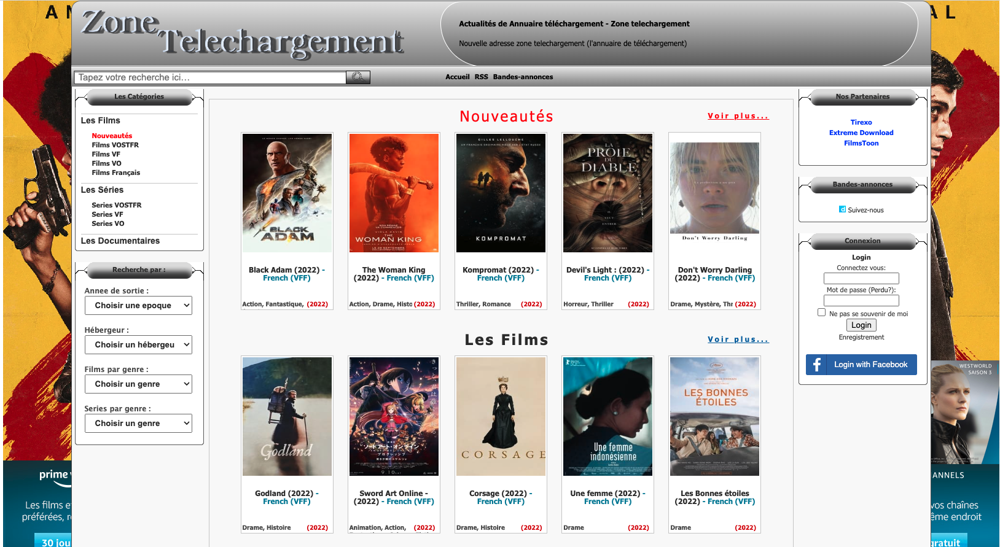
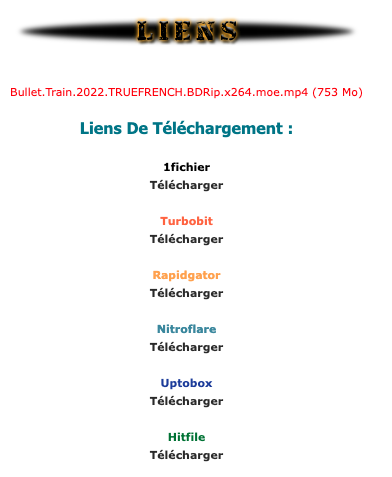
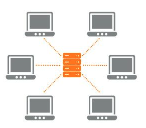
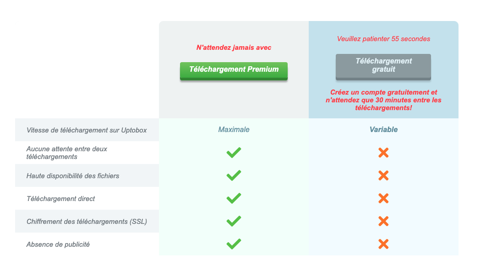
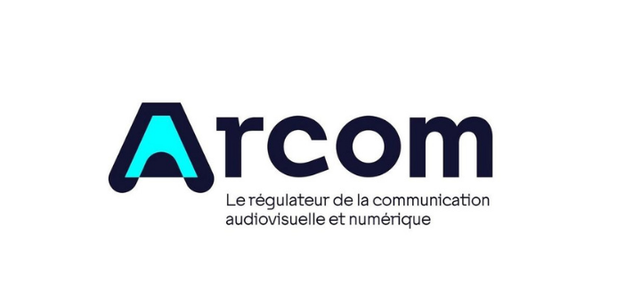
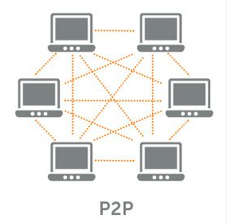
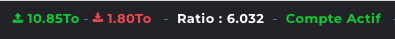
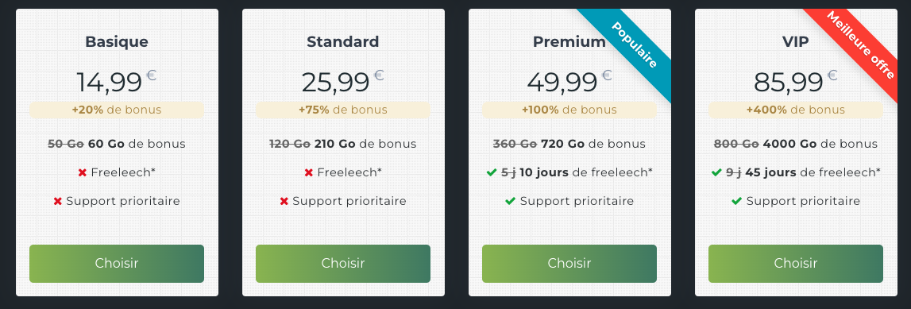
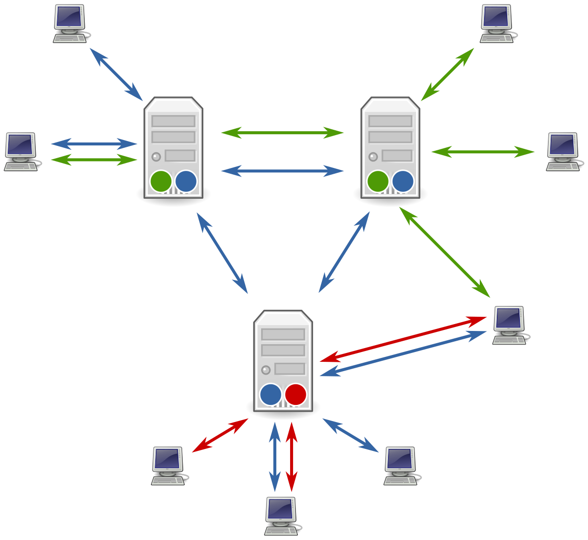
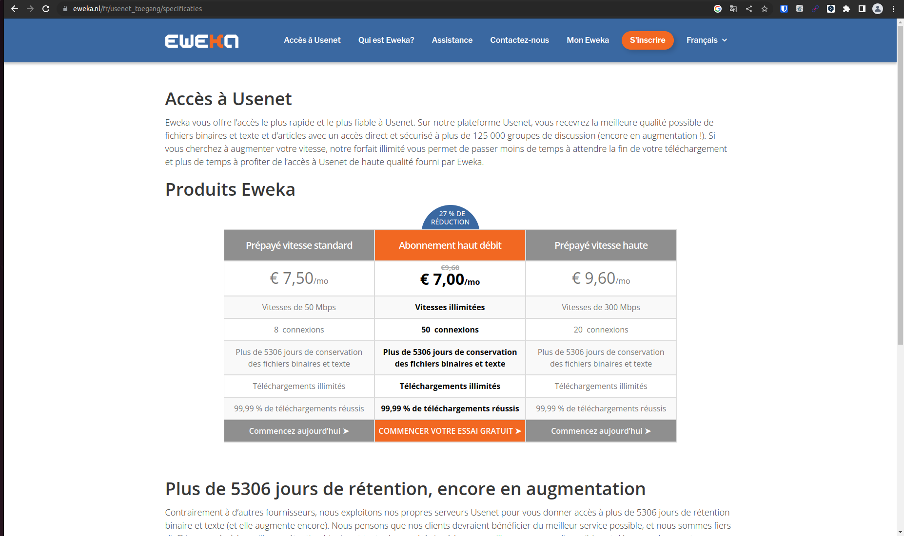

Le piratage évolue avec son temps.

Netflix, Disney+, HBO... sont maintenant disponibles avec des milliers de films à la demande. Quand le choix entre débourser 20€ pour acheter un DVD ou le pirater était simple, il n'en est plus rien aujourd'hui.

L'unique configuration de piratage qui est donc encore vraiment avantageuse aujourd'hui, c'est une configuration où **tout** est automatisé : du téléchargement du film à sa mise à disposition sur un service de streaming privé. Et c'est déjà tout à fait possible.

Plus qu'un tutoriel, cet article rassemble les connaissances que j'ai accumulé après des heures de recherche, expérimentations... et permettra aux débutants de comprendre une partie du monde du piratage des films et séries en ligne.

> **Disclaimer** : cette situation où tout est téléchargable sans revenus reversés aux ayants-droits n'est évidemment pas souhaitable de mon point de vue. C'est cependant un autre débat et il est d'autant plus important de comprendre comment nous en sommes arrivés là pour y trouver des solutions.

Cet article sera séparé en deux parties.

**Partie 1 : télécharger.**

Vous saurez comment télécharger des films depuis les sources suivantes et dans quel cas chacune est la plus efficace.
* les sites de **direct download** (ou DDL)
* le partage de films en **pair-à-pair** (torrent)
* le réseau **Usenet**

**Partie 2 : automatiser et distribuer.**

Vous saurez également comment automatiser le téléchargement depuis ces sources grâce à **Radarr**, **Sonarr** ou encore **Overseerr**.

Enfin, vous saurez comment rendre disponible en streaming vos films, en les **hébergeant** sur un serveur grâce à **Plex** ou **Jellyfin**.

## Partie 1 : Télécharger des films piratés

Il y a trois moyens principaux utilisés pour télécharger des films illégalement sur internet. Le **téléchargement direct** (DDL), le **téléchargement pair à pair** (P2P) et le réseau **Usenet**. Nous allons voir, dans chaque cas, le fonctionnement et le modèle économique qui se cache derrière.

### Le téléchargement direct (DDL)

#### Fonctionnement ⚙️

Le téléchargement direct, aussi appelé **D**irect **D**own**L**oad (ou **DDL**), est le plus simple.

Certains pirates disposent déjà des films (en les enregistrant sur Netflix par exemple) et les envoient sur un site d'hébergement de fichiers (comme Uptobox).

Ensuite, ceux-ci créent **un site pour référencer leurs films piratés**. Il en existe beaucoup de ce type, appartenant à des pirates différents, comme Zone Téléchargement, Extreme Download ou HDEncode.   

En cliquant sur un film sur le site de référencement, vous arrivez une page comme celle-ci :

Chaque lien vous redirige vers un site d'hébergement sur lequel le pirate a téléversé le film et sur lequel vous pouvez le télécharger, comme Uptobox.

C'est un téléchargement dit **direct** car il se fait entre un utilisateur et un serveur (celui du site d'hébergement), et n'implique pas de tiers.

Ici, en orange le serveur du site d'hébergement, comme Uptobox, et en gris chaque utilisateur qui télécharge le film.

#### Modèle économique 💰

Il y a donc deux acteurs ici :
* **le site de réféncement**, créé par le pirate, comme Zone Téléchargement
* **les sites d'hébergement**, qui stockent le fichier du film du pirate sur leurs serveurs et qui le délivrent aux utilisateurs, comme Uptobox

**Le pirate propriétaire du site de référencement** touche de l'argent grâce aux publicités affichés sur son site. Des millions d'utilisateurs le visitent chaque jour, générant des **revenus publicitaires** très importants.

**Les sites d'hébergement** de films piratés touchent de l'argent grâce à leurs offres payantes, pour accélérer le téléchargement ou pour télécharger plus souvent, comme ci-dessous pour Uptobox.

> **AllDebrid :** certains services comme [Alldebrid](https://alldebrid.com/) permettent de télécharger des fichiers sur tous les sites d'hébergement sans limite de débit et sans limite de téléchargement pour un faible coût. Ils achètent des comptes premium sur tous les sites et revendent l'accès moins cher.

#### Qu'en dit la loi ? 🚔

**Le téléchargement direct n'est jamais légal... mais vous ne pourrez jamais être poursuivi**. En effet, le téléchargement se déroule entre vous et le site d'hébergement uniquement. **Pas besoin de VPN** car il est impossible pour l'Arcom (*Autorité de régulation de la communication audiovisuelle et numérique*), de surveiller ce trafic.

Par contre, être propriétaire d'un site de référencement est risqué. Régulièrement, le nom de domaine de ces sites est banni par les FAI (*Fournisseurs d'accès à internet, comme Orange*), les pirates changent donc souvent leurs adresses.

#### En résumé, le téléchargement direct ✴️

Ainsi :
* les sites de **référencement**, comme Zone Téléchargement, mettent à votre disposition une liste de liens vers des sites d'**hébergement** pour télécharger les films, comme Uptobox
* le téléchargement est dit **direct** car il se fait entre vous et le site d'**hébergement**
* il est donc **impossible d'être poursuivi** par l'Arcom
* les sites d'hébergement essaieront tous de vous vendre un **offre payante** pour télécharger plus vite et plus souvent
* les sites de **référencement** changent souvent d'adresse car **bannis par les FAI**

Le téléchargement direct est une bonne option pour débuter car assez simple. Cependant, l'expérience n'est souvent pas très fluide : débits souvent bridés sans payer les sites d'hébergement, publicités envahissantes, changements d'adresses des sites fréquents, etc.

### Le téléchargement pair-à-pair (P2P)

#### Fonctionnement ⚙️

Le téléchargement "pair-à-pair" est un peu plus compliqué, mais très puissant. 

Supposons qu'un pirate ait acheté le DVD d'Avatar. Celui-ci va extraire le contenu du DVD sur son ordinateur. Il va ensuite autoriser d'autres pirates à venir sur son ordinateur pour télécharger le fichier.

Et tout nouveau pirate souhaitant disposer du film va faire de même : télécharger le fichier sur son ordinateur et autoriser d'autres pirates à venir le télécharger.

Ainsi, au bout de quelques partages, les nouveaux arrivants vont pouvoir l'obtenir de dizaines de pirates en même temps, ce qui rend très souvent le téléchargement **très fiable, et très rapide** (le débit n'étant plus bridé par le site d'hébergement à l'inverse du DDL).

Mais comment trouve-t-on les pirates disposant du fichier ?

Eh bien, comme pour le DDL, des sites de référencement sont mis en place (appelés **trackers**) pour permettre aux pirates de trouver le fichier « .torrent » correspondant au film recherché. Chaque torrent permet d'accéder à la liste des IPs des pirates disposant déjà du fichier et étant prêts à le partager.

Lorsque vous commencez à télécharger le fichier, vous êtes appelés un **leecher** (un téléchargeur), et lorsque le téléchargement est fini, vous pouvez autoriser le partage et devenir un **seeder** (un envoyeur) à votre tour. Le tracker en est notifié et vous êtes ajoutés à cette liste des seeders dans le fichier torrent.

Pour télécharger des fichiers, vous devez disposer d'un client torrent, comme QbitTorrent.

#### Modèle économique 💰

Les trackers sont les seuls à gagner de l'argent, et mettent généralement en place un système de ratio. Avez-vous pensé tout à l'heure à ce qu'il se passe si le pirate télécharge seulement le film sans laisser son ordinateur ouvert pour les prochains ? 

Personne ne peut plus télécharger rapidement le fichier et c'est la faiblesse du p2p : la vitesse de téléchargement dépend du nombre de seeders actifs.

D'où le principe de ratio : **vous devez envoyer une quantité de données supérieure ou égale à celle ce que vous téléchargez** ou votre compte est banni du tracker.

Banni... sauf... si vous payez.

Pour une quinzaine d'euros, vous pouvez ainsi télécharger jusqu'à 60 Go sans ne rien repartager.

> **Seeder, parfois impossible :** le choix d'être un seeder ou non n'en est pas toujours un. Certains pirates disposent d'une faible bande passante montante et ne renvoient pas assez de données pour maintenir leur ratio positif...

> **Triche :** Certains logiciels de triche permettent d'augmenter artificiellement votre ratio, mais sont très souvent détectés par les trackers, qui bannissent les comptes.

### Qu'en dit la loi ? 🚔

**Le téléchargement pair-à-pair pour du contenu piraté est illégal, et vous pouvez facilement être poursuivi**. C'est ici que le VPN ou AllDebrid est utile. En effet, il suffit que l'Arcom explore les fichiers torrents et trouvent votre adresse IP pour vous identifier... et vous envoyer l'amende. Cacher son IP réelle derrière un VPN permet d'éviter une telle chose.

Comme pour les sites de référencement de DDL, les trackers P2P changent souvent d'adresse car bannis par les FAI.

#### En résumé, le téléchargement pair à pair

Ainsi :
* le téléchargement est dit **pair-à-pair** car il se fait entre vous et les autres pirates
* les sites de référencement appelés **trackers**, comme YggTorrent, mettent à votre disposition des fichiers **.torrent** pour télécharger chaque film
* ces fichiers **.torrent** vous permettent de trouver les **IPs** des **seeders**, les pirates disposant déjà du film
* il est donc **possible d'être poursuivi par l'Arcom** si vous n'utilisez pas de VPN car ceux-ci peuvent accéder à votre IP
* le téléchargement est souvent **plus rapide et plus fiable** que le DDL (dépend en fait du nombre de seeders)
* les trackers mettent généralement en place un **système de ratio** vous obligeant à repartager les films
* les trackers **changent souvent d'adresse** car bannis par les FAI

Le téléchargement pair-à-pair est une bonne option pour les pirates un peu plus expérimentés car il permet souvent de télécharger plus rapidement qu'en passant par les sites d'hébergement gratuits comme Uptobox. Il nécessite cependant un VPN.

### Le téléchargement via Usenet

#### Fonctionnement ⚙️

Usenet ressemble à une version de Reddit décentralisée, distribuée et très utilisée il y a une dizaine d'années. Chacun peut créer son serveur Usenet et **héberger un "newsgroup"**, qui sera utilisé pour échanger sur un sujet en particulier.

Les autres serveurs peuvent ensuite décider d'héberger ce même newsgroup et **vont se synchroniser périodiquement ensemble** pour partager les nouveaux messages et fichiers.

En se connectant à un serveur Usenet, vous pouvez donc accéder à tous les messages et fichiers des newsgroup hébergés par celui-ci.

Aujourd'hui, Usenet est utilisé en majorité pour partager des fichiers (souvent illégalement).

Il n'est pas possible de créer son propre serveur Usenet individuellement et de se synchroniser avec des centaines de milliers de groupes, ce serait bien trop lourd.

Il existe donc des **Usenet Providers**, comme Eweka, qui vous autorisent à vous connecter à leur serveur Usenet synchronisé à des milliers de groupes et à accéder à tous les groupes qu'ils hébergent et télécharger les fichiers.

Il faut donc vérifier 4 critères pour choisir son Usenet Provider :
* le nombre de groupes qu'il héberge (plus de 125 000 pour Eweka, par ex.)
* le temps de rétention des messages/fichiers par newsgroup (10 ans pour Eweka, par ex.)
* la vitesse de téléchargement (200 mbps pour Eweka, par ex.)
* les limites de téléchargement (aucune pour Eweka, par ex.)

> **Note :** Eweka dispose d'une version à 36€/an [ici](https://www.eweka.nl/en/landing/special-usenet-deal).

Vous devez aussi disposer d'un moteur de recherche pour chercher les fichiers des films sur les newsgroup, comme NZBGeek, pour une dizaine d'euros par an.

Une fois que vous disposez de ces deux éléments, vous pouvez utliser un client Usenet comme SABnzbd pour télécharger les fichiers.

#### Modèle économique 💰

Ici, le modèle économique est simple : vous payez un abonnement mensuel à votre Usenet Provider pour qu'il vous laisse accéder à son serveur Usenet et télécharger les fichiers. (autour de 30€/an min)

Vous devez aussi payer un moteur de recherche comme NZBGeek (autour de 5-10€/an min)

Pour une quinzaine d'euros, vous pouvez ainsi télécharger jusqu'à 60 Go sans ne rien repartager.

#### Qu'en dit la loi ? 🚔

Si votre Usenet Provider supporte le chiffrement SSL, vous pouvez télécharger sans VPN. Encore une fois, comme pour le DDL, c'est un téléchargement direct entre vous et le serveur Usenet, l'Arcom n'a pas de visibilité là-dessus.

#### En résumé, le téléchargement via Usenet

Ainsi :
* celui-ci utilise Usenet, un réseau décentralisé de serveurs synchronisés entre eux
* vous devez payer un provider pour y accéder
* vous devez également payer un moteur de recherche pour trouver les fichiers
* vous pouvez télécharger sans VPN si votre provider supporte le chiffrement SSL
* le téléchargement est souvent **très rapide et très fiable** (ne dépend pas du nombre de seeders, c'est le serveur Usenet qui vous envoie le fichier)

En résumé, le téléchargement via Usenet est une bonne option pour les pirates qui peuvent payer une cinquantaine d'euros par an pour s'assurer un téléchargement très rapide et facile d'accès.

Comme nous le verrons en partie 2, Usenet et le téléchargement pair-à-pair sont souvent utilisés en complément l'un de l'autre et peuvent tous les deux être automatisés.

[Partie 2](/custom-netflix-part2)
