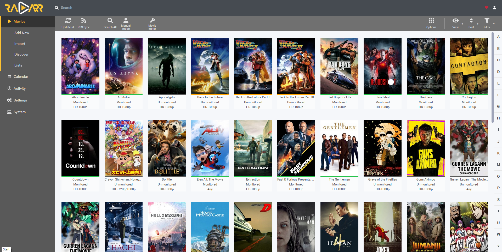
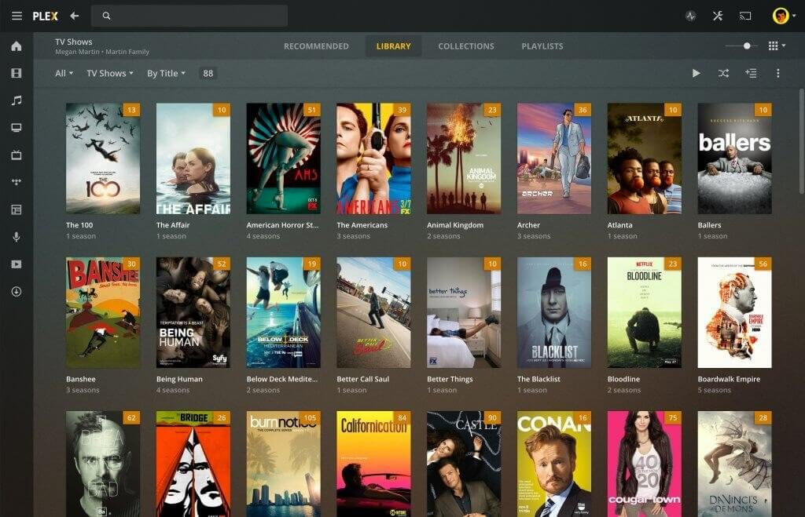
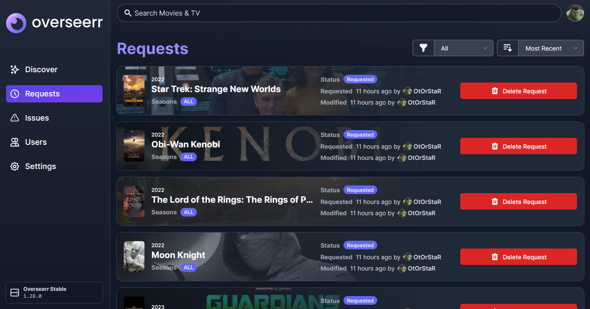

Comme nous l'avons vu dans une première partie, il est possible de télécharger des films via des sites de DDL comme Zone Téléchargement, en pair-à-pair, ou via Usenet. Si vous n'êtes pas familier avec ces termes, je vous invite à lire la première partie de ce guide.

Rechercher chaque film manuellement, l'ajouter à son client de téléchargement, puis le lire est fastidieux. Dans cette partie, nous allons voir comment automatiser tout cela sur son propre serveur, et ainsi créer son propre Netflix privé, à l'aide de **Sonarr**, **Radarr**, **Overseerr** et **Plex**.

> **Note :** Cette partie est un bref résumé de comment fonctionne Radarr, Sonarr et Plex. Pour un guide plus complet d'installation, je vous invite à consulter [cet article, par Hunam](https://42e27452.hunam-website.pages.dev/posts/ultimate-guide-setup-streaming-service-sonarr-radarr-plex-usenet-torrents/).

## Automatiser la recherche des films

Une fois que vous disposez d'un accès à Usenet et à plusieurs sites torrents, vous noterez qu'il est très fastidieux de rechercher un film sur chaque site, les comparer, vérifier qui a la meilleure qualité avec une taille raisonnable, dans la bonne langue, etc.

Radarr fait ce travail à votre place pour les films et Sonarr le fait pour les séries.

Ainsi, vous pouvez ajouter tous vos **Indexers**, c'est-à-dire NZBGeek pour Usenet, et vos trackers torrent préférés, comme YGGTorrent.

Ensuite, vous pouvez ajouter des **Profiles** pour chaque type de film que vous souhaitez télécharger. Par exemple, vous pouvez avoir un profil pour les films en 1080p en VO, un autre pour les films en 720p en français, un autre pour les films en 4K, etc.

Enfin, vous devez ajouter des **Download Clients**. Par exemple, si vous utilisez qBittorrent, vous pouvez l'ajouter à Radarr pour le rendre capable de télécharger des torrent.

Puis, vous disposez d'un bouton sur l'interface de Radarr pour ajouter un nouveau film à votre collection, avec le Profile de votre choix. Radarr va alors rechercher ce film sur tous vos indexers, et télécharger le meilleur résultat, en utilisant un client de téléchargement configuré.

C'est la même chose pour Sonarr.

## Rendre les films disponibles en streaming

Une fois votre bibliothèque de films téléchargée, vous pouvez les rendre disponibles en streaming sur votre réseau local, via Plex.

Plex, installé sur votre serveur, va scanner votre bibliothèque de films. Pour chaque film, il va trouver les métadonnées (titre, synopsis, affiche, etc.) sur The Movie Database et les afficher proprement dans une interface web.

Chaque fichier peut être streamé à la volée depuis votre serveur, ou téléchargé pour être regardé hors-ligne.

> **Note :** Plex est freemium et propriétaire contrairement à l'ensemble des logiciels présentés dans cet article. Une alternative libre et gratuite est Jellyfin, mais elle n'est pas aussi bien développée que Plex ([post Reddit résumant mon point de vue](https://www.reddit.com/r/jellyfin/comments/mvcgmw/comment/hkq8tz0/?utm_source=share&utm_medium=web2x&context=3)).

Vous pouvez ensuite partager l'accès à votre serveur à vos amis, et ils pourront regarder vos films depuis leur navigateur web, ou depuis leur application mobile.

## Automatiser la requête de films

Maintenant que vous avez un serveur capable de télécharger des films, les rendre disponibles au streaming à vos amis, le tout automatiquement, vous pouvez aussi leur permettre de demander des films à télécharger.

Un peu comme s'ils allaient eux-mêmes sur Radarr ajouter un film à leur collection, mais en plus simple (l'interface de Radarr est complexe).

Pour cela, il existe **Overseerr**.

Overseerr permet de chercher n'importe quel film ou série sur The Movie Database via une jolie interface, et de demander à Radarr ou Sonarr de le télécharger.

## Et voilà !

Maintenant, vous connaissez les principaux moyens de télécharger des films, et comment il est possible d'automatiser ces téléchargements sur votre serveur. Il est donc possible de créer son propre Netflix privé, où chacun peut ajouter des films puis les regarder en streaming depuis son navigateur web ou son téléphone.