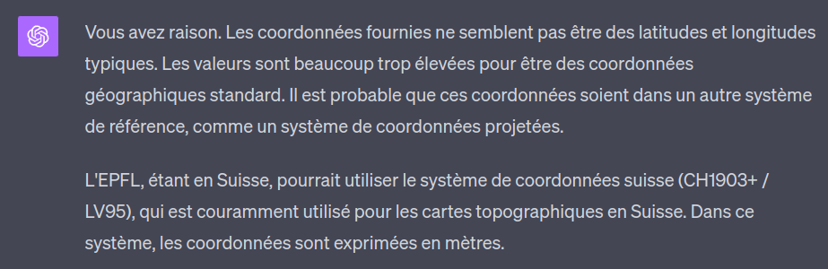
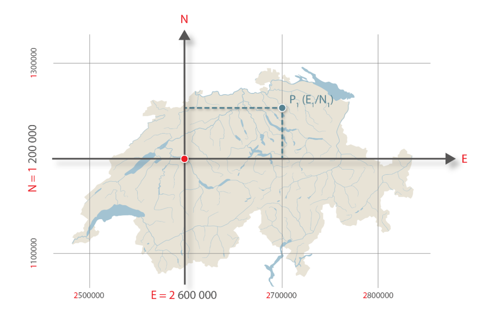
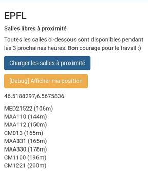

Si vous êtes à l'EPFL, vous connaissez probablement déjà le super outil [flep/occupancy](https://occupancy.flep.ch), qui permet en quelques minutes de lister la totalité des salles disponibles dans le campus pour une certaine durée.

Un léger problème tout de même, c'est que si vous ne connaissez pas bien l'EPFL (comme moi actuellement :), le nom des salles ne vous parlera probablement pas.

Quand 30 salles différentes s'affichent, comment savoir si la salle CM 121 est plus proche que vous que la CE 1 515 après avoir mangé à Arcadie ?

Pour optimiser ça, je me suis dit qu'il pourrait être intéressant de permettre de lister les quelques salles disponibles **proches de soi**.

## Récupérer les coordonnées des salles

Pour développer ce projet, il me faut récupérer la totalité des coordonnées de toutes les salles.

Pour cela, il y a plusieurs options :
- utiliser Google Maps pour pointer les coordonnées de chaque salle
- aller les demander au service informatique de l'EPFL
- essayer de comprendre comment fonctionne le [GeoPortail](https://geoportail.epfl.ch/) de l'EPFL (moins long et clairement plus fun)

Bon. Après avoir ouvert le portail de l'EPFL et inspecter quelques requêtes, je vois qu'on peut effectivement récupérer des "coordonnées" pour chaque salle. 

Par exemple:  
- `GET` `https://plan.epfl.ch/search?limit=20&partitionlimit=5&interface=main&routing=validated&query=CM1121`  
```json
{
   "type":"FeatureCollection",
   "features":[
      {
         "type":"Feature",
         "id":"12156#locaux",
         "geometry":{
            "type":"MultiPolygon",
            "coordinates":[
               [
                  [
                     [
                        2533002.05,
                        1152532.725
                     ],
                     [
                        2533016.31,
                        1152532.725
                     ],
                     [
                        2533016.31,
                        1152518.45
                     ],
                     [
                        2533002.05,
                        1152518.45
                     ],
                     [
                        2533002.05,
                        1152532.725
                     ]
                  ]
               ]
            ]
         },
         "properties":{
            "layer_name":"locaux",
            "label":"CM 1 121",
            "floor":1,
            "vertex_id":30989
         }
      }
   ]
}
```

Plutôt content. Jusqu'à lire les coordonnées. En tant que français peu expérimenté en carto... je me demande pourquoi ce site ne renvoie pas comme habituellement des coordonnées latitude/longitude mais des coordonnées immenses allant jusqu'à 2M.

Donc là ~~j'abandonne~~ je demande à ChatGPT et la réponse apparait ;)



Le plan de l'EPFL utilise donc le système de coordonnées géographiques suisse MN95 (ou LV95 en allemand), la version améliorée du système MN03 (1903).

Les deux sont "centrés" sur Berne, dont les coordonnées Nord, Est sont (600 000, 200 000). Dans le nouveau (MN95) les coordonnées Nord sont précédées d'un 2 et les coordonnées E d'un 1. Ce qui explique le faux "2 millions" de tout à l'heure. C'était juste 600 000.



Et fact que j'ai trouvé amusant, le 0 de ce système de coordonnées se trouve... à Bordeaux, pour garantir des coordonnées positives pour toute la Suisse.

Enfin bref, ce qui compte pour ce projet c'est la formule pour passer de l'un à l'autre, parce qu'évidemment `navigator.geolocation` ne renvoie pas des coordonnées MN95, mais utilise le système de coordonnées WGS84.

## From MN95 to WGS84

Heureusement, cette formule est disponible en ligne par l'[Office Fédéral de Topographie Suisse](https://www.swisstopo.admin.ch/content/swisstopo-internet/fr/topics/survey/reference-frames/_jcr_content/contentPar/tabs/items/dokumente_publikatio/tabPar/downloadlist/downloadItems/417_1462802199217.download/ch1903wgs84-FR.pdf).

### Centrer Berne.

Le code est écrit en JS, mais le concept est le même pour tous les langages.

```js
// soient E et N nos coordonnées dans le système MN95 (donc en mètres)
let yCentre = E - 1200000;
let xCentre = N - 2600000;

// changer l'unité à 1000 km
xCentre /= 1000000;
yCentre /= 1000000;
```

### Calculer la latitude et la longitude.

```js
// les cstes correspondent à l'observatoire de Berne, le nouveau (0,0) de notre système)
const latitudeInitiale = 16.9023892;
const longitudeInitiale = 2.6779094;

// ces coefficients nous permettent de savoir
// de cb augmenter la latitude et la longitude
// à chaque x ou y de nos coordonnées

const latiXCoeff = 3.238272;
const latiYP2Coeff = -0.270978;
const latiXP2Coeff = -0.002528;
const latiXYP2Coeff = -0.0447;
const latiXP3Coeff = -0.0140;

const longiYCoeff = 4.728982;
const longiXYCoeff = 0.791484;
const longiXP2YCoeff = 0.1306;
const longiYP3Coeff = -0.0436;

// on les applique aux X et Y centrés calculés précédemment

const nouvelleLatitude =
    latitudeInitiale
    + latiXCoeff * xCentre
    + latiYP2Coeff * (yCentre**2)
    + latiXP2Coeff * (xCentre**2)
    + latiXYP2Coeff * xCentre * (yCentre**2)
    + latiXP3Coeff * (xCentre**3);

const nouvelleLongitude = 
    longitudeInitiale
    + longiYCoeff * yCentre
    + longiXYCoeff * xCentre * yCentre
    + longiXP2YCoeff * (xCentre**2) * yCentre
    + longiYP3Coeff * yCentre**3;
```

### Convertir en degrés.

Nous obtenons ici des valeurs en secondes d'arc. Or, nous souhaitons des degrés.

La Terre est divisée en 360 degrés (un cercle complet). Chaque degré est divisée en 60 minutes, ce qui nous donne 3600 secondes/degré.

Petit produit en croix :

```js
const nouvelleLatitudeEnDegres = nouvelleLatitude * 1 / 3600 * 10000;
const nouvelleLongitudeEnDegres = nouvelleLongitude * 1 / 3600 * 10000;
```

Ce script nous sera bien utile par la suite !

## Exporter les coordonnées

Maintenant, il nous faut pouvoir exporter les coordonnées de toutes les salles dans un fichier JSON.

Il y a sans doute une façon plus propre de récupérer la liste des salles, mais je vais utiliser l'API de Flep/Occupancy pour ça.

Ensuite, il nous faut boucler sur chaque salle, appeler l'API privée du plan de l'EPFL, convertir les données et les sauvegarder en suivant cette structure :
```json
{
    "name": "ODY016",
    "type": "SALLE DE COURS",
    "geometry": {
        "type": "MultiPolygon",
        "coordinates": [
            [[
                46.51993236219606,
                6.567810070631254
            ],
            [
                46.52004457543968,
                6.567808266620984
            ],
            [
                46.52004564331144,
                6.567947695378289
            ],
            [
                46.519933430065606,
                6.5679494990996945
            ],
            [
                46.51993236219606,
                6.567810070631254
            ]]
        ]
    }
}
```

Après quelques galères avec le format de données renvoyé par le plan de l'EPFL, le fichier JSON est prêt !

## Coder notre appli

Nous avons maintenant toutes les clefs en main, let's do it.

### Récupérer les coordonnées de l'utilisateur

```js
navigator.geolocation.watchPosition((position) => {
    // on récupère les coordonnées de l'utilisateur
    const { latitude, longitude } = position.coords;

}, () => {}, {
    enableHighAccuracy: true,
    timeout: 5000,
    maximumAge: 0
});
```

### Trier les salles par distance

```js
function getUserRoomDistance(userLatitude, userLongitude, roomLatitude, roomLongitude) {
    const R = 6371;
    const deltaLatitude = deg2rad(roomLatitude - userLatitude);
    const deltaLongitude = deg2rad(roomLongitude - userLongitude);
    const a = Math.sin(deltaLatitude/2) ** 2
        + Math.cos(deg2rad(userLongitude)) * Math.cos(deg2rad(roomLatitude)) * Math.sin(deltaLongitude/2)**2;
    const c = 2 * Math.atan2(Math.sqrt(a), Math.sqrt(1-a));
    return R * c;
}

function deg2rad (deg) {
    return deg * (Math.PI/180);
}
```

### Connexion à l'API de Flep/Occupancy

```js
fetch('https://occupancy-backend-e150a8daef31.herokuapp.com/api/rooms/find_free_rooms', {
    method: 'POST',
    headers: {
        'Content-Type': 'application/json'
    },
    body: JSON.stringify([{
        start: start.toISOString(),
        end: end.toISOString(),
    }])
})
.then((res) => res.json())
.then((data) => freeRooms = data.map((r) => r.name));
```

Combiner le tout et...

## L'app est en ligne !

Je suis actuellement au Rolex, les salles les plus proches sont donc les salles de maths, puis celles du CM :)

**Le lien : https://lesswalkmorework.polysource.ch**  
**Repository GitHub: https://github.com/polysource-projects/lesswalkmorework**


