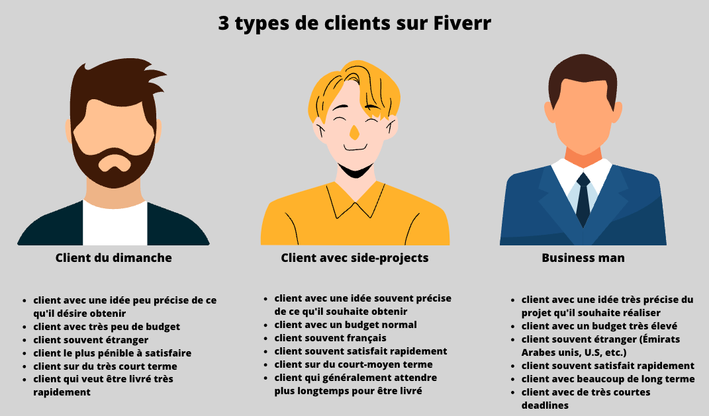

Fiverr est une place de marché sur laquelle il est possible d’acheter les services de travailleurs indépendants spécialisés (en théorie…) dans un domaine. Durant 14 mois passés sur la plateforme, j’ai eu le temps de la découvrir et de la connaître désormais presque parfaitement, jusqu'à obtenir le niveau de vendeur le plus haut de la plateforme.

Je vous propose de revenir sur cette expérience qui me semble intéressante pour : 
* les acheteurs curieux de savoir ce que vivent quotidiennement les freelances qui travaillent pour eux
* les nouveaux vendeurs qui hésitent à investir de leur temps dans Fiverr
* et… tous les autres curieux ;)

Je vais d’abord commencer par évoquer **l’algorithme de Fiverr** (metrics utilisés, ranking des vendeurs, etc.), pour évoquer **ses conséquences directes sur la vie d’un vendeur** (burn-out, fatigue, dépendance envers la plateforme, etc.), et conclure sur mon avis général concernant la plateforme.

## Satisfaire l’algorithme Fiverr

Commençons par le commencement et les généralités. Comment la plateforme fonctionne-t-elle ?

L’algorithme de Fiverr fonctionne simplement. Quand un acheteur tape « logo » sur Fiverr, la plateforme veut :
* qu’il trouve un **vendeur rapidement**
* qu’il soit **satisfait de son achat** de logo chez le vendeur (évalué par la note, achats répétés chez le même vendeur)
* qu’il **n’annule pas** la commande
* qu’il soit livré **dans les temps**
* qu’il **dépense le plus possible** (cad tout son budget, voire un peu plus)

Ainsi, en tant que vendeur, la plateforme détermine : 
* un **temps de réponse** moyen
* une **note de satisfaction** moyenne des acheteurs
* un score de **“Repeat Business”**
* un **taux d’annulation** de commandes
* un **taux de livraison en retard**
* un **prix de vente** moyen

Ces critères, couplés à l’âge de votre compte, sont utilisés pour déterminer votre classement général dans les recherches, et **votre niveau Fiverr** (vendeur débutant, niveau 1, niveau 2 ou meilleur vendeur).

### Débuter en travaillant gratuitement

Au début, la plateforme vous fait apparaître chez des clients au budget faible, voire très faible. Et c’est là qu’il faut savoir faire des sacrifices utiles pour la suite. Un seul mot d'ordre pour les nouveaux vendeurs : __accepter toutes les commandes que l’on sait réaliser et fermer les yeux sur le prix__.

Quitte à travailler gratuitement, peu importe. Au début, vous travaillerez beaucoup et gagnerez très peu (sur un bon mois). Ce n’est absolument pas un investissement perdu, vous ne travaillez pas gratuitement, vous travaillez pour votre profil et votre ranking.

### Commencer à être rentable

Une fois parvenu à atteindre autour de 20 avis positifs sur votre profil (sans avis négatif…), vous venez d’atteindre une étape majeure dans votre chemin vers la rentabilité sur Fiverr.

Vous commencez à être contactés par des clients intéressants, bien différents de ceux que vous avez pu rencontrer jusqu’ici et qui ont des projets sérieux. Contrairement aux clients du lancement de votre profil qui veulent la lune pour 5€, ceux-ci sont plus respectueux, ont plus d’ambition réalistes, plus de budget… **plus professionnels**, en résumé.

Les clients les plus actifs disposant d’un badge “Fiverr Select” commencent à vous contacter, et vous débloquez l'accès aux publicités sur Fiverr.

C’est **LÀ** que Fiverr devient intéressant. C’est uniquement, et bien uniquement autour des 20 avis positifs que vous pouvez commencer à penser à refuser des commandes trop faiblement rémunérées ou qui ne vous intéressent pas pour sélectionner les meilleures. Beaucoup de gens restent bloqués avant, en essayant de faire du profit dès le départ.

A partir de ce moment-là, vous devez garder quelques idées clés en tête, et vous foncez droit vers la réussite : 
* n’acceptez jamais aucune commande que vous n’êtes pas certain de pouvoir livrer.
* si un client vous menace de mettre une mauvaise étoile, faites tout votre possible pour le satisfaire. Vous devez à tout prix garder une bonne note sur votre profil. Si vous tombez sur un client récalcitrant, pas de chance, vous allez devoir travailler plus; c’est comme ça sur Fiverr, le pouvoir de la note dont ils disposent est extrêmement fort. S’il n’accepte pas votre travail, remboursez-le généreusement. Mieux vaut avoir perdu du temps que de tâcher votre profil.
* répondez aussi vite que vous le pouvez à tous vos messages. Sur Fiverr, les clients qui ont beaucoup de budget sont généralement impatients et veulent tout ce qu’ils demandent tout de suite. Par expérience, les opportunités les plus rentables viennent des demandes répondues dans l’heure.

## La vie d’un freelance Fiverr

Je vais maintenant évoquer mon expérience personnelle avec Fiverr, et la façon dont j’ai vécu ces 14 derniers mois.

### Le stress des opportunités

En tant qu'étudiant, je n’avais aucune attente particulièrement élevée. Je me suis lancé sur la plateforme en tant que développeur pour essayer, et j’ai vite accroché. Le premier mois, j’y passé toutes mes soirées, à fond, et j’ai réalisé 20 commandes pour environ 1 071€.

Or, cela représenterait en théorie environ 50€ par commande. Sauf qu’ici… ce n’est absolument pas le cas. La médiane du prix par commande est d’environ 25€.

Pourquoi… ? Le premier mois, un acheteur m’a contacté en m’informant qu’il était prêt à payer 500€ pour un projet plutôt simple pour ce que j’avais l’habitude de faire, s’il était livré dans les 24 heures. J’ai accepté. Et j’ai ainsi réalisé **50% de mon CA de septembre 2021 en une journée**.

Et cet exemple montre une caractéristique clef de la plateforme : tous les clients ont des budgets complètement différents, à tel point qu’en un an, j’ai vendu une heure de mon travail entre 5€ et 750€.

Deuxième point important, les clients les plus rémunérateurs sur Fiverr veulent généralement **tout, tout de suite**. C'est fou, mais une nuit de travail sur 5-6 heures pour un riche client pressé peut vous rapporter plus que des dizaines d'heures passés à travailler pour des clients lambda. Parce que la contrainte "Je veux tout en 24 heures" peut vous permettre de facturer très cher, et que les clients étrangers n'ont parfois **aucune** limite de budget.

C’est ce qui rend selon moi la plateforme addictive. Être un vendeur sur Fiverr, c’est enchaîner les commandes “normales” jusqu’à trouver LE client de la semaine, riche businessman d’un pays étranger qui va permettre de réaliser en quelques jours sous caféine 2-3k€, soit un mois de CA avec des commandes normales. Client qu'il serait impossible de trouver en dehors de la plateforme.  

Un autre exemple, en avril 2022, j’ai pu livrer en moins d’une dizaine d’heures une grosse commande urgente d’un californien **qui représente toujours aujourd’hui 20% du CA total que j’ai réalisé sur Fiverr depuis le début**. Quand je parle de décalage, je n’exagère pas.

On peut en arriver à ce schéma simplifié. Les clients du dimanche sont ceux que vous obtenez au début, pour basculer vers un nombre de clients business de plus en plus élevé lorsque vous disposez d'un nombre important d'avis. Ils restent rares, et il faut réaliser beaucoup de commandes pour en trouver.

### Burn out obligé ?

La **pression** engendrée par Fiverr n’est absolument pas négligeable. Les messages s’accumulent vite, il faut être toujours disponible pour répondre. Les commandes s’accumulent également très vite, avec **énormément de clients différents** sur la plateforme, **beaucoup de projets différents**. Le timer du temps restant avant la livraison est affiché en gros, il faut tout livrer à l’heure, pas le droit à l’erreur, l’algorithme ne laissera pas passer ça.

Comme je l'ai expliqué plus tôt les opportunités très rémunérées demandent généralement de faire une croix rapidement sur son planning (dormir, passer du temps avec les amis, etc.). C'est un rythme très éprouvant à tenir.

Après 2 mois passés à enchaîner les commandes, parfaitement, des dizaines d’avis positifs, je commence à être **très fatigué**. C’est la première **annulation** de commande de ma part. Je sais parfaitement faire ce que me demande le client, et même payé 100€ de l’heure, je ne peux pas. La fin de mon week-end arrive et je n’ai plus aucune énergie, je suis irritable, déprimé, et je n’ai pas la force d’écrire toutes ces lignes de code après avoir passé mon week-end à livrer, négocier avec les clients, me plier en quatre pour obtenir la note maximale. 

Peut-être que cela est uniquement dû au fait que je sois étudiant et à la nécessité de faire tout ce travail en soirée ou le week-end après une journée de cours, mais je pense sincèrement que ce même problème se pose à tous les freelances Fiverr.
Quand vous travaillez en direct, si le client n’est pas satisfait, il peut dans le pire des cas demander un remboursement et ouvrir un litige, mais certainement pas **ternir votre réputation pour tous vos futurs acheteurs**. Cette pression supplémentaire a énormément de poids.

### Le mode indisponible... indispensable

Décembre est donc un mois très calme pour moi pendant lequel je prends conscience de tout ça, et qui me permet de récupérer… pour reprendre de plus belle en janvier. La dopamine Fiverr me manque et je suis content de travailler avec de nouveaux clients sur de nouveaux projets. Cependant, je ne refais pas l’erreur que j’avais faite au début : j’active le mode indisponible dès que je dois livrer plus de 2-3 commandes. Je ne suis plus dérangé par de nouvelles demandes, et je peux me concentrer pleinement sur ce qu’il me reste à livrer.   

### Aucune prise de risque tolérée

J’ai reçu de la part de plusieurs amis une question; est-ce une bonne idée d’utiliser Fiverr pour se perfectionner dans une techno en étant payé ? Autrement dit, un client va me demander de réaliser un site web ou un logo, et je vais en profiter pour me former, et ensuite livrer. Et à ça je répondrais que si vous cherchez vraiment la rentabilité... ne le faites pas. La plateforme vous encourage à n’accepter aucune commande que vous n’êtes pas certain de satisfaire. S’il y a bien une chose que celle-ci punit plus sévèrement qu’un clic qui ne conduit à aucune commande, c’est un clic qui conduit à une commande annulée. De plus, c’est également un risque d’obtenir une note négative sur votre profil qui fera fuir les futurs acheteurs. Donc, acceptez un maximum de commandes oui, mais n’acceptez que celles que vous avez déjà réalisées par le passé, et que vous êtes parfaitement certain de pouvoir livrer.

### De lourdes taxes

Il me semble difficile d’évoquer Fiverr sans évoquer les taxes prélevées sur chaque mission (20%). C’est tout à fait conséquent. J'ai ainsi payé à Fiverr plusieurs milliers d'euros au cours de l'année. C'est délirant d'un point de vue technique, 20% pour une mise en relation... mais en tant que vendeur, ça les vaut évidemment. Fiverr me permet de trouver des clients que je peux facturer 50-100% plus cher que via mon réseau personnel.

### Une dépendance à Fiverr évidente

Un sujet qui me semble plus important, par contre, est le fait de dépendre de la plateforme pour contacter son réseau. Je me suis déjà fait bannir de la plateforme par erreur début janvier, et je mesure à quel point je suis dépendant de la plateforme pour réaliser mon CA. Lorsqu'un client le demande, je lui envoie une facture en direct (pour rester dans les T.O.S de Fiverr, vous ne devez pas proposer vous-même de ne pas payer via la plateforme). Cela me permet de disposer d’un réseau en dehors de Fiverr au cas où mon compte ne serait, un jour, plus disponible.

## Conclusion

En résumé, Fiverr est une plateforme intéressante pour les vendeurs, car elle permet :
* de démarrer de zéro, sans aucun réseau préalable, uniquement des compétences
* de ne pas perdre de temps à convaincre l’acheteur de vos compétences, tous vos avis sont inscrits sur votre profil
* de travailler avec des clients du monde entier, sur beaucoup de projets différents
* de travailler avec des clients proposant une rémunération bien plus élevée que la normale, les “Fiverr Select”

…mais pour autant : 
* requiert une disponibilité permanente pour répondre aux demandes et pour ne pas manquer les quelques opportunités des “Fiverr Select”
* engendre une pression énorme, notamment sur les notes que laissent les clients
* une importante dépendance envers la plateforme, sur laquelle se situe tout son réseau

Si vous souhaitez vous lancer en tant que vendeur : 
* travaillez (quasi) gratuitement avant les 20 premiers avis, faites la course aux 5 étoiles
* ne jouez pas avec le feu, n’acceptez aucune commande avec un risque d’annulation de votre part
* misez tout sur les avis et les notes positives, en rendant ceux-ci prioritaires
* n’hésitez pas à utiliser le mode indisponible quand vous êtes overbooké. Fiverr est une plateforme fatiguante et stressante par son fonctionnement, il est facile de se laisser happer

> Cet article est un résumé aussi bref que possible de mon expérience, mais il y a évidemment beaucoup de détails que je n’ai pas pu aborder. Si vous avez des questions, n’hésitez pas à me les poser sur Twitter !
