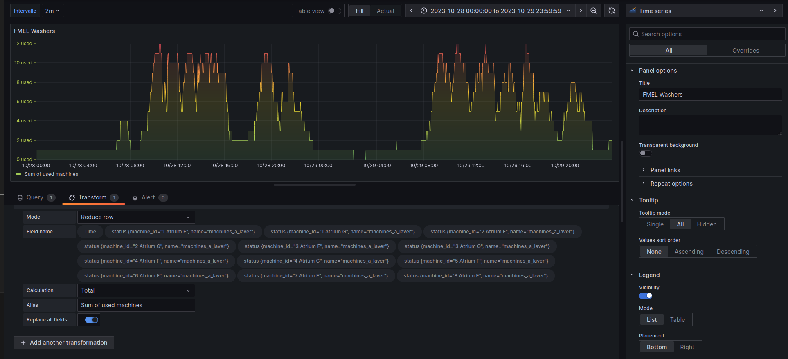
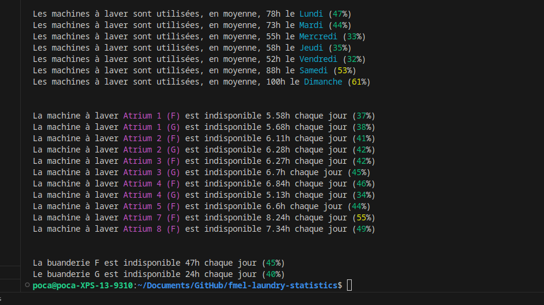

En cherchant un prétexe pour découvrir de nouvelles technos et en utilisant l'appli de machines à laver de ma résidence, j'ai décidé de faire une petite expérience.

Notre problématique : quel jour/heure optimal pour faire ses machives à laver ?

Dans cet article, je vais détailler :
* comment collecter des données sur de la disponibilité des machines à laver de ma résidence (automatiquement)
* comment stocker efficacement ces données avec **InfluxDB**
* comment créer une view de ces données très rapidement avec **Grafana**
* et... le résultat de l'expérience :)

## Collecte des données

Pour collecter les données, j'ai configuré un reverse proxy (avec mitmproxy) pour intercepter les requêtes de l'application mobile de EEProperty.

Je vous invite à lire [mon article sur le reverse engineering de PixPay](https://blog.androz2091.fr/reverse-eng-pixpay/) pour un tutoriel plus complet, c'est le même principe.

### Mapping de l'API

On obtient ces endpoints :

* `POST https://login.eeproperty.com/api/v3/mobile/user/login` : permet d'obtenir un JWT pour s'authentifier
* `GET https://vesta.eeproperty.com/api/v3/mobile/machines` : permet d'obtenir la disponibilité des machines à laver

J'ai également publié une [librairie TypeScript](https://github.com/polysource-projects/eeproperty-wrapper) pour simplifier son utilisation.

### Automatisation

Maintenant, il ne nous reste plus qu'à stocker les données. Pour ça, j'ai décidé d'utiliser **InfluxDB**.

Son utilisation est extrêment simple pour des données temporelles (exactement ce qu'on veut faire). Il suffit de créer une base, puis d'envoyer des points avec un timestamp.

Voilà à quoi ressemble mon code, qui s'exécute toutes les 120 secondes :
```
jwt_token = LOGIN(credentials)
machines = GET_MACHINES(jwt_token)

LIST points = []

FOR EACH machine IN machines
    points.ADD({
        timestamp: CURRENT_DATE_TIME_WITHOUT_SECONDS,
        machine_id: machine.number + ' ' + machine.room,
        status: IF machine.state IS 'DEACTIVATED' THEN 0 ELSE 1
    })

INFLUXDB_WRITE('http://localhost:8086', 'washers', points)
```

Et c'est tout ! On a juste à lancer ce script, et revenir plus tard.

## Analyser les données

Re. 33 jours se sont écoulés depuis la rédaction de cette première partie.

J'ai pu collecter 284 912 points.

On peut vérifier que ce nombre de points est bien cohérent. Avec 12 machines à laver tournant pendant 33 jours, et un point toutes les 2 minutes : (33 \* 24 \* 60 / 2) \* 12 = **285 120 points**, soit un écart de 0.07%, on est ok.

### Grafana

La première chose que l'on peut faire pour visualiser les données, c'est créer un dashboard Grafana.

En quelques secondes (sur Linux :), Grafana est lancé et on peut ajouter InfluxDB comme entrée, et créer un dashboard.

Dans l'onglet **Query**, on récupère tous les points de la range en train d'être visualisée :
```flux
from(bucket: "machines") 
  |> range(start: v.timeRangeStart, stop: v.timeRangeStop)
  |> aggregateWindow(every: ${interval}, fn: mean)
```
Puis, dans l'onglet **Transform**, à chaque instant t disponible, on fait un reduce sur tous les points pour avoir le nombre de machines utilisées à chaque instant.

> C'est pour ça qu'il est très important que le timestamp soit le même pour toutes les machines. Par exemple, quand j'envoie mon point pour sauvegarder le statut de "Atrium F (1)", il faut qu'il ait exactement le même timestamp que le point qui indique le statut de "Atrium F (2)", pour que la somme se fasse correctement.

On peut également définir un paramètre "interval" dans les paramètres pour lisser la courbe et réduire le nombre de points en cas de besoin.



On obtient un joli graphique avec nos données, qui nous permet de repérer plusieurs tendances !

Il semble en effet y avoir une forte corrélation entre le jour/heure de la semaine et l'utilisation des machines à laver.

### Analyse plus poussée

Maintenant, même si le graphique est génial pour avoir une idée de ce qu'on l'on veut chercher, il nous faut des résultats plus précis.

Pour ça, j'ai créé un script qui appelle notre base InfluxDB et fait des calculs plus intéressants.

Et après un long travail d'analyse et de nettoyage des données (comme la suppression de la machine F 6, qui était en panne pendant deux semaines et faussait les résultats)...

### Les résultats :)



Nous y voilà !

On peut donc conclure que le meilleur jour pour aller faire ses lessives semble être le vendredi (peut-être que les gens sortent plus ?) ou le mercredi, avec 2x moins de gens que le dimanche.

On remarque également que le bâtiment G est très légèrement moins utilisé que le bâtiment F, probablement car plus loin de l'ascenseur et avec 2x moins de machines.

D'autres statistiques plus poussées et intéressantes peuvent être faites ! 

*Par exemple, en moyenne, les dimanches, 4 machines sont disponibles simultanément entre 18h et 19h, jusqu'à seulement 2 entre 15h et 16h... et contrairement à 7 entre 14h et 15h !*
