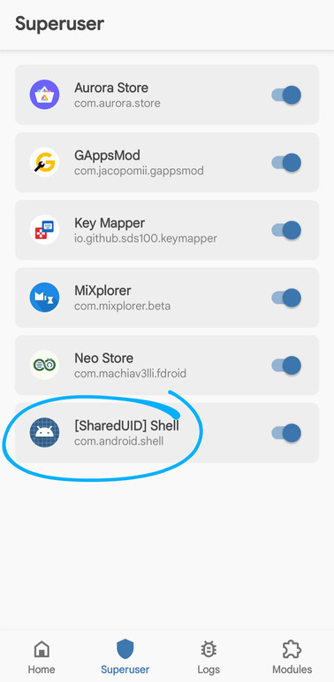
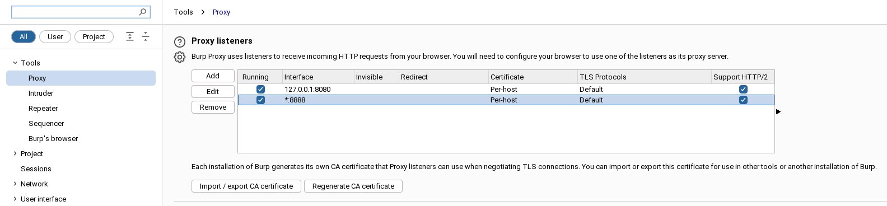
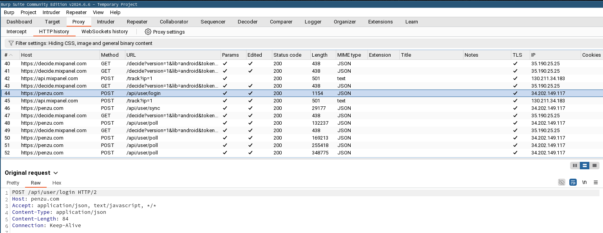

Cet article assez court explique pas à pas comment bypasser le SSL pinning lors de l'analyse d'une application Android avec Frida et Burp.

Je vous invite à lire [mon article sur PixPay](http://localhost:8000/reverse-eng-pixpay/) pour un peu plus de détail sur ce qu'est le reverse engineering.

## Prérequis

* Python 3.11 ou plus
* Burp Suite (CE suffit)
* Les Android Platform Tools (pour utiliser l'outil `adb`)
* Un Android rooté
* Un cable pour connecter votre téléphone à votre ordinateur

## Installer Frida


Commencez par créer un environnement virtuel et installez Frida.

### 💻 Sur votre ordinateur 

#### Créer un environnement virtuel

```
python3 -m venv frida
source frida/bin/activate
```

#### Installer Frida

```
pip install Frida
pip install objection
pip install frida-tools
```

### 📱 Sur votre Android 

Maintenant, installons Frida sur votre téléphone. Assurez-vous que le débogage USB est activé puis branchez votre téléphone à votre ordinateur.

#### Télécharger Frida Server

Exécutez cette commande sur votre ordinateur pour obtenir l'architecture de votre téléphone.

```
adb shell getprop ro.product.cpu.abi
```

Cliquez sur [ce lien](https://github.com/frida/frida/releases), et sélectionnez la version de **Frida Server** (et non pas Platform Kit !) correspondant à votre architecture.

#### Décompresser et renommer le fichier

Remplacez `VERSION` et `ARCH` par les valeurs que vous avez obtenues précédemment.

```
xz --decompress frida-server-VERSION-android-ARCH.xz

mv frida-server-VERSION-android-ARCH frida-server
```

#### Uploader le fichier sur votre téléphone

Les commandes suivantes permettent de copier le fichier sur votre téléphone et de le rendre exécutable.

```
adb push frida-server /data/local/tmp/
adb shell "chmod 777 /data/local/tmp/frida-server"
```

#### Exécuter Frida Server

```
adb shell
su
/data/local/tmp/frida-server &
```



> Attention à bien accorder les permisssions root au Shell pour exécuter Frida Server.

Et voilà !

Maintenant, sur votre ordinateur, lancez la commande suivante :

```
frida --codeshare akabe1/frida-multiple-unpinning -U -f com.yourapp.package
```

Remplacez `com.yourapp.package` par le package de l'application que vous souhaitez analyser.

## Suite Burp

Lancez la suite Burp et dirigez-vous vers l'onglet `Proxy`.

### Installer le certificat Burp

Dans un premier temps, il vous faut exporter le certificat Burp. Pour cela, rendez-vous dans `Proxy` > `Options` > `Import / Export CA Certificate`.

Sélectionnez le format `DER` et exportez le certificat (en prenant garde d'ajouter manuellement l'extension `.der` !). Téléchargez-le sur votre téléphone, et depuis les paramètres, installez-le.

#### Faire confiance au certificat 

Avec un explorateur root comme [MiXplorer](https://mixplorer.com), rendez-vous dans un de ces deux dossiers :
* `/data/misc/keychain/cacerts-added/`
* (ou, si le premier dossier est vide) `/data/misc/user/0/cacerts-added/`

Déplacez le fichier que vous avez trouvé dans un des deux dossiers vers `/system/etc/security/cacerts`.

Redémarrez votre téléphone.

### Configurer le proxy sur Burp et Android

Pour que votre téléphone utilise Burp comme proxy, rendez-vous dans les paramètres de votre téléphone, puis dans `Réseau et Internet` > `Wi-Fi` > `Modifier le réseau` > `Avancé`.

Obtenez l'IP locale de votre ordinateur avec la commande `ip a` par exemple, et entrez-la dans le champ `Proxy`.

En tant que port, utilisez `8888`.



Puis rendez-vous dans Burp, et ajoutez une `Bind Address` dans les paramètres de proxy (`*:8888`, sélectionnez `All interfaces`).

Et voilà !

Vous devriez voir les requêtes en clair arriver dans Burp (si ce n'est pas le cas, assurez-vous que l'interception est bien activée).


