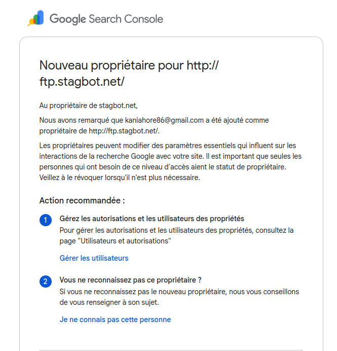
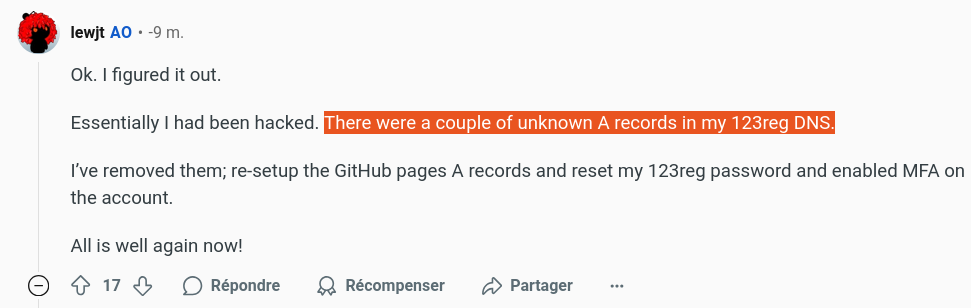
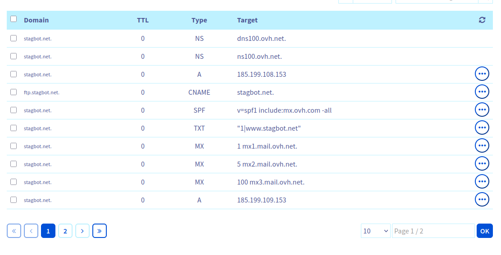
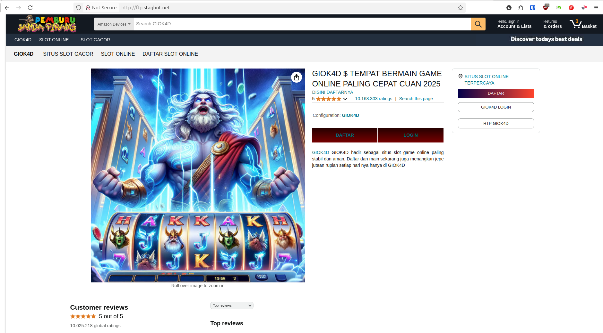

Un peu de contexte avant de vous raconter le hack dont je viens d'être victime et que je viens de découvrir il y a quelques minutes. Une méthode que je n'aurais pas soupçonnée et qui m'a fait sourire, donc je la partage ici :) et... aussi pour ne pas refaire la même erreur plus tard.

Il y a un mois, en juin 2025, j'achète le nom de domaine **stagbot.net**, que je configure pour héberger un site GitHub Pages.

Je l'achète chez OVH, sans hébergement, ne change rien de la configuration DNS par défaut mise à part l'entrée A pour `stagbot.net`, qui pointe maintenant vers **185.199.108.153**, l'adresse IP de GitHub.

Je me rends ensuite vers le repository GitHub associé, configure GitHub Pages et mon site est en ligne en quelques minutes.

---

J'ai reçu aujourd'hui cet email assez étrange de la part de Google:

Je clique sur "Gérer les utilisateurs", et seul mon compte est listé, avec un statut "Propriétaire". Je mets ça de côté.

Quelques heures plus tard, je décide de chercher en ligne, voir si d'autres personnes ont le problème. Toutes réalisent qu'il y a eu un problème de sécurité quelque part, et même si aucune ne semble correspondre à mon cas, jusqu'ici personne ne parle d'un "bug" de Google. Puis, je tombe sur ce commentaire : 

Quelqu'un aurait vraiment réussi à hacker mon compte OVH protégé par 2FA, puis à changer les DNS de mon domaine ? 

Je m'y connecte, puis liste les enregistrements DNS:

Aucun n'a été modifié, donc pas de hack OVH. mais **ftp.stagbot.net** pointe vers **stagbot.net**... qui pointe lui-même vers GitHub! Vous l'avez ? :)

Donc... le hacker:
- a remarqué que **ftp.stagbot.net**, créé par défaut par OVH, pointait vers GitHub Pages (via l'entrée A de `stagbot.net`)
- a créé un repository GitHub puis configuré GitHub Pages avec le nom de domaine **ftp.stagbot.net**
- a été approuvé par GitHub (le domaine pointant bien vers chez eux et n'étant pas déjà configuré...)
- a donc pu afficher n'importe quoi sur **ftp.stagbot.net**
- a donc pu afficher un script Google pour valider la propriété du sous-domaine.

Franchement, bien joué. 😂

Il n'est heureusement pas possible de faire grand chose sur la Search Console (mis à part désindexer le sous-domaine, ce qu'il n'avait pas intérêt à faire étant donné qu'il s'en sert pour référencer son propre site de scam)...!

