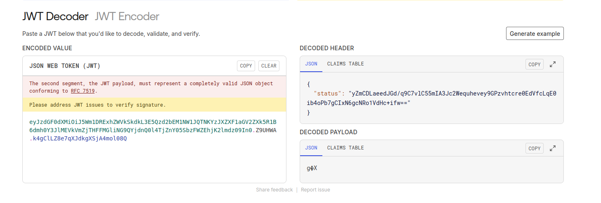
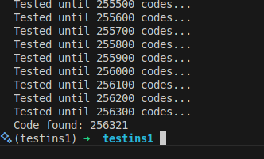

Un write-up du challenge Unchained du CTF Insomnihack, lequel a lieu tous les ans au Swiss Tech Center à l'EPFL.

Après 11h de CTF au Swiss Tech Center, il est 5h30 du matin et c'est le moment de l'écrire avant d'oublier :)

Notez que ce write-up n'est absolument pas la façon la plus optimisée de résoudre le problème (j'y ai passé près de 6h!) mais j'espère que mon raisonnement pourra ainsi paraître plus atteignable à d'autres débutants qui n'ont pas encore fait beaucoup de CTF!

## Le challenge

Le sujet, ce simple serveur Python. Une instance est en ligne (avec une `MAIN_KEY` et une `app.secret_key` non connues).

🚩 Notre objectif ? Obtenir la variable d'environnement `os.environ['INS']` (renvoyée par l'endpoint `/secret`).

```python
from base64 import b64encode, b64decode
from Crypto.Cipher import AES
from Crypto.Util.Padding import pad, unpad
from random import randint
import uuid
import os
from flask import Flask, request, session, redirect, url_for
import re
from waitress import serve

app = Flask(__name__)
app.secret_key = ''.join(["{}".format(randint(0, 9)) for num in range(0, 6)])

MAIN_KEY = b"FAKE_KEY"

def gen_userid():
    return str(uuid.uuid4())

def encrypt(data,MAIN_KEY):
    cipher = AES.new(MAIN_KEY, AES.MODE_ECB)
    cipher_text_bytes = cipher.encrypt(pad(data, 16,'pkcs7'))
    cipher_text_b64 = b64encode(cipher_text_bytes)
    cipher_text = cipher_text_b64.decode('ascii')
    return cipher_text

def decrypt(MAIN_KEY, cipher_text):
    rem0ve_b64 = b64decode(cipher_text)
    cipher = AES.new(MAIN_KEY, AES.MODE_ECB)
    decrypted_bytes = cipher.decrypt(rem0ve_b64)
    decrypted_data = unpad(decrypted_bytes, 16, 'pkcs7').decode('ascii')
    return decrypted_data

@app.route("/")
def welcome():
    return '''
    <div style="text-align: center;">
        <h1 style="font-size: 3em; color: #333;">UNDER CONSTRUCTION</h1>
        

    </div>
    <!-- HACKERS HAVE NO CHANCE THIS TIME!!! -->
    '''


@app.route("/status")
def status():
    if 'status' in session:
        plain_text = decrypt(MAIN_KEY, session["status"])
        return f'Logged in as {plain_text}'
    return 'You are not logged in'

@app.route("/secret")
def get_secret():
    plain_text = decrypt(MAIN_KEY, session["status"])
    role = plain_text.split("::")[2]
    if role == 'admin':
        return  os.environ['INS']
    return f'You are a just a {role}. Only admins can see the secret!'

@app.route('/login', methods=['GET', 'POST'])
def login():
    if request.method == 'POST':        
        user_id = gen_userid()

        user = re.sub(r'\W+', '', request.form['username'])

        status_data = user_id + \
        "::" + user + \
        "::" + "guest"

        cipher_text = encrypt(data=status_data.encode('ascii'),MAIN_KEY=MAIN_KEY)
        session['status'] = cipher_text

        return redirect(url_for('status'))
    return '''
            <form method="post">
                <p>
                    <label for="username">Username:</label>
                    <input type="text" id="username" name="username">
                </p>
                <p>
                    <input type="submit" value="Login">
                </p>

                <p> * Note to myself: Password field TBD </p>
            </form>
    '''

@app.route('/logout')
def logout():
    session.pop('status', None)
    return redirect(url_for('status'))

if __name__=="__main__":
    serve(app, host='0.0.0.0', port=80)
```

Cependant, comme on le voit dans `/secret`, le rôle de l'utilisateur est vérifié, et doit être égal à `admin`.

Il faut se connecter avec `/login` en soumettant un `username`, puis la session sera stockée sur le navigateur `${random_user_id}::${username}::{role}`, le tout chiffré avec la clef `MAIN_KEY`!

(`random_user_id` est un uuid donc quelque chose comme `e3482f4e-7970-4da5-8626-15578b78e7a4`).

## Tentative #1 : l'injection de séparateur

Nous avons d'abord tenté de faire l'équivalent d'une injection SQL, ajouter `::` dans le nom d'utilisateur. En effet, soumettre `simon::admin`, si accepté par le serveur, aurait donné `e3482f4e-7970-4da5-8626-15578b78e7a4::simon::admin::guest` et dans l'endpoint `/secret`, `.split('::')[2]` aurait été égal à `admin`!

Malheureusement, il y a une regex vraiment pas cool dans `/login` qui enlève définitivement cette possibilité en n'acceptant uniquement les lettres :(

## Tentative #2 : récupérer la `MAIN_KEY`

Après un bout de temps passé à chercher comment injecter quelque chose dans le formulaire de `/login`, on en est convaincus, on doit chercher autre chose.

On se tourne alors vers la fonction `encrypt`. Celle-ci utilise **AES** en mode **ECB** (aucune idée de ce que c'était jusque-là). On se demande si une faille a volontairement été laissée dans cette fonction `encrypt`, et si cette faille devrait nous permettre de récupérer la `MAIN_KEY`.

Et si oui... pourquoi faire ? Aucune idée pour le moment.

On se tourne alors vers les cookies de session générés par Flask et on trouve ceci :
```
session: "eyJzdGF0dXMiOiJ5Wm1DRExhZWVkSkdkL3E5Qzd2bEM1NW1JQTNKYzJXZXF1aGV2ZXk5R1B6dmh0Y3JlMEVkVmZjTHFFMGliNG9QYjdnQ0l4TjZnY05SbzFWZEhjK2lmdz09In0.Z9UHWA.k4gClLZ8e7qXJdkgXSjA4mol08Q"
```

Clairement, on dirait un JWT (json web token).

En l'insérant dans https://jwt.io, on obtient le résultat suivant :



```json
{
  "status": "yZmCDLaeedJGd/q9C7vlC55mIA3Jc2Wequhevey9GPzvhtcre0EdVfcLqE0ib4oPb7gCIxN6gcNRo1VdHc+ifw=="
}
```

le payload semble être... dans les headers du JWT ? je n'avais jamais vu ça, mais au moins nous sommes en mesure de récupérer le résultat chiffré de la fonction `encrypt`!

En résumé, nous sommes capable d'obtenir la version chiffrée d'un grand nombre d'entrées (mais pas de toutes, parce que le serveur rajoute un ID random devant, et `::guest` à la fin).
C'est déjà bien !

## Tentative cool : utiliser la taille des blocs (1)

En cherchant plus sur le ECB, on se rend compte que son fonctionnement est le suivant :


Chaque bloc de 16 bytes est chiffré indépendamment des autres. C'est utile pour nous ! On sait qu'une fois qu'on a obtenu le chiffré de `::admin`, on pourrait directement le mettre chiffré tel quel dans notre cookie !

## mais... peut-on modifier le cookie ?

Et c'est là que vient le deuxième (mais plus petit) problème : le cookie est signé avec `app.secret_key` (qui est généré aléatoirement à chaque lancement du serveur).

Heureusement, le code ci-dessus nous est donné et on voit que c'est un code à 6 chiffres : seulement 1,000,000 de tentatives (10**6) pour trouver la bonne clef !

Pour ça, il faut arriver à ce que l'attaque soit suffisamment rapide (et notamment, entièrement en locale) et on doit remercier [GioBonvi](https://gist.github.com/GioBonvi/b94278d0519dfa46f96f3de354efe269) pour son script ;)

En récupérant le JWT généré par l'instance live d'Insomnihack, on peut la valider via le script en précisant la clef. On a juste à tester avec toutes les clefs, et c'est bon ! Malheureusement j'ai eu la très bonne idée de faire un script bash qui appelle le script Python, au lieu de faire une boucle dans Python directement ce qui m'a fait perdre un bon bout de temps !

```python
from hashlib import sha1
from flask.sessions import session_json_serializer
from itsdangerous import URLSafeTimedSerializer, BadTimeSignature
from zlib import decompress


def readAndVerifyCookie(cookie, secret_key):
  signer = URLSafeTimedSerializer(
    secret_key, salt="cookie-session",
    serializer=session_json_serializer,
    signer_kwargs={"key_derivation": "hmac", "digest_method": sha1}
  )
  try:
    session_data = signer.loads(cookie)
    #print("The signature is correct!")
    return session_data
  except BadTimeSignature:
    #print(f"The signature is not correct!")
    return None

jwt = "eyJzdGF0dXMiOiJRamo2V3UrZGp0NVRVNXRwa3dqcXoyQmE2WjhRZFJ3ZTFrK2NhdUhtSXN1WjgzSkg5dUpPQVNMSkpnNnZad3FvTWJtNzR3a0VCeWo4Mi8vdzFJVUQ5Zz09In0.Z9SbRw.WS4VqAkE1dPnlUCG5iGAzEdZv2Y"

def check():
  for i in range(1000000):
    if i%100 == 0:
      print(f"Tested until {i:06d} codes...")
    if readAndVerifyCookie(jwt, f"{i:06d}") is not None:
      print(f"Code found: {i:06d}")
      exit(0)

check()
```



et voilà ! Nous pouvons maintenant injecter des cookies signés !

On teste avec un payload `status` non signé (mais toujours chiffré !), on le signe et on le met en tant que cookie et ça passe !

## Suite : utiliser la taille des blocs (2)

Maintenant qu'on peut injecter des cookies signés... quel payload mettre ?

Nous ne savons toujours pas comment chiffrer `id::me::admin` pour le metter dans le cookie. Pour ça, on teste de se login sur l'instance en ligne avec les valeurs suivantes puis on récupère les cookies :

- `e3482f4e-7970-4da5-8626-15578b78e7a4::aaaaaaaaaaadmin::guest` (pour que `admin::guest` commence à un nouveau bloc de 16 bytes)
    ```
    \xd7\xf8 \xd7\xb8\x92Y\xb7L\x8e\xea3',\t\xc0Q\x1c\x9e(jg~\x12\x15\xb2\x98\x87\x19\xc9,\xd1D\xf0\\\xd7\x11\xaa\x9f8t\xe3\x9a\x02\xe75\x81\xe4o\x04\xa9\xd5\x84@\x1c\xb1\x97\xa5\x98\xf2\xf8$\xb9\x12
    ```
- `797d503d-7faa-4d35-b93f-e6e501cc60da::1234567891admin::guest` (qui donne donc la même fin)
    ```
    \xe1\xa6\x02M\x18\xeam\x14\x19K$\xf4^\xcd\x84M\x9e\xea\x8el\x12\xcf\x91B\xec\xa0\xca\xf5\xde3\x16\x08\xe1\x83m\xb7\xa6\x14\xfch\xee\x9c\xd9\x83\xe3\x85\x7flo\x04\xa9\xd5\x84@\x1c\xb1\x97\xa5\x98\xf2\xf8$\xb9\x12
    ```

puis... on teste :
- `052599b1-d2af-461b-8210-151cb212c012::1234567891 admiz::guest` et là, problème ! la fin n'est pas identique !
    ```
    \xc9j#\xcd\x1f\xb3\x94_\xa8\x8f\xf7\xddW\xe2\x07\xcc/\x93\x82\x95\x18L\xfb\xd4s=\xf2\x88\x8c-D\xac\x16\xcc\n\x1a&P\x06\x8b\x98\x8e\xa9\x86\x14\xb40\x89\xf5D0'\x15{\xa1\xcf%c\xe1\x12\x13\xed\xb2\xc2
    ```

Jusqu'ici, nous pensions que le ECB faisait une sorte de XOR entre la clef et le bloc en clair, mais en fait non, encoder 1234567890 et 1234567891 sera parfaitement différent (même au début). On peut seulement obtenir un bloc de 16 bytes chiffré mais on ne peut pas ensuite le découper en blocs plus petits.
Donc on ne peut donc pas obtenir juste la représentation de `admin` tout seul !

## La fin et résolution

Après (beaucoup de) réflexion, on aboutit à une solution !

- chiffrer `43ebe362-4558-45cc-b0e6-104b989cd8a3::admin::guest` puis récupérer le ème bloc chiffré `d8a3::admin::gue`
- chiffrer `e3482f4e-7970-4da5-8626-15578b78e7a4::aaaaaaaaaaadmin::guest` puis récupérer le 3ème bloc chiffré `e7a4::aaaaaaaaaa`
- remplacer le 3ème bloc chiffré de `43ebe362-4558-45cc-b0e6-104b989cd8a3::admin::guest` par le 3ème bloc chiffré de `e3482f4e-7970-4da5-8626-15578b78e7a4::aaaaaaaaaaadmin::guest`
- puis ajouter le 3ème bloc du chiffré de `43ebe362-4558-45cc-b0e6-104b989cd8a3::admin::guest`!

Cela donne les résultats suivants :

- `43ebe362-4558-45cc-b0e6-104b989cd8a3::admin::guest`
- puis `43ebe362-4558-45cc-b0e6-104b989ce7a4::aaaaaaaaaa`
- puis `43ebe362-4558-45cc-b0e6-104b989ce7a4::aaaaaaaaaad8a3::admin::gue`

et voilà ! on obtient bien `admin` en position 3 du chiffré, et on peut le mettre dans le cookie signé !

## Qui est le "nous" ?

Je n'ai pas fait ça tout seul, merci au nous de l'équipe soit Valerio, Laura, Marin, Adrien, baribal02, lynx8511 et zookafoob :)
