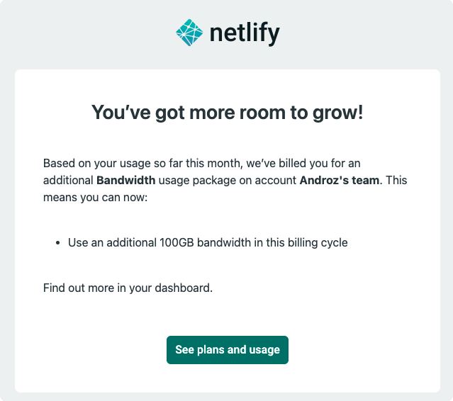

Créer un site web rapidement est de plus en plus simple. Grâce à React, Svelte ou encore Vue, il est possible de créer un site assez complexe en quelques heures. Mais une fois celui-ci achevé, il nous faut trouver un moyen de l'héberger sur un serveur, et c'est là où il faut faire le bon choix.

> Cet article est centré sur Netlify mais s'applique également aux autres services cloud basé sur le pay-as-you-go (vous payez ce que vous consommez), tels que Firebase. Vous ne choisissez pas ce que vous consommez, et par conséquent, ce que vous payez.

### Netlify, la solution toute trouvée... 

En tant que développeur, Netlify peut sembler une excellente solution. En effet, c'est un outils formidable pour publier des sides-projects facilement, **sans avoir à gérer un serveur virtuel privé (VPS)**, et, surtout, **sans avoir à build et déployer l'application manuellement** à chaque modification (Netlify fait le déploiement après chaque commit sur GitHub, automatiquement). Le tout **gratuitement**.

C'est donc pour cela que j'ai personnellement déployé sur Netlify, au fil des mois, un premier site, puis un deuxième et maintenant une vingtaine de petits sites sur mon compte Netlify. C'est très pratique, j'ai accès à un tableau de bord avec tous les déploiements, je peux tout gérer avec une interface très simple sans avoir à gérer quoi que ce soit sur mon propre serveur. La solution rêvée.

### ...sauf si vous prévoyez des vacances.

Juin 2021. Une quinzaine de jours de vacances pendant lesquels je décide de me déconnecter presque entièrement de tous mes réseaux sociaux "pro". Je venais alors de déployer la v2 de [Discord Data Package Explorer](https://ddpe.androz2091.fr), hébergée sur Netlify. Aucun risque de crash de VPS, de problème de configuration Apache ou quoi que ce soit, je pouvais partir en paix en laissant Netlify s'occuper du reste.

Vous devinez bien que tout ne s'est pas passé comme prévu.

Après quelques jours, j'ai reçu ce mail, puis un autre et... encore un autre. Au total, Netlify m'a facturé trois forfaits de 100GB de bande passante à 20€ l'unité **en deux semaines**. Il se trouve que plusieurs tiktokers ont réalisé des vidéos sur mon site, et que celui-ci (pendant à peu près une semaine), s'est retrouvé avec plusieurs centaines de milliers de requêtes par jour, entraînant le dépassement de la limite gratuite de 100Gb définie par Netlify.

J'ai la capacité de payer les 60€ facturés par Netlify. Mais que serait-il advenu pour un temps de déconnexion de deux ou trois mois et que le site avait continué à bénéficier d'une audience aussi importante ? La facture peut rapidement dépasser les 100 ou 200 euros (voire beaucoup plus...) par mois.

C'est pour cela que selon moi, vous devez **être extrêmement vigilant** en utilisant Netlify (et toutes ces solutions, même Cloudflare Pages, dont vous devenez vite dépendants...), et en réalité, chercher à l'éviter un maximum. Car ce n'est pas vous qui choisissez ce que vous payerez à la fin du mois et Netlify ne viendra pas attendre gentiment une confirmation de votre part. Et la note peut en conséquent s'avérer très, très salée. 

### Une meilleure solution ?

Il n'existe pas de solution miracle qui vous permettent de déployer vos applications gratuitement et aussi facilement que le fait Netlify. Cloudflare Pages est un peu similaire et ne dispose pas de limite de bande passante ni d'auto-facturation. Cependant, leur service venant d'être créé, je ne doute pas du fait que cela change un jour pour un système de facturation tel que celui utilisé par Netlify, en fonction de ce que vous consommez.

La meilleure solution reste probablement de gérer cela soi-même, avec un VPS et un système de hooks (une action est effectuée quand un commit est créé, entre autre le build et le déploiement de votre application). La configuration est clairement plus longue, mais cela vaut, je pense, le coup. Prenez ce temps et gardez votre argent.

N'hésitez pas à m'envoyer vos suggestions d'alternatives à Netlify sur [Twitter](https://twitter.com/androz2091) ou [Discord](https://androz2091.fr/discord) ! 
