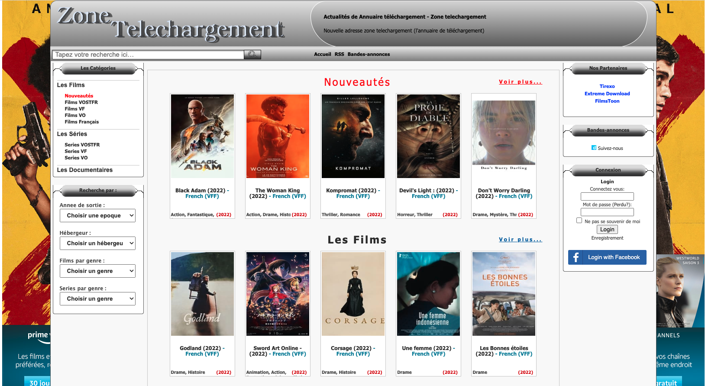
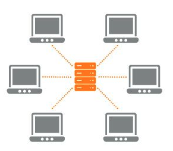
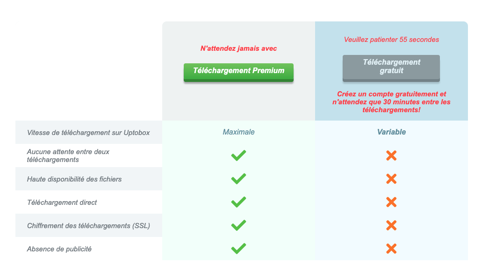
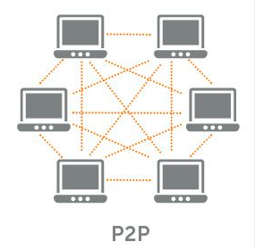
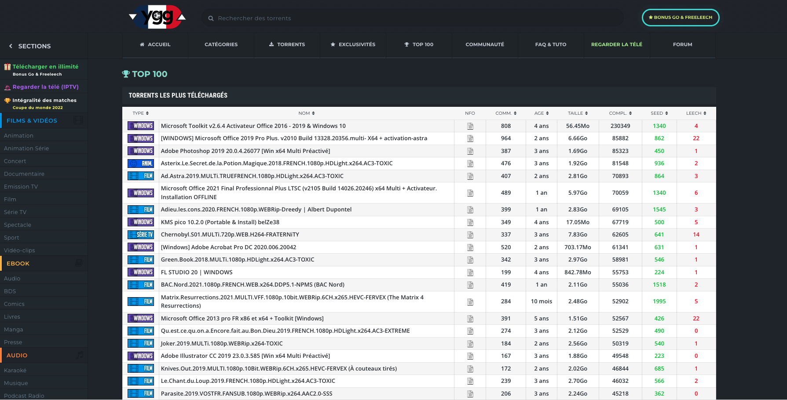
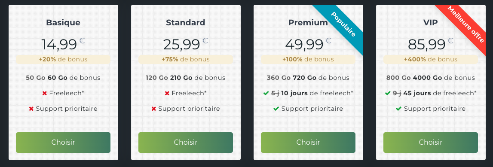

20h00. « On se télécharge Avatar ce soir ? »  
20h04. Le film piraté se lance en HD, audio et sous-titres impeccables dans toutes les langues... sans un seul centime reversé aux ayants droit.

Cet article me permet de rassembler les quelques connaissances que j'ai pu accumulé dans ce domaine après de nombreuses recherches et détailler comment une telle situation est désormais possible en quelques clics, sans aucun risque de poursuite. Cette situation n'est évidemment pas souhaitable de mon point de vue et il d'autant plus important de comprendre comment nous en sommes arrivés là pour y trouver des solutions.

Il y a deux moyens principaux utilisés pour télécharger des fichiers sur internet, le **téléchargement direct** et le **téléchargement pair à pair** (P2P). Et les deux sont utilisés pour partager des films en ligne. Nous allons voir, dans les deux cas, le fonctionnement et le modèle économique qui se cache derrière.

## Obtenir les fichiers en téléchargement direct

### Fonctionnement ⚙️

Le téléchargement direct est très simple. Supposons qu'un pirate, que l'on appelera Adrien, ait acheté le DVD d'Avatar. Adrien va extraire le contenu du DVD sur son ordinateur et l'envoyer sur un cloud (comme Google Drive, Dropbox, etc.).

Ensuite, Adrien va poster le lien de téléchargement sur **un site de référencement de films piratés**. Il existe beaucoup de sites web de ce type comme Zone Téléchargement, Extreme Download ou HDEncode.

En cliquant sur un film, vous obtenez une page comme celle-ci :

Chaque lien vous redirige vers un **site d'hébergement**, sur lequel vous pouvez télécharger le film. C'est un téléchargement **direct**, entre vous et le serveur du site d'hébergement.

(en orange le site d'hébergement, comme Google Drive, et en gris les utilisateurs qui téléchargent le film d'Adrien)

### Modèle économique 💰

Il y a donc trois acteurs ici :
* **Adrien**, le pirate qui dispose du film original
* **le site de référencement** des films piratés avec leurs liens
* **les sites d'hébergement** qui stockent le film

Adrien, d'abord, ne gagne rien. Adrien fait généralement ça par plaisir sur son temps libre, pour se sentir intégré et valorisé dans sa communauté de pirates. Un pirate qui partage un film rare est remercié par des milliers de personnes sur les sites de référencement.

**Le propriétaire du site de référencement**, par contre, touche de l'argent grâce aux publicités affichés sur son site. Des millions d'utilisateurs le visitent chaque jour, générant des **revenus publicitaires** très importants.

**Les sites d'hébergement** de films piratés ont un très faible débit gratuitement, et une limite maximum de téléchargements par jour. En effet, ce sont ces sites qui utilisent **leur espace de stockage et leur bande passante** coûteuse pour permettre aux milliers d'utilisateurs de télécharger le film.

Ici, l'offre premium d'un site d'hébergement (Uptobox).

> Certains services comme [Alldebrid](https://alldebrid.com/) permettent de télécharger des fichiers sur tous les sites d'hébergement sans limite de débit et sans limite de téléchargement pour un faible coût. Ils achètent des comptes premium sur tous les sites et revendent l'accès moins cher.

### Et la loi ? 🚔

**Le téléchargement direct n'est jamais légal... mais vous ne pourrez jamais être poursuivi**. En effet, le téléchargement se déroule entre vous et le site d'hébergement uniquement. **Pas besoin de VPN**, impossible pour Hadopi (*Haute Autorité pour la diffusion des oeuvres et la protection des droits sur internet*), de surveiller ce trafic.

Par contre, les coupables aux yeux de la loi sont les propriétaires des sites de référencement. Régulièrement, leur nom de domaine est banni par les FAI (*Fournisseurs d'accès à internet, comme Orange*), leur adresse change donc souvent.

### En résumé, le téléchargement direct

Ainsi :
* le téléchargement est dit **direct** car il se fait entre vous et le site d'hébergement
* il est donc **impossible d'être poursuivi** par Hadopi
* les sites d'hébergement essaieront tous de vous vendre un **offre payante** pour télécharger plus vite et plus souvent
* les sites de référencement **changent souvent d'adresse** car bannis par les FAI

Grâce à AllDebrid, vous pouvez donc télécharger n'importe quel film sans aucun risque de poursuite pour 3€ par mois en téléchargement direct. Cependant, ce n'est pas la méthode la plus efficace et utilisée.

## Obtenir les fichiers en téléchargement pair à pair

### Fonctionnement ⚙️

Le téléchargement pair à pair est un peu plus compliqué. Supposons qu'un pirate, que l'on appelera Adrien, ait acheté le DVD d'Avatar. Adrien va extraire le contenu du DVD sur son ordinateur. Il va ensuite autoriser d'autres pirates à venir sur son ordinateur pour télécharger le fichier.

Chaque pirate va faire de même, télécharger le fichier sur son ordinateur et autoriser d'autres pirates à venir le télécharger. Ainsi, au bout de quelques partages, tout nouveau pirate souhaitant télécharger le film va pouvoir l'obtenir de dizaines de pirates en même temps, ce qui rend le téléchargement **très fiable, et très rapide**.

Comme pour le téléchargement direct, des sites de référencement sont mis en place pour permettre aux pirates de trouver les fichiers « torrents », chaque fichier torrent permettant de rejoindre le réseau de téléchargement pour un fichier.

### Modèle économique 💰

Et ici... Adrien ne gagne toujours rien.

Les sites de référencement sont les seuls à gagner de l'argent, et mettent généralement en place un système de ratio. N'avez-vous pas pensé tout à l'heure, « et si le pirate télécharge seulement le film sans laisser son ordinateur ouvert pour les prochains ? », c'est parfait pour lui, non ?

Seulement, dans ce cas, le film n'est plus partagé par personne. D'où le principe de ratio : **vous devez envoyer une quantité de données identique à celle ce que vous téléchargez**.

Sinon, votre compte est désactivé et vous ne pouvez plus rejoindre le réseau. Sauf... Sauf si vous payez.

Pour une quinzaine d'euros, vous pouvez ainsi télécharger jusqu'à 60 Go sans ne rien repartager.

> Le repartage ou non n'est pas forcément un choix. Certains pirates disposent d'une faible connexion internet et, ainsi, ne peuvent pas télécharger sur les sites de torrent avec un système de ratio.

### Et la loi ? 🚔

**Le téléchargement pair à pair pour du contenu piraté est illégal, et vous pouvez facilement être poursuivi**. C'est ici que le VPN est utile. En effet, il suffit que l'équipe de Hadopi rejoigne le réseau P2P pour vous identifier grâce à votre IP et vous envoyer un courrier. Cacher son IP derrière un VPN permet d'éviter une telle chose.

Comme pour les sites de référencement du téléchargement direct, les sites de référencement du téléchargement pair à pair changent souvent d'adresse car bannis par les FAI.

### En résumé, le téléchargement pair à pair

Ainsi :
* le téléchargement est dit **pair à pair** car il se fait entre vous et les autres pirates
* il est donc **possible d'être poursuivi par Hadopi** si vous n'utilisez pas de VPN car ceux-ci peuvent infiltrer le réseau
* le téléchargement est **plus rapide et plus fiable** que le téléchargement direct
* les sites de référencement mettent généralement en place un **système de ratio** vous obligeant à repartager les films
* les sites de référencement **changent souvent d'adresse** car bannis par les FAI

Avec une bonne connexion pour pouvoir repartager les films et un VPN, vous pouvez télécharger n'importe quel film grauitement en téléchargement pair à pair.

## Conclusion

Le **téléchargement direct** est une méthode très **simple et non dangereuse lorsque l'on connait les sites**. Le **téléchargement pair à pair** est plus **efficace, plus rapide** et peut être utilisé dans des cas plus complexes (comme l'ouverture **d'un serveur Plex** pour lire les contenus).

Une véritable **économie du piratage** s'est mise en place. Les sites de référencement et d'hébergement sont de grosses entreprises, tournant à plein régime et générant des revenus colossaux à coup de publicité, abonnements payants pour télécharger du contenu illimité et rapidement dont les clients sont les pirates.

Ces sites font donc tout leur possible pour démocratiser le piratage des contenus, pour ramener du trafic et les revenus qui suivent. 

20h15, votre film vous attend :)
