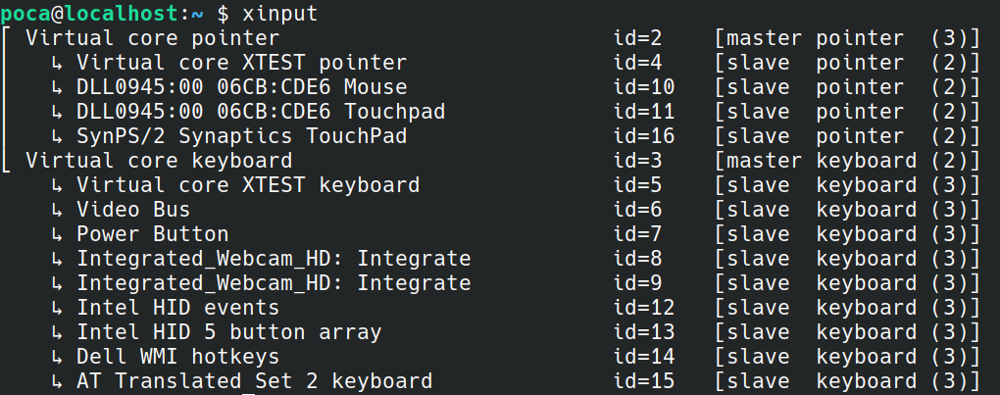
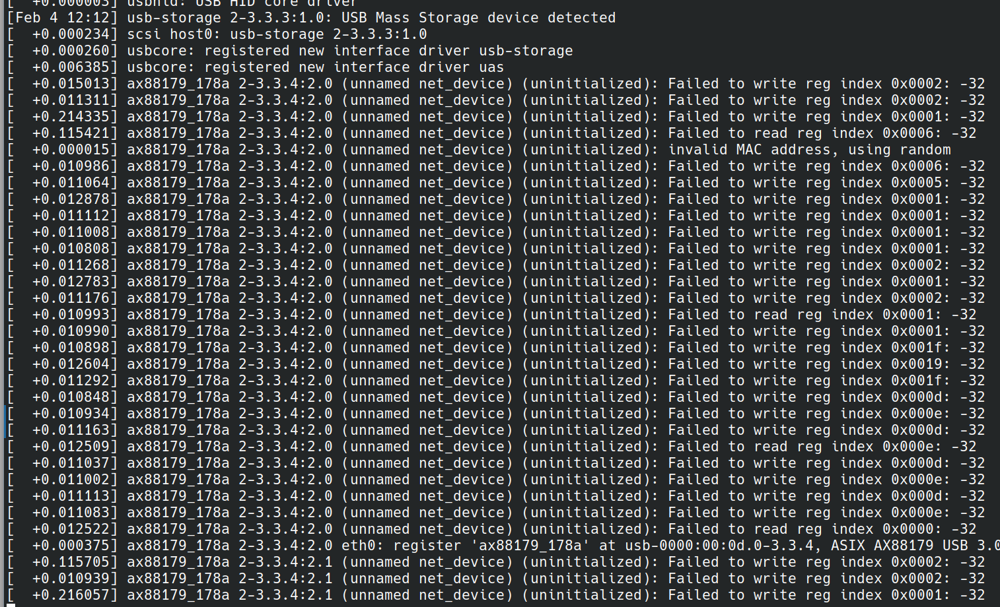

Après avoir passé plus de 6 mois sur Ubuntu, j'ai décidé après avoir rencontré [picnixz](https://github.com/picnixz) (qui m'a bien aidé :) de migrer vers openSUSE.

Cet article me permet de noter les différents patches/bugs/scripts utiles que je rencontre (beaucoup) pour pouvoir m'en souvenir plus tard (et peut-être plus tard mon avis sur la distrib).

**Note : ces patches fonctionnent pour mon ordinateur Dell XPS 13 9310**.

## Patch 1 : natural scrolling (sur x11)

Le natural scrolling de mon touchpad se désactivait aléatoirement après quelques restarts. Il était impossible de le réactiver via l'interface de settings d'openSUSE.



Solution :
* récupérer le nom de l'input du touchpad avec `xinput`
* ajouter cette ligne dans le `.profile`:
```
xinput set-prop "DLL0945:00 06CB:CDE6 Touchpad" "libinput Natural Scrolling Enabled" 1
```

## Patch 2 : faire fonctionner les hauts-parleurs

Les hauts-parleurs ne fonctionnaient pas (le son était en mute forcé).

Solution :
* mettre à jour le système avec `sudo zypper update`
* installer sof-software avec `sudo zypper install sof-software`

## Patch 3 : faire fonctionner mes écouteurs bluetooth

Mes écouteurs bluetooth n'apparaissaient pas dans la liste des devices audio disponibles.

Solution :
* mettre à jour le système avec `sudo zypper update`
* installer pipewire-pulseaudio avec `sudo zypper install pipewire-pulseaudio`

## Patch 4 : faire fonctionner mon hub USB

J'ai acheté [cet hub USB](https://www.amazon.fr/dp/B0CHXZYSMG). Sauf qu'en le branchant, openSUSE freeze complètement et plus rien ne fonctionne.



Le problème était dû au port Ethernet présent sur le hub USB qui n'était pas compatible avec mon ordi. Le blacklister permet de faire fonctionner le reste des ports du hub.

Solution :
* debugger avec `sudo dmesg -w -H` (`-w` pour follow comme ça on peut voir les logs avant le freeze, `-H` pour un affichage lisible).
* repérer le port qui pose problème (ici `ax88179_178a`).
* créer un fichier `/etc/modprobe.d/blacklist-ax88179_178a.conf`
* écrire `blacklist ax88179_178a`
* redémarrer.

## Patch 5 : lecture de vidéos sur Firefox

Les vidéos se lisent mal sur Firefox :


Certaines vidéos YouTube sont fluides mais d'autres non. Même chose sur Discord, les attachments ne se lisent pas tout le temps.

Solution : not found yet :(

## Tip 1 : script pour améliorer le shell

Ce script dont je ne suis pas l'auteur permet d'améliorer l'interface du shell en ajoutant la branche git courante, le code de statut de la dernière commande exécutée, etc.

Ce script doit être ajouté dans le `.bashrc`.

```bash
# PS1 changes (with git branches)
parse_git_branch() {
    if [[ `git branch 2>/dev/null` ]]; then
        local bname
        bname=$(git branch --no-color 2> /dev/null | sed -e '/^[^*]/d' -e 's/* \(.*\)/\1/')
        local rname
        rname=$(git remote 2>/dev/null)
        if [[ $rname =~ 'origin' ]]; then
            printf '(%s)\n' "$bname"
        else
            printf '(%s:%s)\n' "$rname" "$bname"
        fi
    fi
}

update_PS1() {
  if test $? -eq 0 ; then
      local status_=""
  else
      local status_="\001\033[33m\002($?)\001\033[00m\002 "
  fi
    
  local username_="\001\033[01;32m\002\u\001\033[00m\002"
  local hostname_="\001\033[01;32m\002\h\001\033[00m\002"
  local location_="\001\033[01;34m\002\w\001\033[00m\002"

  local branch_="$(parse_git_branch)"
  if test -z "$branch_" ; then
      branch_=" "
  else
      branch_=" \001\033[38;5;1m\002${branch_}\001\033[00m\002 "
  fi  
    
  local prefix_=""
  if ! test -z "$VIRTUAL_ENV" ; then
      prefix_="\001\033[38;5;9m\002[`basename \"$VIRTUAL_ENV\"`]\001\033[00m\002 "
  fi

  export PS1="${prefix_}${username_}@${hostname_}:${location_}${branch_}${status_}\$ "
}

shopt -u promptvars
PROMPT_COMMAND=update_PS1
```
