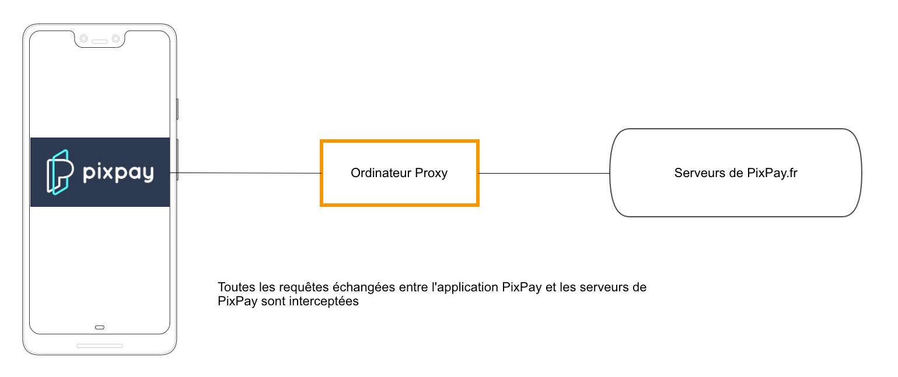
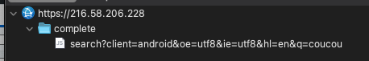

Bonjour à tous. Dans ce premier post sur ce blog, je vais détailler l'ingénierie inversée (reverse engineering) de l'application PixPay, une néo-banque française.

Cet article me sert à la fois de notes dans le cas où j'aurais à faire de nouveau cela avec une autre application, et à la fois de tutoriel pour que vous puissiez (peut-être) apprendre quelques petites choses !

Dans ce post, j'utiliserai [Charles Proxy](https://charlesproxy.com), [ProxyDroid](https://play.google.com/store/apps/details?id=org.proxydroid), un Android 7.0 rooté (en fait un Samsung J3 2016 Android 5.0 avec une ROM Android 7.0) et [Frida](https://frida.re). 

## Reverse engineequoi ?

L'ingénierie inversée (reverse engineering en anglais) consiste à étudier la façon dont a été conçue une application, souvent pour pouvoir automatiser certaines actions de l'application avec du code. Un petit exemple parlant, si on comprend comment fonctionne Instagram, on peut parvenir à publier automatiquement des posts avec un script.

## Pourquoi avoir choisi PixPay ?

Après avoir déjà fait un peu d'ingénierie inversée avec l'application Pronote, je voulais me familiariser un peu avec Charles Proxy et tous ces outils. Intercepter les requêtes de l'application n'aurait du me prendre qu'une petite heure mais comme vous allez le voir, cela s'est avéré un peu plus ardu. J'ai choisi PixPay par curiosité pour ces "néo-banques" et parce que c'est une des seules qui n'a pas déjà été étudiée.

## Intercepter les requêtes

Bon, maintenant que j'ai choisi l'application, PixPay, il faut trouver un moyen de comprendre comment elle fonctionne, et plus exactement comment fonctionne son API privée. Par exemple, pour s'inscrire il faut peut-être envoyer une requête à `https://api.pixpay.fr/auth/register` avec comme paramètre un numéro de téléphone et un mot de passe. Le problème, c'est que je ne peux pas tester toutes les requêtes imaginables (`/auth/register`, `/register`, `/appregister`...) en testant avec différents noms dans les formulaires. Ce serait beaucoup trop long et n'aurait que peu de chance de succès.

Pour cela, le plus simple est donc de lancer l'application sur son téléphone et de connecter son téléphone à un **serveur proxy** (ici mon ordinateur), qui va intercepter toutes les requêtes partant du téléphone. Voilà un petit schéma :



Comme toutes les requêtes entre l'application et l'API sont interceptées, cela va me permettre de trouver toutes les URLs (`endpoints`) de l'API en naviguant simplement sur l'application.

## Lançons Charles Proxy

Pour cela, j'ai décidé d'utiliser Charles Proxy, un logiciel qui nous permet de lancer un serveur proxy sur un ordinateur pour m'y connecter avec mon téléphone. Il y a de nombreux tutoriels sur Google, mais en résumé :
* téléchargez Charles sur https://www.charlesproxy.com/ (de nombreux cracks existent, sinon $20 à vie)
* lancez Charles
* dans les paramètres Wifi de votre téléphone, configurer un proxy avec comme `host` l'adresse IP locale de votre ordinateur et comme pot `8888`
* dans les paramètres de Charles > SSL Proxying, ajoutez un domaine `*`.
* ouvrez un navigateur et tapez `https://chls.pro/ssl` pour télécharger le certificat SSL de Charles puis installez-le sur votre téléphone (en cliquant sur le fichier téléchargé)

Une fois Charles et votre téléphone configurés, vous pouvez essayer de faire une recherche Google, vous verrez que celle-ci apparaitra dans Charles.



## Flutter, le framework Android... qui ne suit pas les paramètres Android

Voilà, maintenant je devrais pouvoir lancer PixPay et voir les requêtes ! Sauf que... non. Je lance PixPay et **aucune** requête à l'API ne s'affiche. Pas d'erreur, rien n'est juste affiché dans Charles. La réponse, que j'ai fini par trouver après un moment : PixPay utilise **[Flutter](http://flutter.dev/)**, un framework de développement pour applications Android (que j'ai d'ailleurs utilisé pour mon appli [Notifications pour Pronote](https://github.com/pronote-notifications/pronote-notifications-app)). Et ce framework n'utilise pas le proxy configuré dans les paramètres Wifi du téléphone. Génial.

## Forcer l'utilisation de notre proxy

Pour pallier ce problème, j'ai utilisé ProxyDroid. C'est une application qui vous permet de forcer l'utilisation d'un proxy sur le téléphone. Évidemment, cette appli a besoin du root pour fonctionner. Une semaine plus tard, je récupère un vieux Samsung S4 Mini (Android 4) que j'avais rooté. J'essaye de faire l'installation avec ADB et... ça ne fonctionne pas. L'application nécessite Android 5 pour fonctionner. Je récupère donc un vieux Samsung J3 2016. Il ne reste plus qu'à le rooter... Je vous passe les détails mais après quelques heures passées en vocal avec [@kaki87](https://github.com/kaki87), que je re-remercie infiniment, mon J3 est rooté avec Magisk et XPosed (et une ROM custom, resurrection remix, sous Android 7).

## SSL handshake failed.

Bon, on relance PixPay maintenant. Et ça ne fonctionne toujours pas. "SSL handshake failed" dans Charles.


### Certificat système 

J'ai d'abord essayé de déplacer le certificat de Charles des certificats utilisateurs vers les certificats systèmes mais Flutter... ne fait même pas confiance aux certificats systèmes. 🙂

### SSL Pinning

En résumé, l'application utilise une protection de type SSL Pinning. Pour les curieux, [Micode](https://www.youtube.com/watch?v=AzhnqtQKKHM) explique très bien ce que c'est dans sa vidéo. Pour contourner cette protection nous avons 3 solutions :
* "décompiler" l'APK pour extraire les fichiers smali et trouver le pin SSL pour le remplacer par celui de Charles
* utiliser un module XPosed comme [JustTrustMe](https://github.com/Fuzion24/JustTrustMe) ou [TrustMeAlready](https://github.com/ViRb3/TrustMeAlready)
* utiliser [Frida](https://frida.re/)

Après avoir essayé 4-5 plugins Magisk il faut se rendre à l'évidence, ces plugins Magisk "universels" ne fonctionneront pas avec PixPay. J'ai aussi essayé de décompiler l'APK, mais impossible de trouver de pin SSL (même si c'est peut-être possible).

Je tombe alors sur [un très bon article](https://blog.nviso.eu/2019/08/13/intercepting-traffic-from-android-flutter-applications/) qui utilise Frida. Pour installer Frida :
* si vous possédez Magisk, il existe [MagiskFrida](https://github.com/AeonLucid/MagiskFrida) qui vous fait l'installation automatiquement
* sinon, suivez [ce tuto](https://frida.re/docs/android/)

Je créé le fichier `frida.js`:
```js
function hook_ssl_verify_result(address){
  Interceptor.attach(address, {
    onEnter: function(args) {
      console.log("Disabling SSL validation")
    },
    onLeave: function(retval) {
      console.log("Retval: " + retval)
      retval.replace(0x1);
    }
  })
}

function disablePinning(){
  const m = Process.findModuleByName("libflutter.so")
  const pattern = "2d e9 f0 4f a3 b0 82 46 50 20 10 70"
  const res = Memory.scan(m.base, m.size, pattern, {
    onMatch: function(address, size){
      console.log('[+] ssl_verify_result found at: ' + address.toString())
      hook_ssl_verify_result(address.add(0x01))
    }, 
    onError: function(reason){
      console.log('[!] There was an error scanning memory')
    },
    onComplete: function(){
        console.log("All done")
    }
  })
}

setTimeout(disablePinning, 1000)
```

Ce script est très intéressant, je vous invite à lire [ceci](https://blog.nviso.eu/2019/08/13/intercepting-traffic-from-android-flutter-applications/) pour comprendre comment il fonctionne.
Je lance alors `frida -U -f fr.pixpay -l frida.js --no-pause`, puis lance PixPay et là... 


Ça fonctionne. J'ai maintenant accès à l'intégralité des requêtes qui partent de PixPay vers son API !

Nous avons donc une première requête pour la connexion vers `https://prod-auth.pixpay.app/auth/login`. Cette requête, si elle réussit, nous renvoie un `token`. 
Toutes les autres requêtes fonctionnent avec GraphQL et l'endpoint `https://prod-bo1.pixpay.app/graphql`, authentifiées avec le `token` récupéré précédemment.

## Créer une librairie JavaScript

Il ne me reste plus qu'à créer un compte, mettre quelques euros dessus et créer une petite lib JS pour le fun en implémentant les endpoints principaux.
La librairie finale est disponible sur **[GitHub](https://github.com/Androz2091/pixpay-api)**!

Merci d'avoir lu jusqu'ici et j'espère que ce post aura pu vous en apprendre un peu plus sur l'ingénierie inversée, des applications Flutter notamment! Je remercie encore une fois [Kaki87](https://github.com/kaki87) qui m'a beaucoup aidé ainsi que l'auteur du script Frida, [Jeroen Beckers](https://blog.nviso.eu/author/dauntless/).
