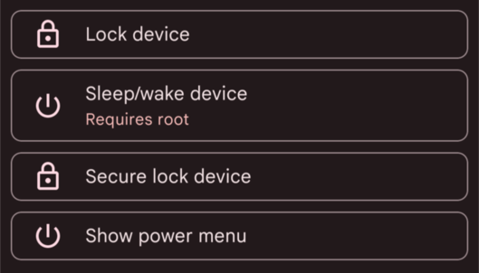
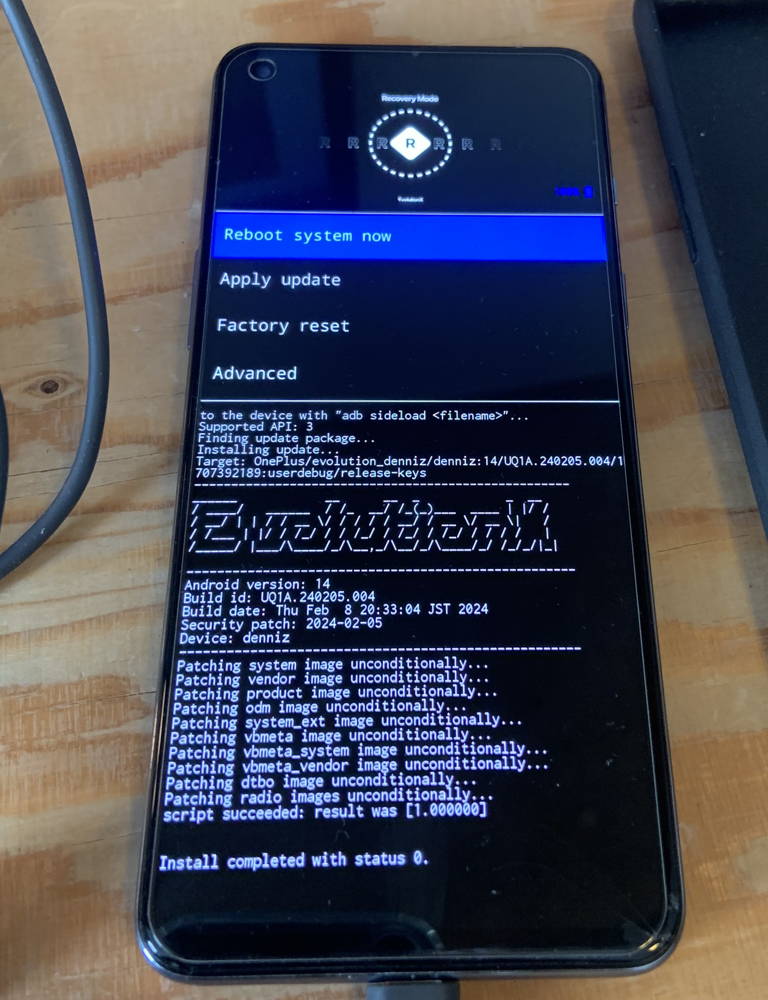
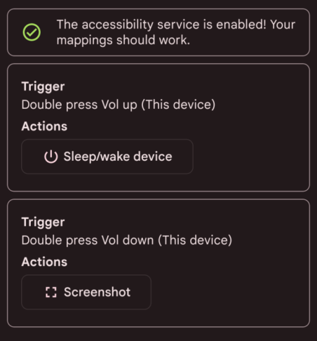

Cela fait maintenant presque 3 mois que mon smartphone est tombé dans une des (bien trop) nombreuses flaques d'eau de la ville pluvieuse qu'est Lausanne.

Résultat : le bouton pour allumer et éteindre le téléphone ne fonctionne plus.

Mais la vie de smartphone n'est pas encore terminée. Le root devrait me permettre de garder actif (en outrepassant les optimisations de batterie) un service de key mapping pour l'allumer et l'éteindre en appuyant deux fois sur le bouton volume haut.

**Capture d'écran de Key Mapper :**



Au moment d'écrire ces lignes, je me demande si je vais pouvoir rooter et accéder au fastboot mode sans que le bouton power ne fonctionne, mais on verra bien !

C'est parti !

J'ai fait le choix de la ROM **Evolution X** (qui me permettra d'accéder à Android 14 au passage), et de **Magisk** pour le root (note : à la fin du post, en bonus, quelques configs utiles avec le root).

## Installer les outils de développement Android

J'en profite pour noter chaque étape du root pour le futur moi qui aura oublié. Je suis sur Linux/openSUSE.

```sh
zypper addrepo https://download.opensuse.org/repositories/hardware/15.5/hardware.repo
zypper refresh
zypper install android-tools
```

## Déverrouiller le bootloader

Dans un premier temps, nous devons **déverrouiller le bootloader**, chargé de vérifier l'intégrité de l'OS installé, puis le lancer.

### Android 13 → 11 → 13 (OnePlus b*shit)

Evidemment... ça ne fonctionne pas. Erreur : `the_serial_is_not_match` / `fastboot_unlock_verify fail`. En fait, le bootloader ne peut plus être déverrouiller après Android 11. Je dois donc chercher un fichier de ROM stock pour un téléphone chinois sorti il y a deux ans. mdr. Après un long moment passé à chercher tout ça, je trouve enfin [ce fichier](https://community.oneplus.com/thread/1596759).

Attention, OnePlus donne un fichier nommé `oplus_ota_downgrade_EU.zip` qu'il faut renommer en `oplus_ota_downgrade.zip` avant de l'installer dans Settings > Update > Local Install.

### Déverrouillage avec ADB et Fastboot

Il nous faut ensuite activer l'option OEM (Original Equipment Manufacturer) Unlock, qui autorise le bootloader à être désactivé.

Bon. Maintenant qu'on est repassé sur Android 11, on peut unlock le bootloader.

Pour ça : `adb -d reboot bootloader`. And it works! J'ai été agréablement surpris que les menus de navigation se fassent avec volume du haut et volume du bas et non le bouton power (heureusement !).

Ensuite, il nous faut redémarrer le téléphone et refaire toutes les mises à jour pour retrouver Android 13.

## Flasher la ROM Custom

Maintenant, il nous faut flasher la ROM Custom. 

J'ai choisi Evolution X, qui reprend la Pixel Experience en ajoutant de nombreuses options sympathiques. Un énorme merci à **lahaina** qui maintient cette ROM pour le OnePlus Nord 2 depuis sa sortie <3

### Démarrer en FastbootD

Il nous faut maintenant:

* démarrer le téléphone avec FastbootD, `adb reboot fastboot`.
* flasher l'image recovery de la ROM, `fastboot flash recovery recovery.img`
* redémarrer en mode recovery
* effacer toutes les données
* cliquer sur "Apply Update", puis "Apply From ADB".
* side loader la ROM avec `adb sideload evolution_denniz-ota-uq1a.240205.004-02092013-OFFICIAL-001.zip`
* rebooter !



C'est assez satisfaisant d'être arrivé jusque-là !

## Flasher Magisk

Maintenant, l'objectif est d'avoir un accès root. Il nous faut donc :

* récupérer le fichier APK de Magisk depuis GitHub
* le renommer en `magisk.zip` pour pouvoir le flasher
* booter en recovery, faire un apply update, apply from ADB
* side loader Magisk avec `adb sideload magisk.zip`
* rebooter !

Note : dans Magisk n'oubliez pas d'ajouter à la deny list les applis comme Fairtiq ou les apps de paiement pour cacher le root.

## Configurer Key Mapper

Key Mapper peut être de nouveau reconfiguré, avec les accès root et voilà !



## Bye bye Play Store...

J'en profite pour reconfigurer mon téléphone un peu mieux qu'avant. Notamment, mon objectif est de ne plus dépendre du Play Store.

Pour cela, j'ai suivi les recommandations de [Kaki87](https://kaki87.net) :)

J'utilise donc...

### Neo Store

Pour la plupart des apps. C'est un client alternatif pour F-Droid.
Elle me permet d'installer:
* Key Mapper
* FastHub RE(vival)
* Aurora Store
* Obtainium
* Element

### Obtainium

C'est une appli qui permet de télécharger directement des apps depuis la source (comme GitHub).
Elle est pratique pour les applis que j'ai envie d'avoir parfaitement à jour.
Elle me permet d'installer :
* Kiwi Browser

### Aurora Store

Celle-ci me permet de télécharger tout le reste. L'avantage du root permet de la faire fonctionner comme Google Play, en installant les MaJ en background.
Elle me permet d'installer :
* Instagram
* Telegram
* Bereal
* etc.
