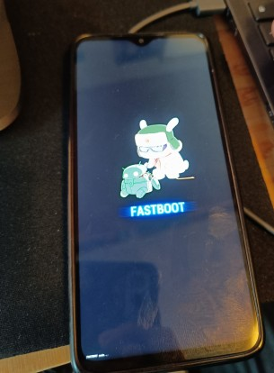
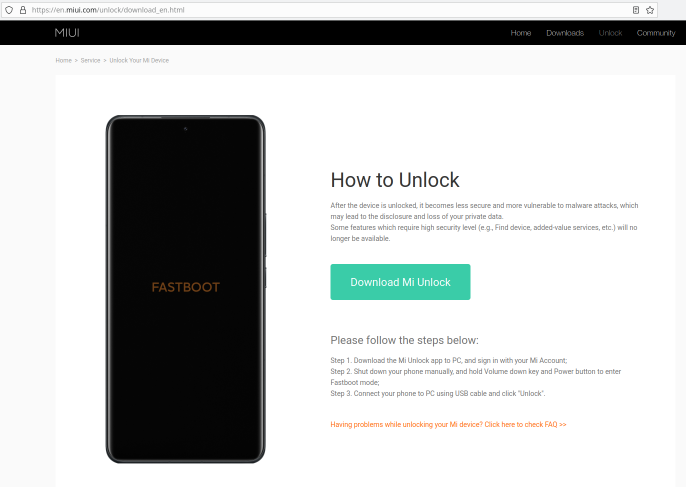
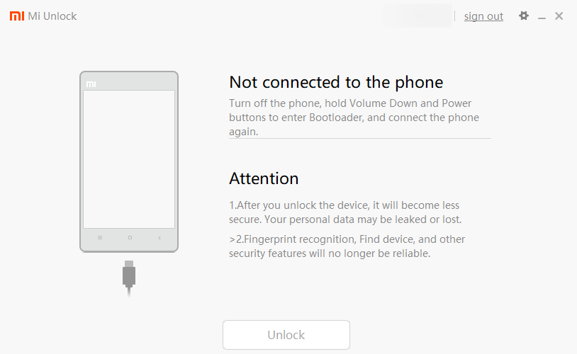
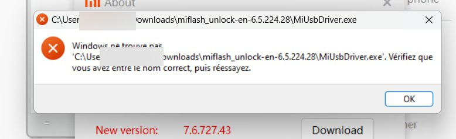
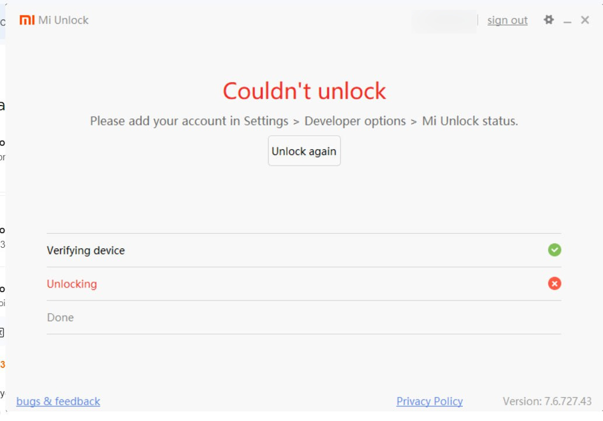
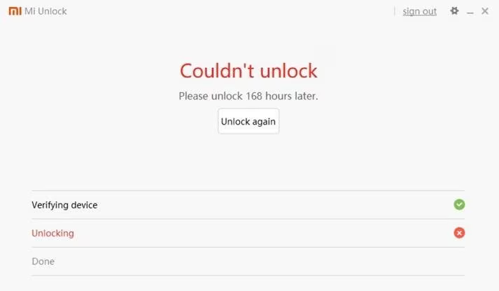

Pourquoi je déteste Xiaomi ? La réponse dans cet article qui explique simplement la procédure que j'ai utilisé et les problèmes rencontrés pour rooter le Xiaomi Redmi Note 8 ;)

(merci à [Emmanuel](https://fr.linkedin.com/in/emmanuel-omont-37ba272a7) d'avoir accepté de rooter son tel)

## Déverrouiller le bootloader

Chez Xiaomi, déverrouiller le bootloader... c'est super pénible.

En gros, 4 étapes :
* activer le débogage USB et l'OEM Unlock et entrer en fastboot
* se créer un compte Xiaomi
* **configurer ce p* de Mi Unlock Tool**
* attendre 168 heures (wtf ?) et recommencer.

### Activer le débogage USB et l'OEM Unlock

Cette étape est courante, il faut activer les options de développeur en appuyant 7 fois sur "Mui version" (et pas version du kernel, ça c'est pour un autre menu).

Ensuite, activer le débogage USB et l'OEM Unlock.

### Se connecter avec son compte Xiaomi

Ici il faut nous créer un compte Xiaomi, puis le lier au téléphone dans "Mi Unlock Status".

### Redémarrer en fastboot

Maintenant, il nous faut redémarrer en mode fastboot. Pour cela, éteindre le téléphone et appuyer sur Volume Down + Power (ou `adb reboot bootloader`). Un communiste en train de bidouiller un Android devrait apparaître.

**Note :** pour sortir du mode Fastboot, il faut appuyer pendant 12-14 secondes sur le bouton power.

### Mi Unlock Tool

Ensuite... il nous faut installer le magnifique outil pour déverrouiller le bootloader, made by Xiaomi, Mi Unlock Tool **a.k.a l'Enfer**.

#### Télécharger la mauvaise version du logiciel

Là, premier problème. Quand on cherche un logiciel développé par Xiaomi, on pourrait trouver cohérent de le télécharger sur le site de Xiaomi. **Erreur**. Le site de Xiaomi apparaît en effet en premier dans les résultats mais il ne permet que de télécharger la version 6.5.

Sauf que lorsqu'on lance la version 6.5, celle-ci nous affiche une pop-up nous demandant de télécharger la version 7.6. Et quand on clique sur le lien, erreur 401. Nice.

Ici, on pourrait se dire que ça marche quand même avec la 6.5, non ? Hehehe.

En fait quand on se connecte avec la 6.5, Xiaomi demande d'ajouter un numéro de téléphone de récupération. Sauf que la 6.5 de leur logiciel ne permet pas de sélectionner le national country code (le dropdown est littéralement pas fonctionnel), donc impossible d'ajouter un numéro.

Une solution logique pourrait aussi être de se dire "Ok, je vais plutôt aller sur le site de Xiaomi officiel en ligne, ajouter un numéro, puis revenir sur l'appli Mi Unlock 6.5". Sauf qu'au moment du test, **impossible** de recevoir un SMS de confirmation depuis leur site. On a essayé avec du +336, du +3306, un autre numéro français en 07. Bref, impossible.

> Fun fact, Xiaomi indique sur son site qu'hors de Chine, seulement 3 codes par SMS par jour. Mdr.

#### Télécharger la bonne version du logiciel (site non officiel wtf)

Bon. On commence par chercher une autre version du logiciel, et on tombe sur [xiaomitools.com](https://xiaomitools.com/mi-unlock-tool-en/), qui propose effectivement la version 7.6 en téléchargement. C'est un site turc absolument pas officiel, mais puisque le constructeur n'est pas foutu de nous donner la bonne version, pas d'autre choix que de passer par là.

Quand on lance le soft, on a la même étape demandant d'ajouter un numéro de téléphone. On entre le numéro (parce qu'ici le dropdown fonctionne, youpi), et... on reçoit le code. Oui oui, donc Mi Unlock Tool non officiel de xiaomitools.com permet d'ajouter un numéro de téléphone de récupération alors que le site officiel de Xiaomi ne le permet pas. WTF ?

Sauf qu'ici... le téléphone n'est pas détecté, même en fastboot. **Le problème**, nous n'avions pas installé les drivers (là c'est clairement de notre faute ;).

Pour les installer, cliquer sur la petite icône paramètre en haut à droite, puis "check".

Notez que sur la version 6.5 fournie par le constructeur, nous obtenons cette erreur :

Il faut donc bien utiliser la version 7.6 pour cette étape.

Et là... it works!

### Relier son compte

Nous avions déjà lié le compte Xiaomi au téléphone, mais le Mi Unlock Tool nous demande de répéter l'opération. Idk why.

Retourner dans les settings du téléphone > Mi Unlock Status > Relier le compte fonctionne.

Et lorsqu'on réessaye d'unlock en fastboot avec Mi Unlock Tool, ça fonctionne ! 

Il n'y a plus qu'à attendre 7 jours... :'(

> ~~**Note :** j'ai trouvé ce soft entre temps qui pourrait fonctionner pour bypass les 168 heures (jamais testé).~~
> ~~https://drfone.wondershare.com/unlock/bypass-168-hours-waiting-time-for-xiaomi-bootloader-unlocking.html~~
> Update: ce soft ne fonctionne plus (18 février 2024 ;)
