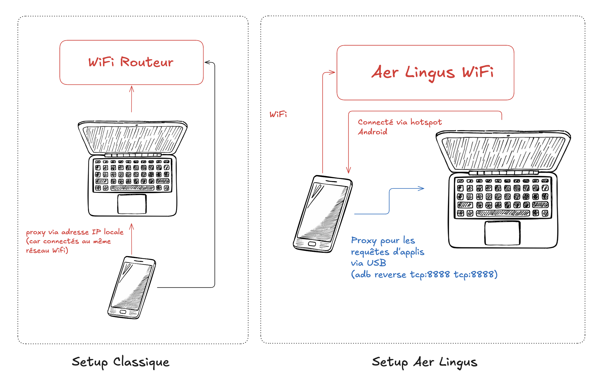
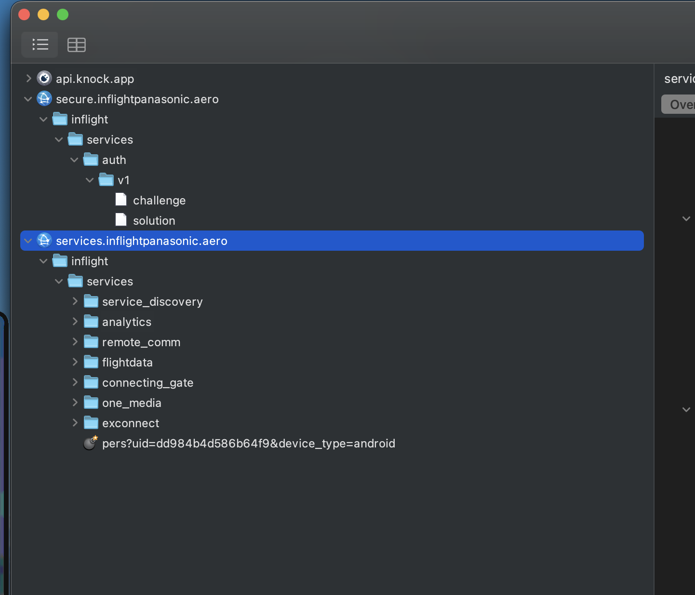
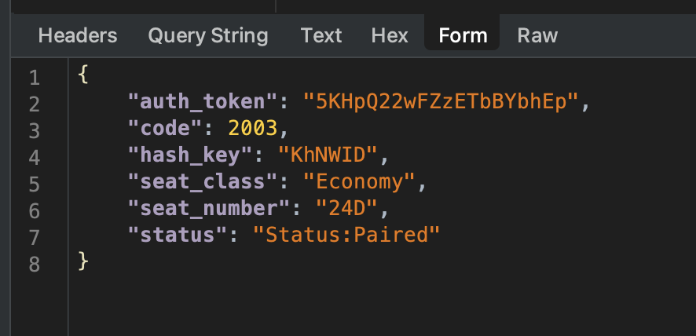
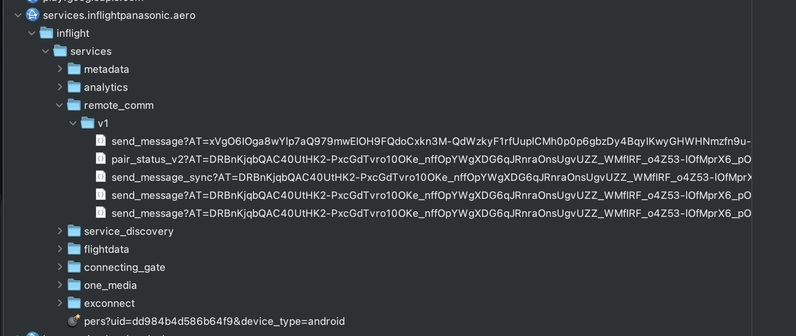

I noticed a few minutes after the takeoff of my flight that the airline Aer Lingus had developed a new mobile app allowing you to control the seat screen remotely on transatlantic flights.

After a long internal debate about whether the entertainment value of reverse engineering their app in-flight was worth the 20 euros for WiFi, I cracked, paid, and downloaded:
- Aer Lingus Play (the app to analyze)
- Frida (a tool to patch APKs live with JavaScript)
- Jadx (an APK decompiler)

The final result is a CLI that allows me to pair with the seat, then send any command to the seat (including calling the flight staff). I also discovered that this app is actually just a wrapper sold by Panasonic to several airlines :)

The CLI:

<video src="/videos/aer-lingus-demo.mp4" controls
  width="100%"></video>
  
What displays on the seat:

<video src="/videos/aer-lingus-demo-screen.mp4" controls
  width="100%"></video>
  
```sh
poca@pocas-MacBook-Pro-2 aer-lingus-play-reverse-engineering % node seat-keyboard.js

    _    _____ ____      _     ___ _   _  ____ _   _ ____
   / \  | ____|  _ \    | |   |_ _| \ | |/ ___| | | / ___|
  / _ \ |  _| | |_) |   | |    | ||  \| | |  _| | | \___ \
 / ___ \| |___|  _ <    | |___ | || |\  | |_| | |_| |___) |
/_/   \_\_____|_| \_\   |_____|___|_| \_|\____|\___/|____/
             github.com/Androz2091/aer-lingus-play-reverse-engineering
             ────────────────────────────────────────────────────────────────

[+] minting AT: via /auth/v1/{challenge,solution}
[✓] AT acquired ([redacted]…)
passcode shown on seat ▸ [redacted]
[+] pairing: tap accept on the seat to confirm…
[✓] paired with seat 24D (Economy) — auth_token=[redacted]

  type text to auto-type. commands:
    /up /down /left /right /select    single key
    /home /back /enter
    /vol+ /vol-  /bri+ /bri-  /light
    /reset        re-zero tracked cursor to (0,0) — when seat cursor is on Q
    /origin       physically drive seat cursor to Q + re-zero
    /letter X     diagnostic: navigate to one char, ENTER, report position
    /unpair       clean up and exit
    /quit         exit without unpairing

seat 24D › /enter
  → { code: 2002, status: 'Message Accepted' }
seat 24D › /left
  → { code: 2002, status: 'Message Accepted' }
seat 24D › /enter
  → { code: 2002, status: 'Message Accepted' }
seat 24D › /enter
  → { code: 2002, status: 'Message Accepted' }
seat 24D › /origin
  cursor → (0,0) [sent 4 DOWN, 3 UP, 10 LEFT]
seat 24D › the smashing
  cursor now at (1,4)
seat 24D › 
```

## Setup Android

The first thing to do is to set up the phone properly and connect it to my computer to analyze the requests on a larger screen with [Charles](https://www.charlesproxy.com/).

Problem: I used to connect my phone to the same WiFi router as my computer, then force my phone to route the app traffic to my computer's local address (then the request would go from my computer to the Internet). But... I paid for WiFi on my phone, so the final request to the Internet **must** come from my phone.



My final setup:
- Connect my phone to Aer Lingus WiFi
- Connect my phone via USB to my computer
- Create a proxy with ADB so that `localhost-android:8888` reaches my computer `localhost-computer:8888` (which is actually Charles)
- Configure the Aer Lingus WiFi in Android to use the proxy `127.0.0.1:8888` (my computer)
- Create an Android WiFi hotspot that I connect to on my computer

Since the proxy is only at the app level, requests coming from devices connected via hotspot are only handled at a lower level (IP) and are sent directly on the Aer Lingus WiFi interface without a proxy! So in summary, for a regular request:
- it starts from my phone
- goes via USB to my computer
- is intercepted and read by Charles
- is sent back from my computer to my phone via WiFi
- then sent directly to the Aer Lingus WiFi!

A few more things remain to be set up after that:
- Download the certificate via `http://chls.pro/ssl`
- Install [MoveCertificate](https://github.com/ys1231/MoveCertificate/releases) to force apps to trust the certificate (from user cert to root cert)

but... despite that, the requests are blocked because the Panasonic app doesn't trust Charles' SSL certificate, even with MoveCertificate. The solution is to patch the app with Frida ([ssl-bypass.js](/aer-lingus-rev/ssl-bypass.js)).

```
poca@pocas-MacBook-Pro-2 platform-tools %  uvx --offline --from frida-tools --with frida==17.9.1 frida -U -f com.aerlingus.ife.companion \
    -l /Users/poca/Documents/platform-tools/ssl-bypass.js \
    -l /Users/poca/Documents/Github/aer-lingus-play-reverse-engineering/dump-airline-key.js
     ____
    / _  |   Frida 17.9.1 - A world-class dynamic instrumentation toolkit
   | (_| |
    > _  |   Commands:
   /_/ |_|       help      -> Displays the help system
   . . . .       object?   -> Display information about 'object'
   . . . .       exit/quit -> Exit
   . . . .
   . . . .   More info at https://frida.re/docs/home/
   . . . .
   . . . .   Connected to Pixel 9 Pro XL (id=[redacted])
Spawned `com.aerlingus.ife.companion`. Resuming main thread!
[Pixel 9 Pro XL::com.aerlingus.ife.companion ]-> [+] SSL bypass loaded
[+] SSLContext.init() bypass
```

Ok! We see that the app makes an initial request to Panasonic's servers to get a challenge and send a solution.



Request to the `/challenge` endpoint
```
curl -H "AI: [redacted]" -H "User-Agent: Dalvik/2.1.0 (Linux; U; Android 16; Pixel 9 Pro XL Build/CP1A.260405.005)" -H "Host: secure.inflightpanasonic.aero" --data "" --compressed "https://secure.inflightpanasonic.aero/inflight/services/auth/v1/challenge"
```

and here's the response received from the server:
```
{
	"counter": [redacted],
	"challenge": "[redacted]"
}
```

then the solution endpoint:
```
curl -H "User-Agent: Dalvik/2.1.0 (Linux; U; Android 16; Pixel 9 Pro XL Build/CP1A.260405.005)" -H "Host: secure.inflightpanasonic.aero" --data "{\"airline_id\":\"[redacted]\",\"counter\":[redacted],\"solution\":\"[redacted]\"}" --compressed "https://secure.inflightpanasonic.aero/inflight/services/auth/v1/solution"
{"airline_id":"[redacted]","counter":[redacted],"solution":"[redacted]
```
and the final response:
```
{
	"counter": [redacted],
	"_t": "[redacted]",
	"_e": 3600
}
```

The `/solution` endpoint returns this token `_t` which is reused by all subsequent requests. Unfortunately, I don't see a simple way to understand how the solution is calculated from the challenge, so we'll need to decompile the APK using Jadx:

`./jadx/bin/jadx --no-res --no-imports -d jadx-out "Aer+Lingus+Play_1.0.37_apkcombo.com.apk"`

Then search for `/solution`, to find [`HttpAuthConnection.java`](/aer-lingus-rev/HttpAuthConnection.java)

The app thus stores an `airline_key` somewhere. It is passed to `setAirlineKey(context, str)` at startup, and after a somewhat tedious transformation (`setIsSeatBack`, line 331) it is divided into two 32-byte parts:

- the first half is the `airline_id`, `[redacted]` in the case of Aer Lingus, which is sent in plain text in the `/challenge` headers
- the second is the HMAC-SHA256 key, a 32-byte secret, never sent over the network

The code takes the first 64 characters of the `airline_key` and applies two passes:

- lines 340 to 350: a swap between odd indices from the start and even indices from the end (`bytes[1]` is swapped with `bytes[62]`, `bytes[3]` with `bytes[60]`, etc.)
- lines 351 to 369: a classic reverse of the second half (bytes 32 to 63)

Then this result is divided into two 32-byte halves (the `airline_id` and the HMAC secret), and an MD5 of the entire buffer is compared to the last 32 characters of the `airline_key` (which are there solely as a checksum, to validate that we've retrieved a correct key). Tedious to read, easy to reproduce thanks to Jadx (and Claude Code, who can seamlessly switch from Java to JavaScript :).

So:
`solution = base64(hex(HMAC-SHA256(challenge, secret)))`. The concatenation `{"airline_id":...,"counter":N+1,"solution":"..."}` is exactly 172 bytes (the `Content-Length` in Charles).
  
Now to retrieve the `airline_key`. Since `setAirlineKey` is called at the app startup, we can create a hook on the method with Frida to retrieve its first argument:

```js
Java.perform(() => {
  const Cls = Java.use('aero.panasonic.inflight.services.appauth.HttpAuthConnection');
  Cls.setAirlineKey.implementation = function (ctx, str) {
    console.log('[AIRLINE_KEY]', str);
    return this.setAirlineKey(ctx, str);
  };
});
```

I restart the app with this script in addition to the SSL bypass and... nice:
```
[AIRLINE_KEY] [redacted]
```

Out of curiosity, I grep this value in the decompiled Java files just to verify where it comes from:

```
$ grep -r '[redacted]' jadx-out/
jadx-out/sources/com/aerlingus/ife/companion/EINApplication.java:280:
  .appId("[redacted]")
```

lol 🤡  
The key is just hardcoded in `EINApplication.java`, and it's the same for all Aer Lingus users.

----

From this point, I just need to identify all possible payloads and then put them in my CLI script to automate them, because once you have the authentication token, the requests are very simple.

To really control a seat, you have to pair:
- Click on the seat screen to get the code
- Enter it in the app, which makes a POST `/ped_pair` with this passcode + the token `_t`
- The server displays a "Accept?" dialog on the seat
- Then the server sends this to the app:



By clicking on the remote control buttons in the app, we see that the following requests are sent with this same token!



Now that I can send commands like "enter", "left", "right", etc., there's one last little + to add to my CLI: keyboard support. For that, I need to add cursor tracking to my script (so it remembers its position and can calculate the path from one key to another relatively by a series of "up"/"down"/"left"/"right" signals to send to the server).

Small problem, the QWERTY keyboard on the seat is not a uniform grid: Shift and Enter are 1.5 cells wide, Space is 5, and the bottom row has only 5 keys instead of 10. After a few iterations (my first attempt for "the smashing" typed "puojnvnkl" lol), it finally works! I spent almost as much time on this as on the rest of the rev.

----

Bottom line: the 20 euros for WiFi to reverse engineer this app for 10 hours was worth it, and the Panasonic app is pretty well made! They have some weird things that seem like security through obscurity (typically the `challenge` endpoint to get a token which just reads a hardcoded key and performs a series of strange manipulations on it), but still secure enough that there's not much more fun to do than replicate their app in a CLI. Connecting to a random seat is not possible unless the passenger has already paired their device, and trying to get their pairing code would require testing around 20M possibilities!
