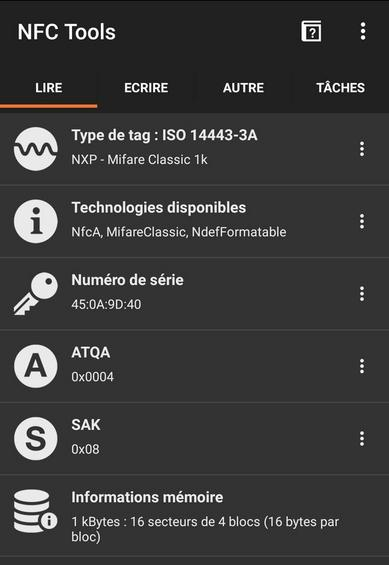
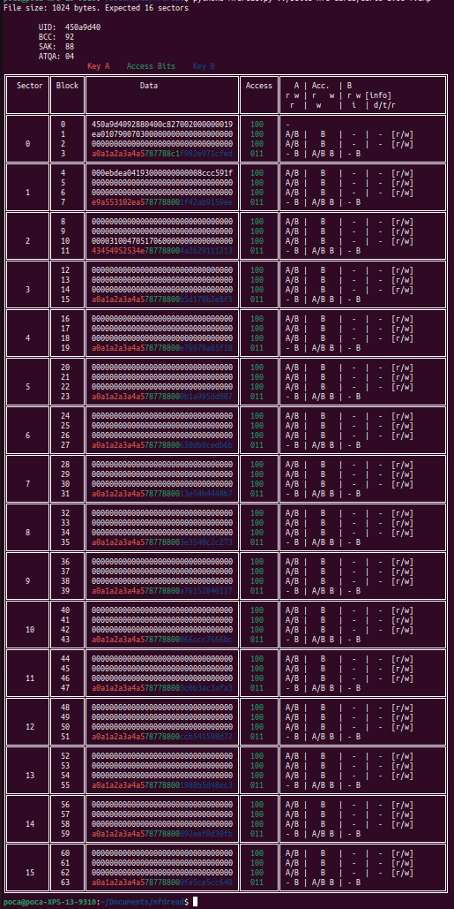
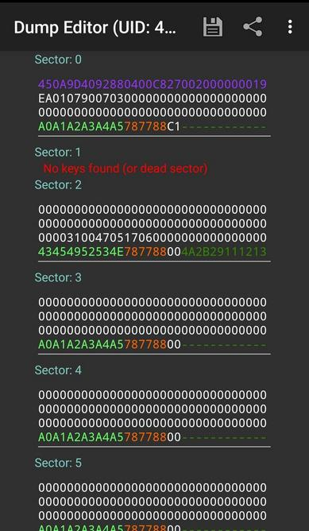
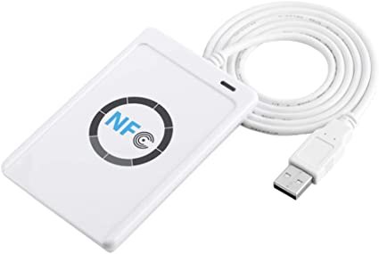
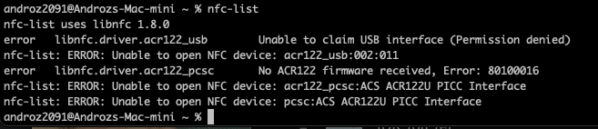
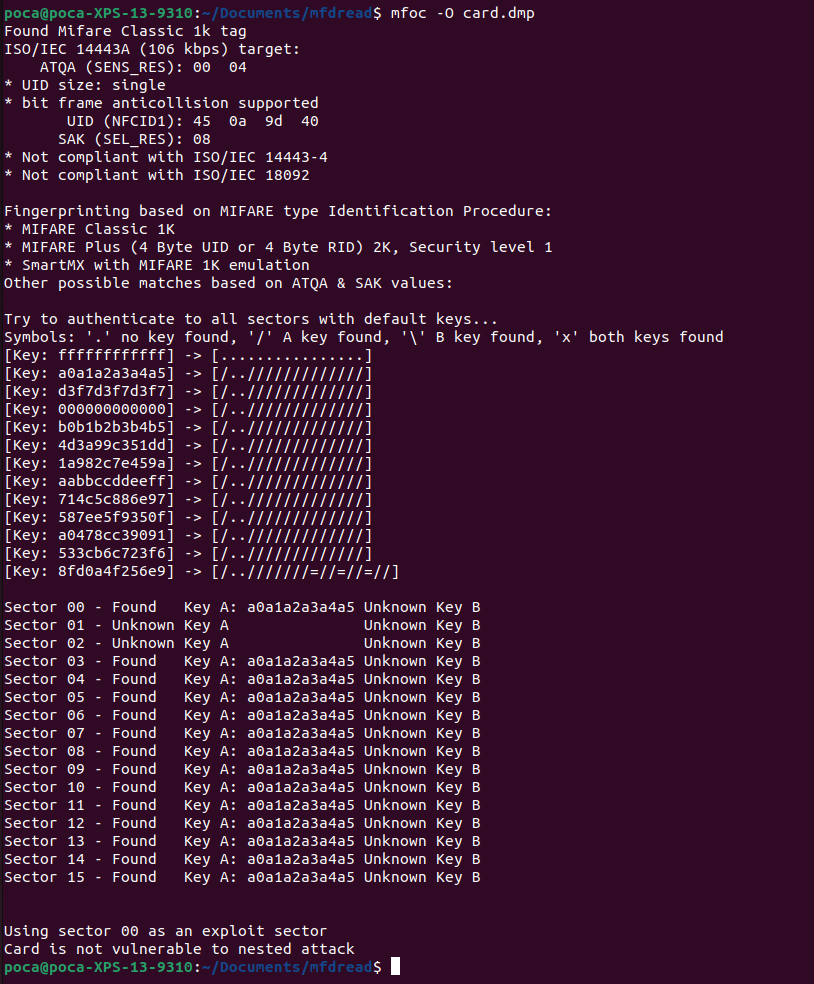
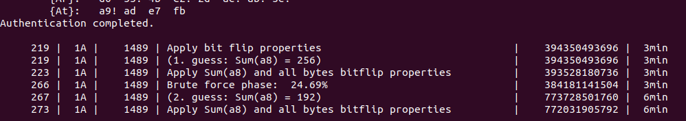
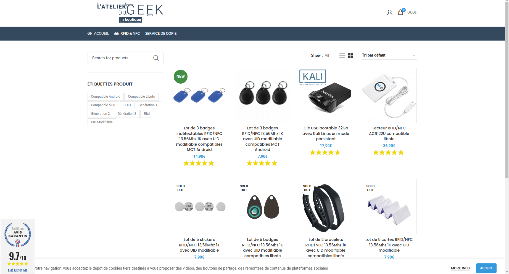
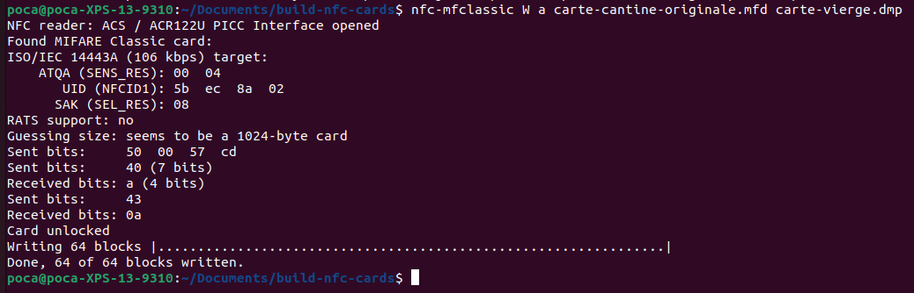

NFC (Near Field Communication) technology is everywhere in our daily lives. Paying by contactless credit card (or via smartphone), validating a subway ticket, beeping your canteen card... all of this is possible thanks to NFC.

If you want to learn more about this technology (or follow my struggles in my experience :), you're in the right place!

Is it possible to duplicate your canteen card to make a copy? And if so, how? That's what I asked myself 6 months ago 😄

To start, I gather some information about my card on my phone with the `NFC Tools` app.

## Attempt #1: via an Android smartphone

I then discover that it's an NFC card produced by the company Mifare. The exact model of the card is Mifare Classic 1k.

After some research, I stumble upon [this article](https://www.latelierdugeek.fr/tag/mifare-classic/) which explains how to duplicate a Mifare building badge directly with your Android smartphone using the [Mifare Classic Tool](https://play.google.com/store/apps/details?id=de.syss.MifareClassicTool) app.

For this, you have to go through three steps:
* buy a blank NFC card
* read the data from the canteen card
* write it onto the new blank NFC card

But... even following exactly the steps listed in the article above, the app doesn't work with my card. and here's why below :)

## Mifare Classic 1k NFC Card 

A Mifare NFC card is a chip that stores numbers (in hexadecimal format).

* Each **card** has 752 bytes of storage spread over **16 sectors** numbered from 0 to 15.
* Each **sector** has **3 blocks** (of 16 bytes) numbered from 0 to 2 for storing data.

> Example of NFC Mifare Classic 1k card content (decrypted because the keys A and B of each sector are visible)

### Authentication Blocks

But, as you can see in the screenshot, each sector actually has a **4th block**, which is used to protect the data in the sector. This one stores **a key A** and **a key B**, which we don't have easy access to. And without these, accessing the other 3 blocks is impossible.

In fact, [in 2008, a flaw was discovered](https://en.wikipedia.org/wiki/Mifare#Security) to attempt to find the keys of a Mifare card without being an approved reader. This is what Mifare Classic Tool tries to do.

However, as you can see here, only the key A is found by the mobile app (and even none on sector 1). After several attempts, it has to be admitted, this simple app will not be enough to hack the keys of my canteen card... !

### Locked UID Block

After this first problem with authentication blocks, we have a second one.

You may have noticed that 16 sectors \* 3 storage blocks \* 16 bytes = 768... and not 752? In fact, **block 0 of sector 0** is used to store **the card's unique identifier**. This one is **locked** and cannot be modified once out of the factory.

This is therefore another issue. If we want to create a perfect clone, we’re going to need a special Mifare Classic 1k card with a modifiable UID.

## Attempt #2: NFC reader and Chinese cards

Here’s what allowed me to finally solve these problems.

### Reading the card via brute force

If the card cannot be hacked via a smartphone, we will need to read the data with another device, like a computer.

Indeed, we can then run LibNFC, software that allows millions of attempts until the right keys of the card are found (brute force attack).

For this, I had to buy an [ACR122U NFC reader](https://boutique.latelierdugeek.fr/produit/rfid-nfc-lecteur-rfid-nfc-acr122u-compatible-libnfc/):

Now... we need a computer capable of running LibNFC. I only had a low-power laptop running Windows and an M1 Mac. I first try using LibNFC on my Mac. However, I keep getting this error during execution:

In fact, macOS attempts to read the NFC reader as a USB device, which results in blocking read access to the reader by LibNFC. To disable this OS behavior, a configuration file needs to be modified... present on a readonly disk since the last macOS update. Better forget it right away.

This is followed by a series of increasingly convoluted attempts to read the card on a computer. Dual-booting the laptop to boot it under Linux, using USB over the network, virtual machines,... none of these solutions really worked, either due to lack of performance or incompatibility.

But 6 months later, I decide to buy a laptop and get a Linux laptop. The project can resume!

I install LibNFC without problems, as well as `mfoc`, which allows launching the brute force process. And then...

A nice message Card is not vulnerable to nested attack shows up 🙂

At least we understand why Mifare Classic Tool didn’t work, the card is not vulnerable to the "nested" attack (the one used by the mobile app). Luckily, there’s also a "hardnested" attack. This one is much heavier, but it might manage to find the keys.

The night passes... and during this time `mfoc-hardnested` cracks the 16 sectors of the card one by one. And the next morning... everything is done! 🎉

The card is fully read, and the keys A and B of each sector are available! We can now proceed to step 2, writing onto the fake card.

### Writing the card to a Chinese copy

Now there's still a problem with the UID that can’t be modified on a standard Mifare card. For this, we can use Chinese copies. Indeed, these are designed to function exactly like a Mifare Classic 1k card, while allowing the writing of block 0 of sector 0!

Good quality Mifare copies are available on the [L'atelier du geek](https://boutique.latelierdugeek.fr/).

We first need to read the Chinese card to retrieve the keys A and B that will allow me to modify its blocks. A simple `mfoc -O carte-vierge.mfd` is enough, as the default keys of the Chinese card are all equal to `ffffffffffff` by default.

To write onto the Chinese card, I first try using the `nfc-mfclassic` command with the basic options, `W` to write the 16 sectors, and `a` to display errors if there are any.

No errors, everything seems to work perfectly... but when reading the Chinese card again, the data isn’t correct (the data aren't equal to the original card). 🥲

After a long evening spent debugging and searching, I finally discover where the problem is. The command that works is actually `nfc-mfclassic W a u carte-cantine-originale.mfd carte-vierge.mfd f`.

Using the `f` parameter allows confirming the writing on the Chinese card of data containing a different UID (inevitably, the Chinese copy did not have the proper UID before writing).
Using the `u` parameter allows confirming that nfc-mfclassic must use the original canteen card’s UID.

There you go!

During the day, a test with the Chinese copy confirms that everything works correctly, the canteen turnstile doesn’t notice a thing 🔥

## Thanks <3

Even though I first started this project alone, I owe a huge thank you to Romain, who spent long hours with me finding solutions to the various problems I encountered!

Thanks also to the [Techcord](https://discord.com/invite/YaM7BwX) community who helped me choose a good computer (and still help me daily :).

And finally, a big thank you to you for sticking through to the end of this article. These are a bit complex notions and even though I did my best to condense everything and explain clearly, I realize this is not the simplest article to understand on this blog! Don’t hesitate to send me your questions [on Twitter](https://twitter.com/androz2091).

*This article mainly focuses on my experience with Mifare cards and the difficulties I personally encountered. If you wish to go further and learn more about the general working of RFID, I recommend [this very good article](https://sbedirect.com/fr/blog/article/comprendre-la-rfid-en-10-points.html).*
