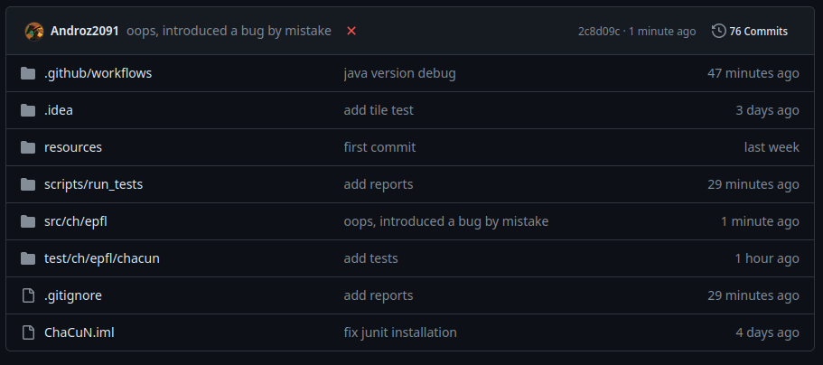
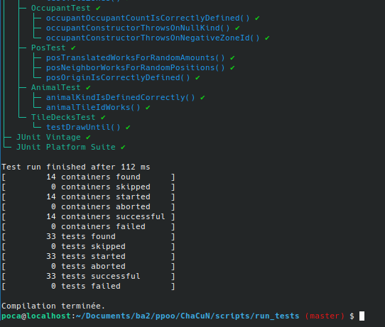

This tutorial is aimed at students in Michel Schinz's CS-108 course at EPFL.

This object-oriented programming course is partly focused on unit tests. Useful for checking your project's status, we have learned so far to run them manually from time to time.

So, why run your tests on every push to the repository?

* reduced mental load - less thinking "hey, did we remember to run the tests?"
* less time wasted - more "alright, I ran the 33 tests and let's move on"
* a better understanding of Java's build tools
* a good introduction to CI/CD

And not to mention its usefulness, automating these processes is often fun and satisfying.

CI/CD stands for continuous integration/deployment (used in almost all major projects). Let's go!

> A big thanks to [Nico](https://t.me/nico_1453) who wrote the GitLab integration entirely, and to [Tom De La Gravière](https://people.epfl.ch/tom.massiasjuriendelagraviere) and [Alessandro](https://t.me/ahl1204) who gave feedback after integrating the pipeline into their project.



> A little cross automatically appears next to the commit when the tests don't pass

## GitHub or EPFL GitLab?

Since EPFL does not provide a server to run CD/CI scripts, I will use GitHub in this tutorial. Note that it is possible to run a GitLab Runner on a cloud server if you have one, feel free to DM me if you need help.

**Whatever platform you choose, make sure your repository is private to avoid any plagiarism issues**.

## TL;DR

If you don't want to spend time reading the explanation, here's how to set up the integration:
* download the [scripts.zip](./scripts.zip) file
* unzip the file and move it to your project
* (GitHub) download the [run_tests.yml](./run_tests.yml) file
* (GitLab) download the [run_tests_gitlab.yml](./run_tests_gitlab.yml) file
* move it to a folder named `.github/workflows`
* that's it!

## Running tests via the terminal

Before even talking about CI/CD, we need to be able to run the tests in the terminal, as that's what our script will have to do.
To do this, we will need to follow 3 steps:
* compile the project
* run the tests
* check the test status

### Compiling the project

To compile the project, we will need to use the `javac` command, which is part of the Java Development Kit.

This command will take all the project's source files, compile them into `.class` files that the `java` command can execute.

* `javac -d out/production/classes src/ch/epfl/chacun/*.java`

Similarly, we want to compile the test files:

* `javac -d out/test/classes -classpath out/production/classes test/ch/epfl/chacun/*.java`

For this, we must provide `javac` with the list of classes used by our tests (like `PlacedTile.class`, or `Tile.class`), namely `out/production/classes`.

**However, there's still a problem**: we haven't imported the Junit library. Methods like `assertEquals` or the `@Test` decorator are not available.
To fix this, we must also provide `javac` with the compiled `.jar` files of Junit, specifically `junit-platform-console-standalone-1.10.2.jar` available on [this site](https://repo1.maven.org/maven2/org/junit/platform/junit-platform-console-standalone/).

Thus, the command becomes:

* `javac -d out/test/classes -classpath out/production/classes:junit-platform-console-standalone-1.10.2.jar test/ch/epfl/chacun/*.java`

Congratulations, your project is compiled!

### Running the tests

Now, we need to run the tests via the console, again without going through the IntelliJ interface.

By specifying the production classes (like `Animal.class`, `PlacedTile.class`, etc.) and the test classes (like `AnimalTest.class` for example), we can run the tests!

* `java -jar junit-platform-console-standalone-1.10.2.jar execute -cp out/production/classes:out/test/classes: --select-package ch.epfl.chacun --reports-dir reports`

Note that we also specify a `reports` folder to automatically read the test results later.



### Analyzing the results

To analyze the results, a fairly simple solution is to check for the presence of `failures: 0` in the report file generated by Junit. It's not an extremely satisfying solution but Junit doesn't offer a simple API for checking how many tests failed.

This can be done automatically via the following command:

* `grep -q "failures=\"0\"" reports/TEST-junit-jupiter.xml || exit 1`

This command also ensures that if a test fails, our script returns an error code understood by GitHub and GitLab as a failure case.

## (GitHub) Creating the CI/CD workflow

For this, I will base it on the format expected by GitHub even though I would have preferred EPFL to provide us with servers to learn these tools.

```yml
name: Run tests

on: [push]

jobs:
  run_tests_job:
    runs-on: ubuntu-latest
    steps:
      - name: Checkout code
        uses: actions/checkout@v3

      - name: Set up JDK 21
        uses: actions/setup-java@v3
        with:
          java-version: '21'
          distribution: 'temurin'

      - name: Run tests
        working-directory: ./scripts/run_tests
        run: |
          ./run_tests.sh
```

Here's what the action looks like.

It creates a virtual machine (a Docker) based on the Ubuntu distribution image. It's not the lightest, but it will be easy to modify and it's the simplest for beginners.

Then:

* the `checkout` step retrieves your project's code into the action
* the `setup JDK` step downloads and exposes `java` and `javac`, the development tools for Java (compile + run the tests)
* the `run tests` step executes the tests and displays a red or green icon depending on the test status!

## (GitLab) Creating the CI/CD workflow

```yml
stages:
  - test

run_tests_job:
  stage: test
  image: ubuntu:latest
  before_script:
    - apt-get update && apt-get install -y openjdk-21-jdk-devel unzip
  script:
    - cd ./scripts/run_tests
    - ./run_tests.sh
```

And that's it! Feel free to DM me if you need help with the installation.
