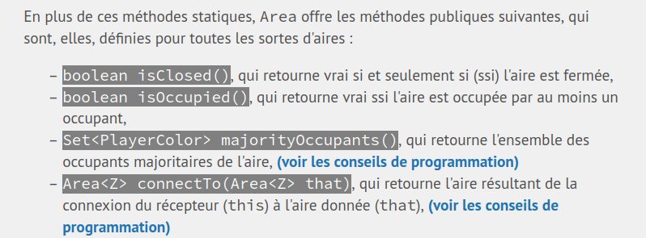

Hello, new tutorial for Michel Schinz's CS-108 course.

The goal here is to slightly enhance the readability of the instructions by addressing two issues:
* the programming tips are always **after** the method definition
* often, the name of the method to create isn't highlighted enough for my taste
* you can't copy the section links to reference them elsewhere (like on ED, for example)

For this, we will need to dynamically modify the page style with a userscript (a JavaScript script written by a user to change the behavior of a site).



> The final result will allow us to highlight the methods and add a link to jump to the tips **specific to each method** without delay

There are dozens of extensions that allow implementing these `userscripts`. We'll use `ViolentMonkey`, which is open source and well-maintained.

**[TL;DR the link to the final script](./script.js)** (to import into ViolentMonkey)

## Detecting method definitions

First, we need to detect the methods present in the instructions. This can be done using the following instruction:

```js
const methods = new Set();

const listItems = document.querySelectorAll('li');
for (listItem of listItems) {

    const firstCode = listItem.querySelector('code:first-of-type');
    if (firstCode) {
        firstCode.style.backgroundColor = '#808080';
        firstCode.style.color = 'white';

        console.log('[METHOD] method definition found, ' + firstCode.innerText);
        methods.add(firstCode);
    }
}
```

To do this, we took the first element formatted as code in each list. We apply a gray background and change the text color.

We also store the method in a `Set`, which will be useful later.

## Detecting programming tips

Secondly, we want to detect programming tips. We can use our previous code to check if the section title is "Programming Tips".

```js
const listItems = document.querySelectorAll('li');
for (listItem of listItems) {
    // are we in a programming tips section? :)
    const parentDiv = listItem.parentNode.parentNode;
    const isConseilsDeProg = parentDiv.id.includes('outline-container') && parentDiv.children[0].innerHTML.includes('Conseils de programmation');
    if (isConseilsDeProg) conseilsDeProg.add(parentDiv);
}
```

## Linking the two

Finally, we can link the two using this piece of code that matches a method and a tip and creates a link tag `<a>` to jump to the right tip.

```js
conseilsDeProg.forEach((parentDiv) => {

  const titles = parentDiv.querySelectorAll('li > code:first-of-type');
  for (title of titles) {
    console.log('[TIP] tip found for method ' + title.innerText);
    const id = title.parentNode.children[0].id;

    for (method of methods) {
      if (method.innerText.includes(title.innerText)) {
        console.log('[MATCHING] tip for ' + title.innerText + ' matched');
        const a = document.createElement('a');
        a.innerHTML = '<b> (see programming tips) </b>';
        a.href = '#' + id;
        method.parentNode.appendChild(a);
      }
    }
  }

});
```

Finally, we loop over all the titles to add a reference link to them:

```js
for (header of document.querySelectorAll('h3, h4, h5, h6')) {
  console.log(header.id);
  const a = document.createElement('a');
  a.href = 'javascript:void(0)';
  a.innerText = '(📋)';
  a.style.marginLeft = '5px';
  header.appendChild(a);
  const link = `${window.location.origin}${window.location.pathname}#${header.id}`;
  a.onclick = () => {
    a.innerText = '(✅ link copied)';
    setTimeout(() => a.innerText = '(📋)', 1_000);
    navigator.clipboard.writeText(link).then(function() {
      console.log('Async: Copying to clipboard was successful!');
    }, function(err) {
      console.error('Async: Could not copy text: ', err);
    });
  }
}
```
