Disney+, Netflix, HBO... are now available with thousands of on-demand movies. The choice between watching a pirated movie or not is no longer as clear-cut as it was when you had to shell out 20€ for a DVD.

Today, the only piracy setup that's still really advantageous is one where finding and watching a pirated movie is as convenient, instantaneous, and reliable as finding and watching a movie on an official streaming platform.

And to make that possible, it's interesting to automate **everything**, from downloading the movie to uploading it to a private streaming service, including downloading subtitles or even the movie poster!

More than just a tutorial, this article brings together the knowledge I've accumulated after hours of research and experimentation... and will hopefully help beginners understand part of the world of online movie and series piracy.

> **Disclaimer**: this situation where everything is downloadable without revenue going to rights holders is obviously not desirable in my view. However, that's another debate and it's even more important to understand how we got here to find solutions.

This article is divided into two parts that can be read independently depending on your knowledge.

**Part 1: Downloading.**

You'll learn how it is possible to download from the following sources and in which case each is the most effective:
* **direct download** sites (or DDL)
* **peer-to-peer** file sharing (torrent)
* the **Usenet** network

**Part 2: Automate and Distribute.**

You'll also learn how it's possible to automate downloads from these sources using **Radarr**, **Sonarr**, or even **Overseerr**.

Finally, you'll find out how to make films available for streaming by **hosting** them on a server using **Plex** or **Jellyfin**.

## Part 1: Downloading Pirated Movies

There are three main ways used to download movies illegally from the internet: **direct download** (DDL), **peer-to-peer** download (P2P), and the **Usenet** network. We will look at the operation and business model behind each case.

### Direct Download (DDL)

#### How It Works ⚙️

Direct download, also known as **Direct DownLoad** (or **DDL**), is the simplest.

Some pirates already have the films (by recording them from Netflix, for example) and upload them to a file hosting site (like Uptobox).

They then create **a site to list their pirated films**. There are many of these, belonging to different pirates, like Zone Téléchargement, Extreme Download, or HDEncode.   

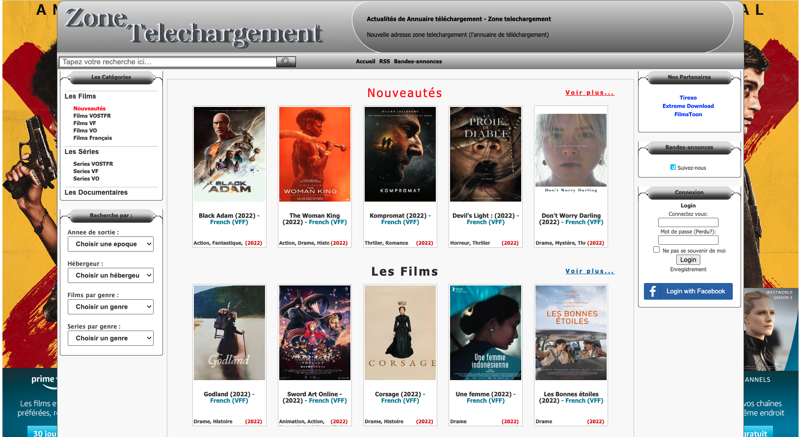

By clicking on a film on the listing site, you land on a page like this one:

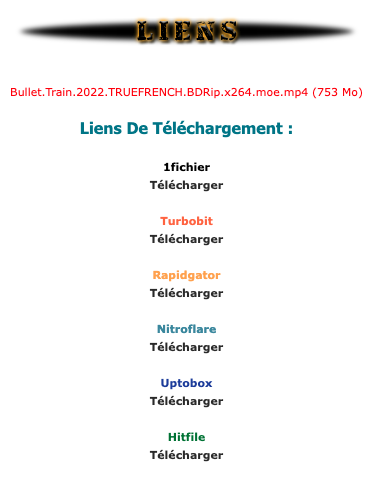

Each link redirects you to a hosting site where the pirate uploaded the movie and where you can download it, like Uptobox.

It's called **direct** download because it occurs between a user and a server (that of the hosting site), and does not involve third parties.

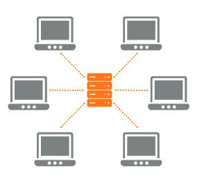

Here, the hosting site's server, like Uptobox, is in orange, and each user downloading the film is in gray.

#### Business Model 💰

There are two players here:
* **the listing site**, created by the pirate, like Zone Téléchargement
* **the hosting sites**, which store the pirate’s movie file on their servers and deliver it to users, like Uptobox

**The pirate who owns the listing site** makes money through ads shown on their site. Millions of users visit it daily, generating significant **ad revenue**.

**The hosting sites** of pirated films make money with their premium offers, to speed up downloads or download more frequently, as shown below for Uptobox.

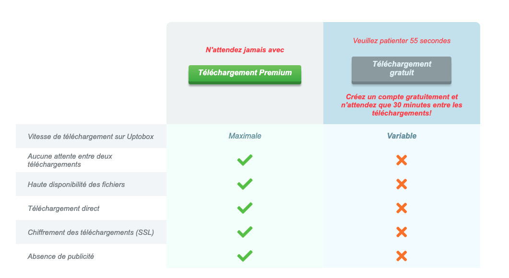

> **AllDebrid:** Some services, like [Alldebrid](https://alldebrid.com/), allow you to download files from all hosting sites without speed and download limits for a low cost. They buy premium accounts on all sites and resell access more cheaply.

#### What Does the Law Say? 🚔

**Direct download is never legal... but you will never be prosecuted.** Indeed, the download occurs only between you and the hosting site. **No need for a VPN** since it's impossible for Arcom (*Authority for the Regulation of Audiovisual and Digital Communication*) to monitor this traffic.

However, owning a listing site is risky. Regularly, the domain names of these sites are banned by ISPs (*Internet Service Providers, like Orange*), so pirates frequently change their addresses.

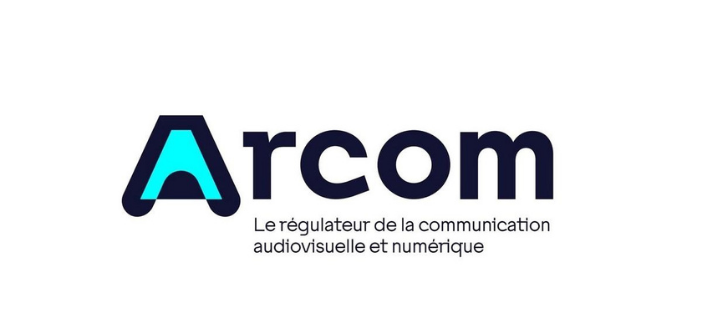

#### In Summary: Direct Download ✴️

Thus:
* **Listing sites**, like Zone Téléchargement, provide you with a list of links to **hosting** sites to download the films, like Uptobox
* The download is called **direct** as it happens between you and the **hosting** site
* It is therefore **impossible to be prosecuted** by Arcom
* Hosting sites will all try to sell you a **premium offer** to download faster and more often
* **Listing sites** frequently change addresses as they get **banned by ISPs**

Direct download is a good option to start with as it’s quite simple. However, the experience often isn't very smooth: speeds are frequently throttled unless you pay for hosting sites, intrusive advertisements, frequent site address changes, etc.

### Peer-to-Peer Download (P2P)

#### How It Works ⚙️

Peer-to-peer download is a bit more complicated, but very powerful. 

Suppose a pirate bought the Avatar DVD. They will rip the DVD contents onto their computer and then allow other pirates to access their computer to download the file.

And every new pirate wanting the movie will do the same: download the file to their computer and allow other pirates to download it.

Thus, after a few shares, newcomers will be able to get it from dozens of pirates at the same time, which often makes the download **very reliable, and very fast** (the speed is not throttled by the hosting site unlike DDL).

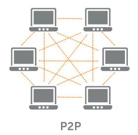

But how do you find the pirates who have the file?

Well, as with DDL, listing sites are set up (called **trackers**) to allow pirates to find the “.torrent” file for the desired movie. Each torrent provides access to the list of IPs of pirates already having the file and ready to share it.

When you start downloading the file, you’re called a **leecher** (a downloader), and when the download is complete, you can enable sharing and become a **seeder** (an uploader) yourself. The tracker is notified and you are added to this list of seeders in the torrent file.

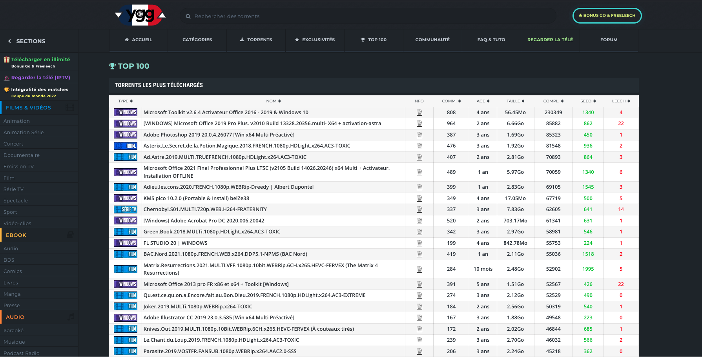

> **Private trackers:** Some trackers aren’t accessible to the general public but only to a very closed community. This is the case for PassThePopcorn, for example, whose private invitations sell for several thousand euros.

To download files, you need a torrent client, like QbitTorrent.

#### Business Model 💰

The trackers are the only ones making money, and usually implement a ratio system. Did you think earlier what happens if the pirate only downloads the movie without leaving their computer on for the next users? 

No one can download the file quickly anymore and that's the weakness of p2p: download speeds depend on the number of active seeders.

Hence the ratio principle: **you must upload an amount of data equal to or greater than what you download** or your account is banned from the tracker.

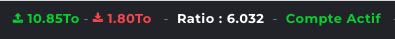

Banned... unless... you pay.

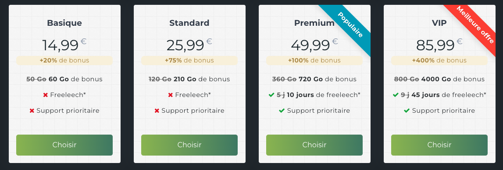

For around fifteen euros, you can download up to 60 GB without having to share.

> **Seeding, sometimes impossible:** The choice to be a seeder is not always one. Some pirates have low upload bandwidth and don’t return enough data to keep their ratio positive...

> **Cheating:** Some cheating software artificially increases your ratio but are often detected by trackers, which ban the accounts.

### What Does the Law Say? 🚔

**Downloading pirated content via peer-to-peer is illegal, and you can easily be prosecuted.** This is where VPN or AllDebrid is useful. All it takes is for Arcom to explore the torrent files and find your IP address to identify you... and send you the fine. Hiding your real IP behind a VPN prevents such a thing.

As with DDL listing sites, P2P trackers frequently change addresses as they get blocked by ISPs.

#### In Summary: Peer-to-Peer Download

Thus:
* The download is called **peer-to-peer** as it occurs between you and other pirates
* **Trackers**, like YggTorrent, provide you with **.torrent** files to download each movie
* These **.torrent** files help you find the **IPs** of **seeders**, the pirates already having the film
* It is therefore **possible to be prosecuted by Arcom** if you do not use a VPN as they can access your IP
* The download is often **faster and more reliable** than DDL (depending on the number of seeders)
* Trackers usually implement a **ratio system** forcing you to reshare the films
* Trackers **frequently change addresses** as they get blocked by ISPs

Peer-to-peer download is a good option for more experienced pirates as it often allows for faster downloads than through free hosting sites like Uptobox. However, it requires a VPN.

### Downloading via Usenet

#### How It Works ⚙️

Usenet is like a decentralized, distributed version of Reddit, highly used a decade ago. Anyone can create their Usenet server and **host a "newsgroup"**, which will be used to discuss a particular topic.

Other servers can then decide to host the same newsgroup and **will periodically synchronize together** to share new messages and files.

By connecting to a Usenet server, you can access all the messages and files of the newsgroups hosted by it.

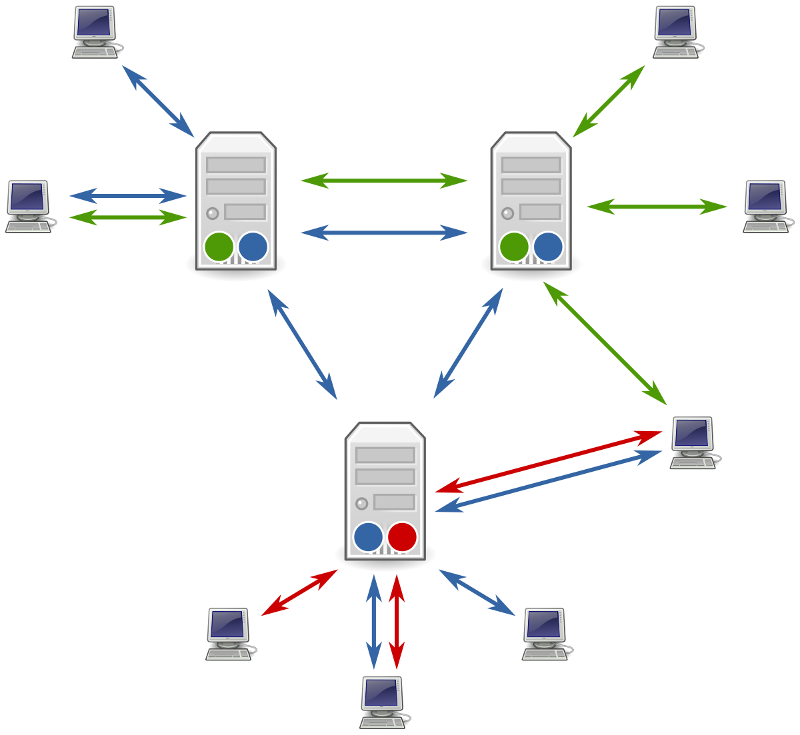

Today, Usenet is mostly used to share files (often illegally).

It is not feasible to create your Usenet server individually and synchronize with hundreds of thousands of groups; that would be too heavy.

There are therefore **Usenet Providers**, like Eweka, which authorize you to connect to their synchronized Usenet server with thousands of groups, accessing and downloading hosted files.

You need to check 4 criteria to choose your Usenet Provider:
* the number of groups it hosts (over 125,000 for Eweka, for example)
* the retention time of newsgroup messages/files (10 years for Eweka, for example)
* download speed (200 mbps for Eweka, for example)
* download limits (none for Eweka, for example)

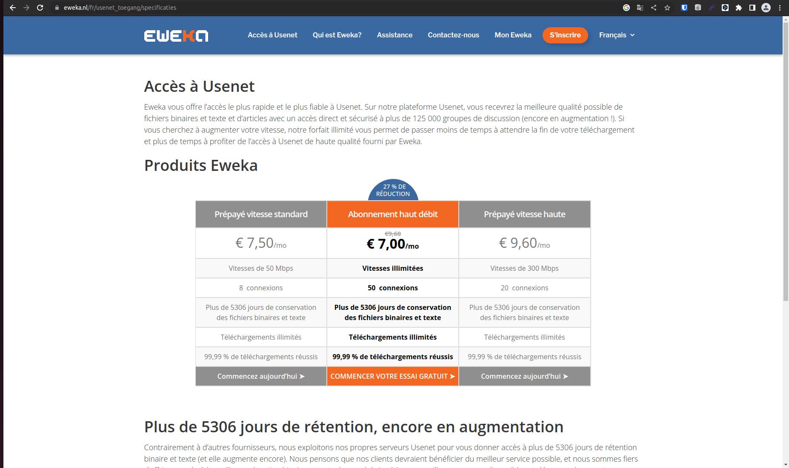

> **Note:** Eweka offers a version at 36€/year [here](https://www.eweka.nl/en/landing/special-usenet-deal).

You also need a search engine to look for movie files on newsgroups, like NZBGeek, for about ten euros per year.

Once you have these two elements, you can use a Usenet client like SABnzbd to download files.

#### Business Model 💰

Here, the business model is simple: you pay a monthly subscription to your Usenet Provider to access its Usenet server and download files. (around 30€/year minimum)

You also pay for a search engine like NZBGeek (around 5-10€/year minimum)

For about fifteen euros, you can download up to 60 GB without having to share.

#### What Does the Law Say? 🚔

If your Usenet Provider supports SSL encryption, you can download without a VPN. Again, as with DDL, it's a direct download between you and the Usenet server, and Arcom has no visibility on it.

#### In Summary: Downloading via Usenet

Thus:
* It uses Usenet, a decentralized network of synchronizing servers
* You must pay a provider to access it
* You must also pay for a search engine to find files
* You can download without a VPN if your provider supports SSL encryption
* The download is often **very fast and very reliable** (does not depend on the number of seeders, the Usenet server sends you the file)

In summary, downloading via Usenet is a good option for pirates who can afford around fifty euros a year to ensure very fast and easily accessible downloads.

As we will see in part 2, Usenet and peer-to-peer downloader are often used in complement with each other and can both be automated.

[Part 2](/custom-netflix-part2)
