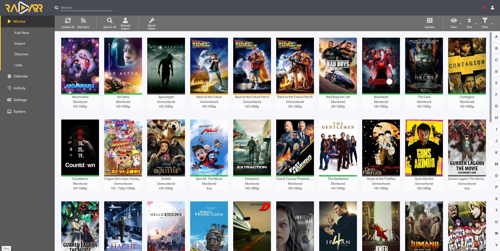
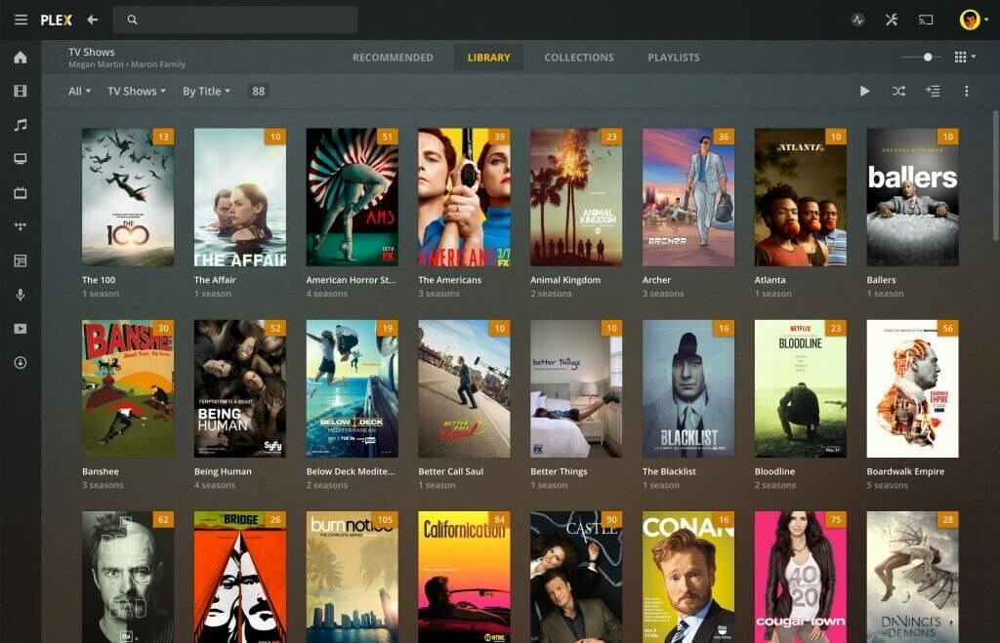
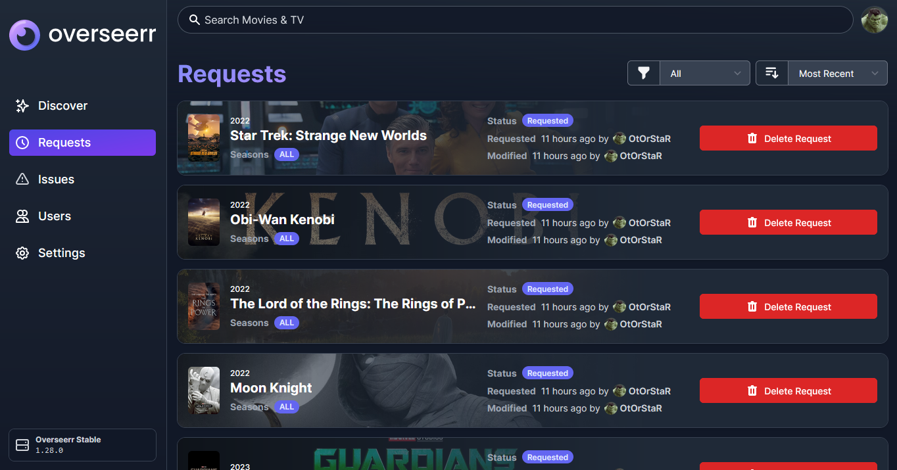

As we saw in the first part, it is possible to download movies via DDL sites like Zone Téléchargement, peer-to-peer, or via Usenet. If you're not familiar with these terms, I invite you to read the first part of this guide.

Searching for each movie manually, adding it to your download client, and then watching it is tedious. In this part, we'll see how to automate all this on your own server, thus creating your own private Netflix, using **Sonarr**, **Radarr**, **Overseerr**, and **Plex**.

> **Note:** This part is a brief summary of how Radarr, Sonarr, and Plex work. For a more complete installation guide, I invite you to check out [this article by Hunam](https://hunam.me/posts/ultimate-guide-setup-streaming-service-sonarr-radarr-plex-usenet-torrents/).

## Automate Movie Searching

Once you have access to Usenet and several torrent sites, you'll notice it's very tedious to search for a movie on each site, compare them, check who has the best quality with a reasonable size, in the right language, etc.

Radarr does this work for you for movies, and Sonarr does it for series.

You can add all your **Indexers**, such as NZBGeek for Usenet, and your favorite torrent trackers, like YGGTorrent.

Then, you can add **Profiles** for each type of movie you want to download. For example, you can have a profile for 1080p movies in original version, another for 720p movies in French, another for 4K movies, etc.

Finally, you need to add **Download Clients**. For instance, if you use qBittorrent, you can add it to Radarr to enable it to download torrents.

You then have a button on the Radarr interface to add a new movie to your collection with the Profile of your choice. Radarr will then search for this movie across all your indexers and download the best result using a configured download client.

It's the same for Sonarr.

## Make Movies Available for Streaming

Once your movie library is downloaded, you can make them available for streaming on your local network via Plex.

Plex, installed on your server, will scan your movie library. For each movie, it will find the metadata (title, synopsis, poster, etc.) on The Movie Database and display them neatly in a web interface.

Each file can be streamed on the fly from your server or downloaded to be watched offline.

> **Note:** Plex is freemium and proprietary unlike the other software presented in this article. A free and open-source alternative is Jellyfin, but it is not as well-developed as Plex ([Reddit post summarizing my view](https://www.reddit.com/r/jellyfin/comments/mvcgmw/comment/hkq8tz0/?utm_source=share&utm_medium=web2x&context=3)).

You can then share access to your server with your friends, and they can watch your movies from their web browser or their mobile app.

## Automate Movie Requests

Now that you have a server capable of downloading movies, making them available for streaming to your friends, all automatically, you can also allow them to request movies to be downloaded.

A bit like if they were going on Radarr themselves to add a movie to their collection, but simpler (the Radarr interface is complex).

For this, there is **Overseerr**.

Overseerr allows you to search for any movie or series on The Movie Database via a nice interface and request Radarr or Sonarr to download it.

## And There You Have It!

Now you know the main ways to download movies and how it's possible to automate these downloads on your server. It's possible to create your own private Netflix, where anyone can add movies and then watch them in streaming from their web browser or phone.
