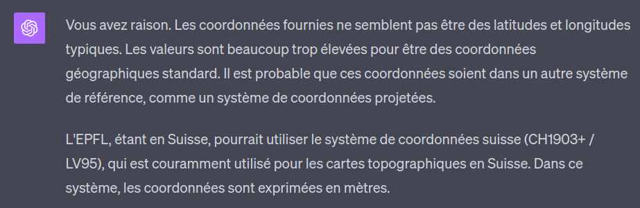
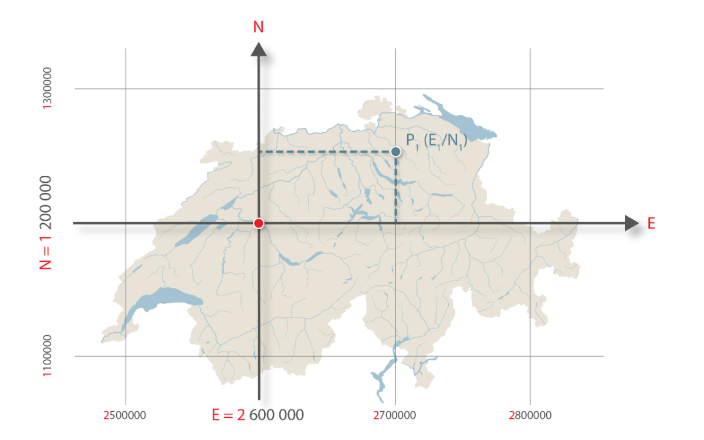
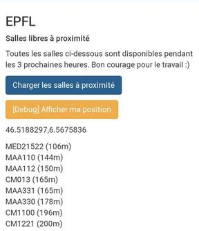

If you're at EPFL, you probably already know about the great tool [flep/occupancy](https://occupancy.flep.ch), which allows you to list all available rooms on campus for a certain period in just a few minutes.

There's a slight problem though, which is that if you're not familiar with EPFL (like me right now :), the room names might not mean much to you, and you'll often end up going further than necessary.

When 30 different rooms show up, how do you know if room CM 121 is closer to you than CE 1 515? Or if there's a small hidden room you didn't notice?

To optimize this, I thought it might be interesting to list the few available rooms, at least for the next 3 hours, **nearby**.

> The EPFL map already lets you see available rooms on a map, but not for a specific duration. It's quite annoying to have to change rooms frequently, hence the availability duration check feature.

## Getting Room Coordinates

To develop this project, I need to get all the coordinates of all the rooms.

For this, there are several options:
- Use Google Maps to pinpoint each room's coordinates
- Ask EPFL's IT service
- Try to understand how EPFL's [GeoPortail](https://geoportail.epfl.ch/) works (less tedious and clearly more fun)

Alright. After opening EPFL's portal and inspecting a few requests, I see that we can indeed get "coordinates" for each room.

For example:  
- `GET` `https://plan.epfl.ch/search?limit=20&partitionlimit=5&interface=main&routing=validated&query=CM1121`  
```json
{
   "type":"FeatureCollection",
   "features":[
      {
         "type":"Feature",
         "id":"12156#locaux",
         "geometry":{
            "type":"MultiPolygon",
            "coordinates":[
               [
                  [
                     [
                        2533002.05,
                        1152532.725
                     ],
                     [
                        2533016.31,
                        1152532.725
                     ],
                     [
                        2533016.31,
                        1152518.45
                     ],
                     [
                        2533002.05,
                        1152518.45
                     ],
                     [
                        2533002.05,
                        1152532.725
                     ]
                  ]
               ]
            ]
         },
         "properties":{
            "layer_name":"locaux",
            "label":"CM 1 121",
            "floor":1,
            "vertex_id":30989
         }
      }
   ]
}
```

Pretty happy, until I read the coordinates. As a Frenchman with little mapping experience... I'm wondering why this site doesn't return the usual latitude/longitude coordinates but instead gives gigantic numbers going up to 2M.

So there ~~I give up~~ I ask ChatGPT and the answer appears ;)



It turns out the EPFL map uses the Swiss MN95 geographic coordinate system (or LV95 in German), the improved version of the MN03 (1903) system.

Both are "centered" on Bern, whose North, East coordinates are (600,000, 200,000). In the new one (MN95) the North coordinates are prefixed with a 2 and the East with a 1. Which explains the false "2 million" from earlier. It was just 600,000.



And a fact I found amusing, the 0 of this coordinate system is located... in Bordeaux, to ensure positive coordinates for all of Switzerland.

Anyway, what matters for this project is the formula for converting between them, because `navigator.geolocation` obviously doesn't return MN95 coordinates, but uses the WGS84 coordinate system.

## From MN95 to WGS84

Fortunately, this formula is available online from the [Swiss Federal Office of Topography](https://www.swisstopo.admin.ch/content/swisstopo-internet/en/topics/survey/reference-frames/_jcr_content/contentPar/tabs/items/dokumente_publikatio/tabPar/downloadlist/downloadItems/417_1462802199217.download/ch1903wgs84-DE.pdf).

### Centering Bern.

The code is written in JS, but the concept is the same for all languages.

```js
// let E and N be our coordinates in the MN95 system (so in meters)
let yCentre = E - 1200000;
let xCentre = N - 2600000;

// change unit to 1000 km
xCentre /= 1000000;
yCentre /= 1000000;
```

### Calculating Latitude and Longitude.

```js
// the constants correspond to the Bern Observatory, the new (0,0) of our system)
const latitudeInitiale = 16.9023892;
const longitudeInitiale = 2.6779094;

// these coefficients tell us
// how much to increase the latitude and longitude
// for every x or y of our coordinates

const latiXCoeff = 3.238272;
const latiYP2Coeff = -0.270978;
const latiXP2Coeff = -0.002528;
const latiXYP2Coeff = -0.0447;
const latiXP3Coeff = -0.0140;

const longiYCoeff = 4.728982;
const longiXYCoeff = 0.791484;
const longiXP2YCoeff = 0.1306;
const longiYP3Coeff = -0.0436;

// apply them to the centered X and Y calculated earlier

const newLatitude =
    latitudeInitiale
    + latiXCoeff * xCentre
    + latiYP2Coeff * (yCentre**2)
    + latiXP2Coeff * (xCentre**2)
    + latiXYP2Coeff * xCentre * (yCentre**2)
    + latiXP3Coeff * (xCentre**3);

const newLongitude = 
    longitudeInitiale
    + longiYCoeff * yCentre
    + longiXYCoeff * xCentre * yCentre
    + longiXP2YCoeff * (xCentre**2) * yCentre
    + longiYP3Coeff * yCentre**3;
```

### Converting to Degrees.

Here we obtain values in arcseconds. However, we want degrees.

The Earth is divided into 360 degrees (a complete circle). Each degree is divided into 60 minutes, which gives us 3600 seconds/degree.

A little cross product:

```js
const newLatitudeInDegrees = newLatitude * 1 / 3600 * 10000;
const newLongitudeInDegrees = newLongitude * 1 / 3600 * 10000;
```

This script will be quite useful to us later!

## Exporting Coordinates

Now, we need to be able to export the coordinates of all the rooms into a JSON file.

There's probably a cleaner way to get the list of rooms, but I'm going to use the Flep/Occupancy API for that.

Then, we need to loop over each room, call the private API of EPFL's map, convert the data and save them following this structure:
```json
{
    "name": "ODY016",
    "type": "SALLE DE COURS",
    "geometry": {
        "type": "MultiPolygon",
        "coordinates": [
            [[
                46.51993236219606,
                6.567810070631254
            ],
            [
                46.52004457543968,
                6.567808266620984
            ],
            [
                46.52004564331144,
                6.567947695378289
            ],
            [
                46.519933430065606,
                6.5679494990996945
            ],
            [
                46.51993236219606,
                6.567810070631254
            ]]
        ]
    }
}
```

After some struggles with the data format returned by the EPFL map, the JSON file is ready!

## Coding Our App

Now we have all the keys in hand, let's do it.

### Get User's Coordinates

```js
navigator.geolocation.watchPosition((position) => {
    // get user's coordinates
    const { latitude, longitude } = position.coords;

}, () => {}, {
    enableHighAccuracy: true,
    timeout: 5000,
    maximumAge: 0
});
```

### Sort Rooms by Distance

```js
function getUserRoomDistance(userLatitude, userLongitude, roomLatitude, roomLongitude) {
    const R = 6371;
    const deltaLatitude = deg2rad(roomLatitude - userLatitude);
    const deltaLongitude = deg2rad(roomLongitude - userLongitude);
    const a = Math.sin(deltaLatitude/2) ** 2
        + Math.cos(deg2rad(userLongitude)) * Math.cos(deg2rad(roomLatitude)) * Math.sin(deltaLongitude/2)**2;
    const c = 2 * Math.atan2(Math.sqrt(a), Math.sqrt(1-a));
    return R * c;
}

function deg2rad (deg) {
    return deg * (Math.PI/180);
}
```

### Connecting to the Flep/Occupancy API

```js
fetch('https://occupancy-backend-e150a8daef31.herokuapp.com/api/rooms/find_free_rooms', {
    method: 'POST',
    headers: {
        'Content-Type': 'application/json'
    },
    body: JSON.stringify([{
        start: start.toISOString(),
        end: end.toISOString(),
    }])
})
.then((res) => res.json())
.then((data) => freeRooms = data.map((r) => r.name));
```

Combine it all and...

## The App is Live!

I'm currently at Rolex, so the nearest rooms are the math rooms, followed by the CM rooms :)

**Link: https://lesswalkmorework.polysource.ch**  
**GitHub Repository: https://github.com/polysource-projects/lesswalkmorework**


