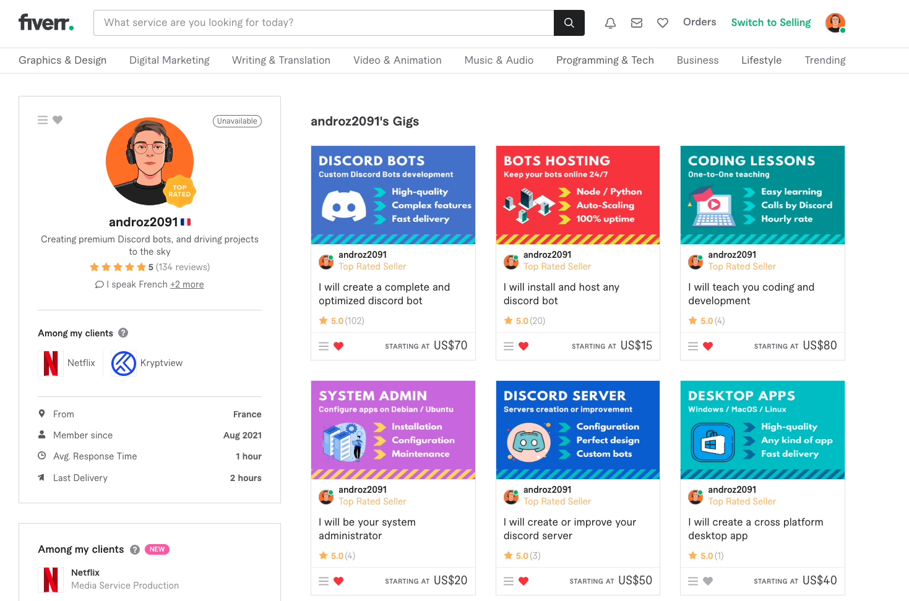
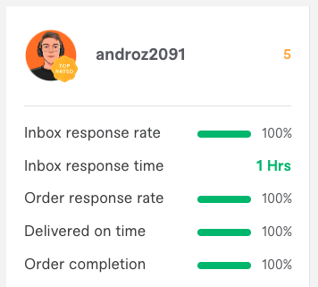
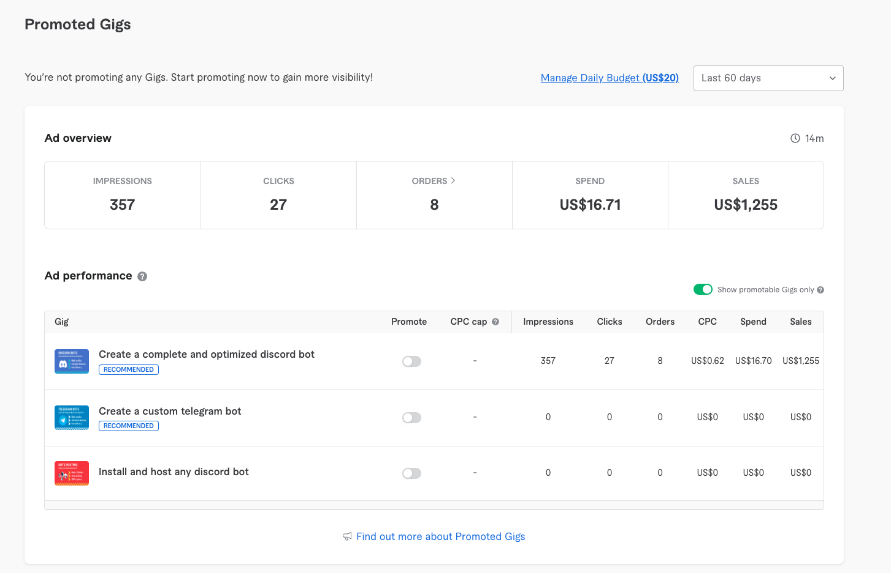
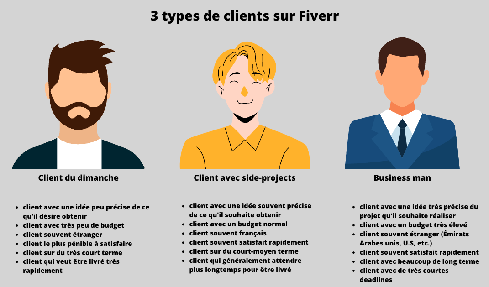
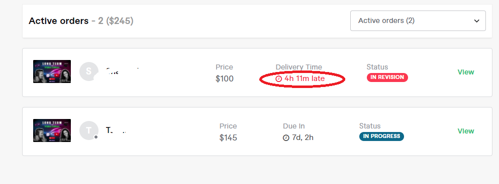
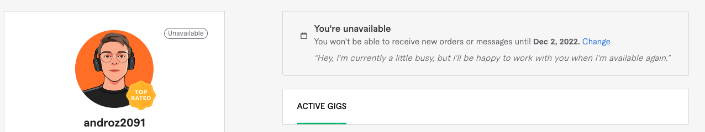

Fiverr is a marketplace where you can buy the services of freelancers specialized in a field. The last 14 months spent on the platform have allowed me to explore and understand it almost perfectly, reaching the platform's highest seller level and 130 exclusively positive reviews.

Let me share this experience which I find interesting for: 
* buyers curious about the daily lives of freelancers working for them
* new sellers who are hesitant to invest their time in Fiverr
* and… everyone else curious ;)

I'll start by discussing **Fiverr's algorithm** (metrics used, seller ranking, etc.), to talk about **its direct consequences on a seller's life** (burn-out, fatigue, dependency, etc.), and conclude with my general opinion about the platform.

## How to Satisfy Fiverr's Algorithm?

Let's start from the beginning and the basics. How does the platform work?

Fiverr's algorithm works simply. When a buyer searches for “logo” on Fiverr, the platform wants:
* them to find a **seller quickly**
* them to be **satisfied with their logo purchase** from the seller (measured by the rating, repeated purchases from the same seller)
* them **not to cancel** the order
* them to receive delivery **on time**
* them to **spend as much as possible** (i.e., their entire budget, or even a bit more)

Hence, as a seller, the platform determines: 
* an average **response time**
* an average **customer satisfaction rating**
* a **“Repeat Business”** score
* an **order cancellation rate**
* a **late delivery rate**
* an average **selling price**

These criteria, coupled with the age of your account, are used to determine your overall search ranking, and **your Fiverr level** (beginner seller, level 1, level 2 or top seller).

### Starting by Working for Free

Initially, the platform makes you appear to clients with low, sometimes very low budgets. This is where you need to make useful sacrifices for the future. There's only one rule for new sellers: __accept all the orders you know how to do and turn a blind eye to the price__.

Even if it means working for free, never mind. At first, you'll work a lot and earn very little (in a good month). It’s absolutely not a wasted investment, you're not working for free; you're working for your profile and ranking.

### Starting to Be Profitable

Once you manage to get around 20 positive reviews on your profile (without negative reviews…), you’ve reached a major milestone on your path to profitability on Fiverr.

You start being contacted by interesting clients, quite different from those you've encountered so far, and who have serious projects. Unlike the initial clients on your profile who want the moon for 5€, these ones are more respectful, have more realistic ambitions, more budget… **more professional**, in summary.

The most active clients with a “Fiverr Select” badge start contacting you, and you unlock access to ads on Fiverr.

This is where Fiverr becomes interesting. It's only, and well only around the 20 positive reviews mark that you can start thinking about turning down poorly paid orders or ones that don't interest you to pick the best ones. Many people are stuck before, trying to make a profit from the start.

From this moment on, you need to keep a few key ideas in mind, and you'll be heading straight for success: 
* never accept any order that you're not sure you can deliver.
* if a client threatens to leave a bad star, do everything possible to satisfy them. You must keep a good rating on your profile at all costs. If you come across a troublesome client, bad luck, you’ll have to work more; that’s how it is on Fiverr, the power they hold with their rating is extremely strong. If they don't accept your work, refund them generously. Better to have lost time than to tarnish your profile.
* respond as quickly as you can to all your messages. On Fiverr, clients with substantial budgets are usually impatient and want everything they ask for immediately. From experience, the most profitable opportunities come from inquiries answered within the hour.

## The Sellers' World on Fiverr

Now I'll discuss my personal experience with Fiverr, the behind-the-scenes, and how I've lived through these last 14 months.

### The Stress of Opportunities

As a student, I didn't have particularly high expectations. I jumped on the platform as a developer to try it out, and quickly got hooked. The first month, I spent most of my evenings on it, fully engaged, completing 20 orders for about €1,071.

However, this would theoretically equate to about €50 per order. But here… that's absolutely not the case. The median price per order is about €25.

Why…? The first month, a buyer contacted me saying they were ready to pay €500 for a rather simple project considering what I was used to doing, if it was delivered in 24 hours. I accepted. And I thus achieved **50% of my September 2021 revenue in one day**.

And this example shows a key characteristic of the platform: all clients have entirely different budgets, to the extent that over a year, I've sold an hour of my work between €5 and €750.

Second important point, the most lucrative clients on Fiverr typically want **everything right away**. It's crazy, but a night of work over 5-6 hours for a wealthy impatient client can earn you more than dozens of hours spent working for ordinary clients. Because the constraint "I want it all in 24 hours" allows you to charge a lot, and foreign clients sometimes have **no** budget limits.

That's what makes the platform addictive in my opinion. Being a seller on Fiverr means stringing together “normal” orders until you find THE client of the week, a wealthy businessman from a foreign country who allows you to make 2-3k€ in a few caffeine-driven days, which is equivalent to a month's revenue with regular orders. A client who would be impossible to find outside the platform.

Another example, in April 2022, I delivered a large urgent order from a Californian in less than ten hours **which still represents 20% of the total revenue I've made on Fiverr since the beginning**. When I talk about discrepancy, I'm not exaggerating.

You can end up with this simplified scheme. The Sunday clients are the ones you get at the beginning, transitioning to a growing number of business clients as you accumulate a substantial number of reviews. They remain rare, and you need to complete many orders to find them.

Of course, there are also French clients with a budget, very friendly and not rushed. They simply aren't part of the majority of the client types represented above on Fiverr.

### Is Burnout an Inevitable Step?

The **pressure** generated by Fiverr is not negligible at all. Messages pile up quickly, you need to always be available to respond. Orders also accumulate very quickly, with **a multitude of different clients** on the platform, **many different projects**. The countdown clock for the remaining delivery time is prominently displayed, everything must be delivered on time, no room for errors, the algorithm won't let that slide.

As I explained earlier, highly profitable opportunities generally require quickly canceling any plans (sleeping, spending time with friends, etc.). It's a very demanding pace to maintain.

After 2 months of perfectly handling orders, dozens of positive reviews, I start to be **very tired**. This is my first **order cancellation**. I know perfectly well how to do what the client asks, and even paid €100 per hour, I can't. The end of my weekend arrives and I have no energy left, I'm irritable, depressed, and I don't have the strength to write all these lines of code after spending my weekend delivering, negotiating with clients, bending over backward to get the maximum rating.

Perhaps it's just because I'm a student and need to do all this work in the evenings or weekends after a day of classes, but I sincerely believe this same issue affects all Fiverr freelancers.
When you work directly, if the client isn't satisfied, they can at worst ask for a refund and open a dispute, but certainly **not damage your reputation for all your future buyers**. This extra pressure carries a lot of weight.

### The Unavailable Mode... Essential

December is thus a very calm month for me where I become aware of all this, allowing me to recover… to start again stronger in January. I miss Fiverr's dopamine and I'm happy to work with new clients on new projects. However, I don't repeat the mistake I made at the beginning: I activate unavailable mode as soon as I have to deliver more than 2-3 orders. I'm no longer bothered by new requests, and I can fully focus on what's left to deliver.   

### No Risk Tolerance

I've been asked by several friends whether it's a good idea to use Fiverr to improve in a technology while getting paid? In other words, a client will ask me to create a website or a logo, and I'll take the opportunity to train, and then deliver. To that, I would say, if you're really looking for profitability... don't do it. The platform encourages you not to accept any order you're not sure to satisfy. If there's one thing it punishes more severely than a click leading to no order, it's a click leading to a canceled order. Moreover, it's also a risk of getting a negative rating on your profile that will scare away future buyers. So, accept as many orders as possible, but only accept those you've done before and are perfectly sure you can deliver.

### Heavy Fees

It's hard to mention Fiverr without talking about the fees taken from each mission (20%). It's quite significant. I've paid Fiverr several thousand euros throughout the year. Technically, it's crazy, 20% for a referral... but as a seller, it's obviously worth it. Fiverr allows me to find clients I can charge 50-100% more than through my personal network.

### Obvious Dependency on Fiverr

A more important topic seems to me, however, is being dependent on the platform to contact your network. I've already been mistakenly banned from the platform at the beginning of January, and I realize how much I depend on it to generate my revenue. When a client asks, I send them an invoice directly (to stay within Fiverr's T.O.S, you must not propose bypassing the platform). This allows me to have a network outside of Fiverr in case my account is, one day, no longer available.

## Conclusion

In summary, Fiverr is an interesting platform for sellers because it allows:
* to start from zero, without any prior network, just skills
* not to waste time convincing buyers of your skills, all your reviews are listed on your profile
* to work with clients from all over the world, on many different projects
* to work with clients offering much higher than usual remuneration, the "Fiverr Select"

… but despite that: 
* requires constant availability to respond to requests and not miss out on the few "Fiverr Select" opportunities
* generates massive pressure, especially on the ratings left by clients
* significant dependency on the platform, where all your network resides

If you want to launch yourself as a seller: 
* work (almost) for free before the first 20 reviews, chase 5-star ratings
* don't play with fire, don't accept any order with a risk of your cancellation
* focus entirely on reviews and positive ratings, making them a priority
* don't hesitate to use unavailable mode when you're overbooked. Fiverr is a tiring and stressful platform due to its operation, it's easy to get sucked in

> This article is as brief a summary as possible of my experience, but there are obviously many details I couldn't cover. If you have questions, feel free to ask them on Twitter!
