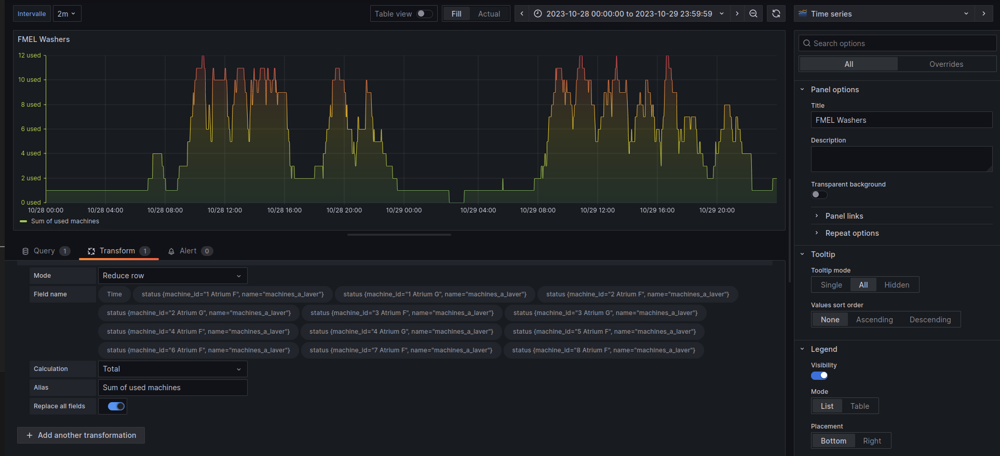
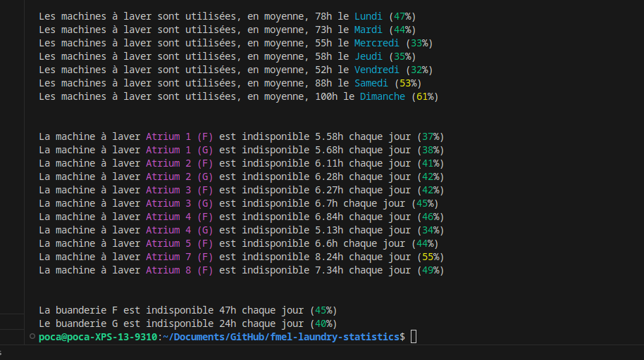

Looking for an excuse to explore new techs and using the laundry app in my building, I decided to carry out a little experiment.

Our challenge: what's the optimal day/time to do laundry?

In this article, I'll detail:
* how to automatically collect data on the availability of my building's laundry machines
* how to efficiently store these data using **InfluxDB**
* how to quickly create a view of these data with **Grafana**
* and... the results of the experiment :)

## Data Collection

To collect data, I set up a reverse proxy (using mitmproxy) to intercept requests from the EEProperty mobile app.

I encourage you to read [my article on reverse engineering PixPay](https://blog.androz2091.fr/reverse-eng-pixpay/) for a more complete tutorial, it's the same principle.

### API Mapping

Here are the endpoints:

* `POST https://login.eeproperty.com/api/v3/mobile/user/login`: to get a JWT for authentication
* `GET https://vesta.eeproperty.com/api/v3/mobile/machines`: to get the availability of the laundry machines

I also published a [TypeScript library](https://github.com/polysource-projects/eeproperty-wrapper) to simplify its use.

### Automation

Now, all that's left is to store the data. For this, I decided to use **InfluxDB**.

It's extremely simple to use for time-series data (exactly what we want to do). You simply create a database, then send points with a timestamp.

Here's what my code looks like, which runs every 120 seconds:
```
jwt_token = LOGIN(credentials)
machines = GET_MACHINES(jwt_token)

LIST points = []

FOR EACH machine IN machines
    points.ADD({
        timestamp: CURRENT_DATE_TIME_WITHOUT_SECONDS,
        machine_id: machine.number + ' ' + machine.room,
        status: IF machine.state IS 'DEACTIVATED' THEN 0 ELSE 1
    })

INFLUXDB_WRITE('http://localhost:8086', 'washers', points)
```

And that's it! We just have to run this script, and come back later.

## Data Analysis

Re. 33 days have passed since writing this first part.

I was able to collect 284,912 points.

We can check that this number of points is consistent. With 12 washing machines running for 33 days, and one point every 2 minutes: (33 \* 24 \* 60 / 2) \* 12 = **285,120 points**, with a deviation of 0.07%, we're good.

### Grafana

The first thing we can do to visualize the data is create a Grafana dashboard.

In just seconds (on Linux :), Grafana is launched and we can add InfluxDB as a data source and create a dashboard.

In the **Query** tab, we retrieve all the points in the range currently being viewed:
```flux
from(bucket: "machines") 
  |> range(start: v.timeRangeStart, stop: v.timeRangeStop)
  |> aggregateWindow(every: ${interval}, fn: mean)
```
Then, in the **Transform** tab, at each available time t, we do a reduce on all the points to get the number of machines used at each moment.

> This is why it's very important that the timestamp is the same for all machines. For example, when I send my point to save the status of "Atrium F (1)", it must have exactly the same timestamp as the point that indicates the status of "Atrium F (2)", so that the sum is done correctly.

We can also define an "interval" parameter in the settings to smooth the curve and reduce the number of points if needed.



We get a nice graph with our data, which allows us to spot several trends!

There seems to be a strong correlation between the day/time of the week and the usage of washing machines.

### More In-depth Analysis

Now, even though the graph is great for getting an idea of what we want to look for, we need more precise results.

For that, I created a script that calls our InfluxDB and performs more interesting calculations.

And after a long work of data analysis and cleaning (such as removing machine F 6, which was down for two weeks and skewed the results)...

### The Results :)



Here we go!

We can conclude that the best day to do laundry seems to be Friday (maybe people go out more?) or Wednesday, with 2x fewer people than on Sunday.

We also notice that Building G is slightly less used than Building F, probably because it's farther from the elevator and has half as many machines.

Other more advanced and interesting statistics can be done! 

*For example, on average, on Sundays, 4 machines are available simultaneously between 6 PM and 7 PM, down to only 2 between 3 PM and 4 PM... and unlike 7 between 2 PM and 3 PM!*
