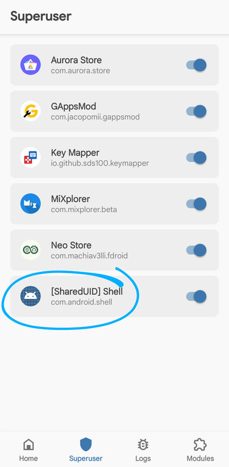
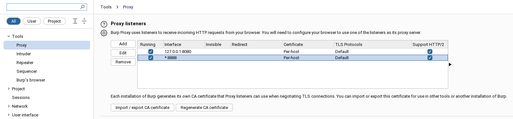
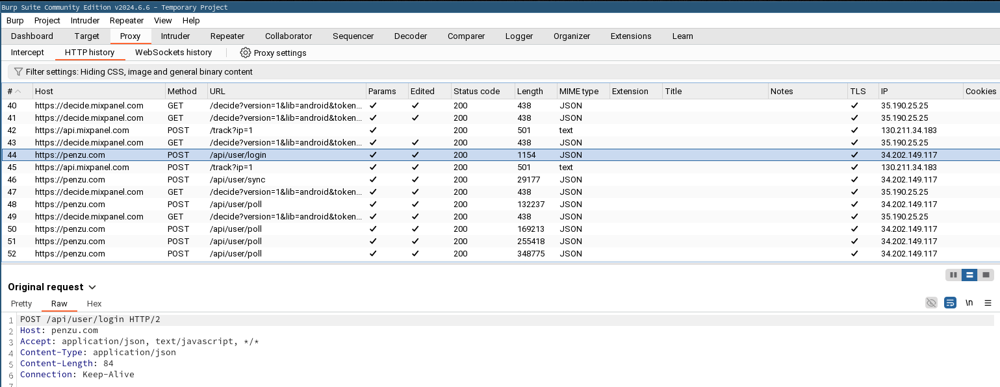

This rather short article explains step by step how to bypass SSL pinning when analyzing an Android application with Frida and Burp.

I invite you to read [my article on PixPay](http://localhost:8000/reverse-eng-pixpay/) for more details on what reverse engineering is.

## Prerequisites

* Python 3.11 or higher
* Burp Suite (CE is enough)
* Android Platform Tools (to use the `adb` tool)
* A rooted Android device
* A cable to connect your phone to your computer

## Installing Frida


Start by creating a virtual environment and installing Frida.

### 💻 On your computer 

#### Create a virtual environment

```
python3 -m venv frida
source frida/bin/activate
```

#### Install Frida

```
pip install Frida
pip install objection
pip install frida-tools
```

### 📱 On your Android 

Now, let's install Frida on your phone. Make sure USB debugging is enabled, then connect your phone to your computer.

#### Download Frida Server

Run this command on your computer to get your phone's architecture.

```
adb shell getprop ro.product.cpu.abi
```

Click on [this link](https://github.com/frida/frida/releases), and select the **Frida Server** version (not the Platform Kit!) corresponding to your architecture.

#### Unzip and rename the file

Replace `VERSION` and `ARCH` with the values you previously obtained.

```
xz --decompress frida-server-VERSION-android-ARCH.xz

mv frida-server-VERSION-android-ARCH frida-server
```

#### Upload the file to your phone

The following commands allow you to copy the file to your phone and make it executable.

```
adb push frida-server /data/local/tmp/
adb shell "chmod 777 /data/local/tmp/frida-server"
```

#### Run Frida Server

```
adb shell
su
/data/local/tmp/frida-server &
```



> Make sure to grant root permissions to the Shell to run Frida Server.

And there you go!

Now, on your computer, run the following command:

```
frida --codeshare akabe1/frida-multiple-unpinning -U -f com.yourapp.package
```

Replace `com.yourapp.package` with the package of the application you want to analyze.

## Burp Suite

Launch Burp Suite and go to the `Proxy` tab.

### Install the Burp certificate

First, you need to export the Burp certificate. To do this, go to `Proxy` > `Options` > `Import / Export CA Certificate`.

Select the `DER` format and export the certificate (making sure to manually add the `.der` extension!). Download it to your phone, and from the settings, install it.

#### Trust the certificate 

With a root explorer like [MiXplorer](https://mixplorer.com), go to one of these two folders:
* `/data/misc/keychain/cacerts-added/`
* (or, if the first folder is empty) `/data/misc/user/0/cacerts-added/`

Move the file you found in one of the two folders to `/system/etc/security/cacerts`.

Restart your phone.

### Configure the proxy on Burp and Android

To have your phone use Burp as a proxy, go to your phone's settings, then `Network & Internet` > `Wi-Fi` > `Modify network` > `Advanced`.

Get your computer's local IP with the command `ip a` for example, and enter it in the `Proxy` field.

For the port, use `8888`.



Then go to Burp, and add a `Bind Address` in the proxy settings (`*:8888`, select `All interfaces`).

And there you have it!

You should see the requests arriving in clear text in Burp (if not, make sure the interception is enabled).


