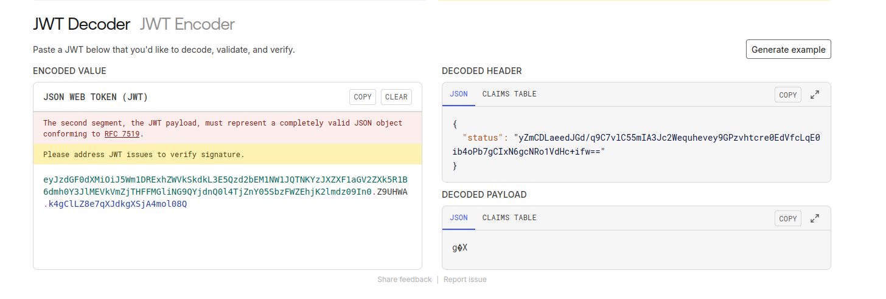
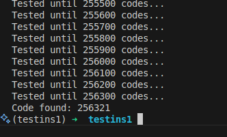

A write-up of the Unchained challenge from the Insomnihack CTF, which takes place every year at the Swiss Tech Center at EPFL.

After 11 hours of CTF at the Swiss Tech Center, it's 5:30 AM, and it's time to write it down before I forget :)

Note that this write-up is absolutely not the most optimized way to solve the problem (I spent nearly 6 hours on it!) but I hope that my reasoning will thus seem more attainable to other beginners who haven't done many CTFs yet!

## The Challenge

The subject, this simple Python server. An instance is online (with an unknown `MAIN_KEY` and `app.secret_key`).

🚩 Our goal? Obtain the environment variable `os.environ['INS']` (returned by the `/secret` endpoint).

```python
from base64 import b64encode, b64decode
from Crypto.Cipher import AES
from Crypto.Util.Padding import pad, unpad
from random import randint
import uuid
import os
from flask import Flask, request, session, redirect, url_for
import re
from waitress import serve

app = Flask(__name__)
app.secret_key = ''.join(["{}".format(randint(0, 9)) for num in range(0, 6)])

MAIN_KEY = b"FAKE_KEY"

def gen_userid():
    return str(uuid.uuid4())

def encrypt(data,MAIN_KEY):
    cipher = AES.new(MAIN_KEY, AES.MODE_ECB)
    cipher_text_bytes = cipher.encrypt(pad(data, 16,'pkcs7'))
    cipher_text_b64 = b64encode(cipher_text_bytes)
    cipher_text = cipher_text_b64.decode('ascii')
    return cipher_text

def decrypt(MAIN_KEY, cipher_text):
    rem0ve_b64 = b64decode(cipher_text)
    cipher = AES.new(MAIN_KEY, AES.MODE_ECB)
    decrypted_bytes = cipher.decrypt(rem0ve_b64)
    decrypted_data = unpad(decrypted_bytes, 16, 'pkcs7').decode('ascii')
    return decrypted_data

@app.route("/")
def welcome():
    return '''
    <div style="text-align: center;">
        <h1 style="font-size: 3em; color: #333;">UNDER CONSTRUCTION</h1>
        

    </div>
    <!-- HACKERS HAVE NO CHANCE THIS TIME!!! -->
    '''


@app.route("/status")
def status():
    if 'status' in session:
        plain_text = decrypt(MAIN_KEY, session["status"])
        return f'Logged in as {plain_text}'
    return 'You are not logged in'

@app.route("/secret")
def get_secret():
    plain_text = decrypt(MAIN_KEY, session["status"])
    role = plain_text.split("::")[2]
    if role == 'admin':
        return  os.environ['INS']
    return f'You are a just a {role}. Only admins can see the secret!'

@app.route('/login', methods=['GET', 'POST'])
def login():
    if request.method == 'POST':        
        user_id = gen_userid()

        user = re.sub(r'\W+', '', request.form['username'])

        status_data = user_id + \
        "::" + user + \
        "::" + "guest"

        cipher_text = encrypt(data=status_data.encode('ascii'),MAIN_KEY=MAIN_KEY)
        session['status'] = cipher_text

        return redirect(url_for('status'))
    return '''
            <form method="post">
                <p>
                    <label for="username">Username:</label>
                    <input type="text" id="username" name="username">
                </p>
                <p>
                    <input type="submit" value="Login">
                </p>

                <p> * Note to myself: Password field TBD </p>
            </form>
    '''

@app.route('/logout')
def logout():
    session.pop('status', None)
    return redirect(url_for('status'))

if __name__=="__main__":
    serve(app, host='0.0.0.0', port=80)
```

However, as seen in `/secret`, the user's role is verified and must be equal to `admin`.

You need to log in with `/login` by submitting a `username`, then the session will be stored in the browser as `${random_user_id}::${username}::{role}`, all encrypted with the `MAIN_KEY`!

(`random_user_id` is a uuid, so something like `e3482f4e-7970-4da5-8626-15578b78e7a4`).

## Attempt #1: Separator Injection

We first tried to perform the equivalent of an SQL injection, adding `::` in the username. Indeed, submitting `simon::admin`, if accepted by the server, would have resulted in `e3482f4e-7970-4da5-8626-15578b78e7a4::simon::admin::guest` and in the `/secret` endpoint, `.split('::')[2]` would have been equal to `admin`!

Unfortunately, there's a really annoying regex in `/login` that permanently removes this possibility by only allowing letters :(

## Attempt #2: Retrieve the `MAIN_KEY`

After spending some time trying to inject something into the `/login` form, we are convinced we're barking up the wrong tree. We turn to the `encrypt` function. It uses **AES** in **ECB** mode (which I had no clue about until then). We wonder if a flaw has intentionally been left in this `encrypt` function, and if that flaw should allow us to retrieve the `MAIN_KEY`.

And if so... for what purpose? No idea for the moment.

We then look at the session cookies generated by Flask and find this:
```
session: "eyJzdGF0dXMiOiJ5Wm1DRExhZWVkSkdkL3E5Qzd2bEM1NW1JQTNKYzJXZXF1aGV2ZXk5R1B6dmh0Y3JlMEVkVmZjTHFFMGliNG9QYjdnQ0l4TjZnY05SbzFWZEhjK2lmdz09In0.Z9UHWA.k4gClLZ8e7qXJdkgXSjA4mol08Q"
```

Clearly, it looks like a JWT (json web token).

When inserted into https://jwt.io, we get the following result:



```json
{
  "status": "yZmCDLaeedJGd/q9C7vlC55mIA3Jc2Wequhevey9GPzvhtcre0EdVfcLqE0ib4oPb7gCIxN6gcNRo1VdHc+ifw=="
}
```

the payload seems to be... in the JWT headers? I've never seen that before, but at least we are able to retrieve the encrypted result from the `encrypt` function!

In summary, we are able to get the encrypted version of a lot of entries (but not all, because the server adds a random ID in front, and `::guest` at the end). That's already something!

## Cool Attempt: Using Block Size (1)

After researching more on ECB, we realize that its operation is as follows:


Each 16-byte block is encrypted independently of the others. That's useful for us! We know that once we've obtained the encryption of `::admin`, we could directly place it encrypted as-is into our cookie!

## But... Can We Modify the Cookie?

And here's the second (but smaller) problem: the cookie is signed with `app.secret_key` (which is randomly generated each time the server is launched).

Fortunately, the above code is given to us, and we see that it's a 6-digit code: only 1,000,000 attempts (10**6) to find the right key!

For that, the attack needs to be fast enough (and especially, entirely local), and we must thank [GioBonvi](https://gist.github.com/GioBonvi/b94278d0519dfa46f96f3de354efe269) for his script ;)

By retrieving the JWT generated by the live Insomnihack instance, we can validate it through the script by specifying the key. We just need to test with all the keys, and it's done! Unfortunately, I had the great idea of making a bash script that calls the Python script instead of looping directly in Python, which made me lose quite a bit of time!

```python
from hashlib import sha1
from flask.sessions import session_json_serializer
from itsdangerous import URLSafeTimedSerializer, BadTimeSignature
from zlib import decompress


def readAndVerifyCookie(cookie, secret_key):
  signer = URLSafeTimedSerializer(
    secret_key, salt="cookie-session",
    serializer=session_json_serializer,
    signer_kwargs={"key_derivation": "hmac", "digest_method": sha1}
  )
  try:
    session_data = signer.loads(cookie)
    #print("The signature is correct!")
    return session_data
  except BadTimeSignature:
    #print(f"The signature is not correct!")
    return None

jwt = "eyJzdGF0dXMiOiJRamo2V3UrZGp0NVRVNXRwa3dqcXoyQmE2WjhRZFJ3ZTFrK2NhdUhtSXN1WjgzSkg5dUpPQVNMSkpnNnZad3FvTWJtNzR3a0VCeWo4Mi8vdzFJVUQ5Zz09In0.Z9SbRw.WS4VqAkE1dPnlUCG5iGAzEdZv2Y"

def check():
  for i in range(1000000):
    if i%100 == 0:
      print(f"Tested until {i:06d} codes...")
    if readAndVerifyCookie(jwt, f"{i:06d}") is not None:
      print(f"Code found: {i:06d}")
      exit(0)

check()
```



And there we go! We can now inject signed cookies!

We test with an unsigned (but still encrypted!) `status` payload, sign it, and set it as a cookie, and it works!

## Next: Using Block Size (2)

Now that we can inject signed cookies... what payload to put?

We still don't know how to encrypt `id::me::admin` to put it in the cookie. For that, we test logging into the live instance with the following values and then retrieve the cookies:

- `e3482f4e-7970-4da5-8626-15578b78e7a4::aaaaaaaaaaadmin::guest` (so that `admin::guest` starts a new 16-byte block)
    ```
    \xd7\xf8 \xd7\xb8\x92Y\xb7L\x8e\xea3',\t\xc0Q\x1c\x9e(jg~\x12\x15\xb2\x98\x87\x19\xc9,\xd1D\xf0\\\xd7\x11\xaa\x9f8t\xe3\x9a\x02\xe75\x81\xe4o\x04\xa9\xd5\x84@\x1c\xb1\x97\xa5\x98\xf2\xf8$\xb9\x12
    ```
- `797d503d-7faa-4d35-b93f-e6e501cc60da::1234567891admin::guest` (which thus gives the same ending)
    ```
    \xe1\xa6\x02M\x18\xeam\x14\x19K$\xf4^\xcd\x84M\x9e\xea\x8el\x12\xcf\x91B\xec\xa0\xca\xf5\xde3\x16\x08\xe1\x83m\xb7\xa6\x14\xfch\xee\x9c\xd9\x83\xe3\x85\x7flo\x04\xa9\xd5\x84@\x1c\xb1\x97\xa5\x98\xf2\xf8$\xb9\x12
    ```

And then... we test:
- `052599b1-d2af-461b-8210-151cb212c012::1234567891 admiz::guest` and there, problem! The ending isn't identical!
    ```
    \xc9j#\xcd\x1f\xb3\x94_\xa8\x8f\xf7\xddW\xe2\x07\xcc/\x93\x82\x95\x18L\xfb\xd4s=\xf2\x88\x8c-D\xac\x16\xcc\n\x1a&P\x06\x8b\x98\x8e\xa9\x86\x14\xb40\x89\xf5D0'\x15{\xa1\xcf%c\xe1\x12\x13\xed\xb2\xc2
    ```

Until now, we thought that ECB did some sort of XOR between the key and the plaintext block, but no, encoding 1234567890 and 1234567891 will be perfectly different (even at the beginning). We can only get a 16-byte block encrypted, but we can't then slice it into smaller blocks.
So, we can't get just the representation of `admin` alone!

## The End and Resolution

After (a lot of) thinking, we come up with a solution!

- Encrypt `43ebe362-4558-45cc-b0e6-104b989cd8a3::admin::guest` and then retrieve the 4th encrypted block `d8a3::admin::gue`
- Encrypt `e3482f4e-7970-4da5-8626-15578b78e7a4::aaaaaaaaaaadmin::guest` and then retrieve the 3rd encrypted block `e7a4::aaaaaaaaaa`
- Replace the 3rd encrypted block of `43ebe362-4558-45cc-b0e6-104b989cd8a3::admin::guest` with the 3rd encrypted block of `e3482f4e-7970-4da5-8626-15578b78e7a4::aaaaaaaaaaadmin::guest`
- Then add the 4th block from the encryption of `43ebe362-4558-45cc-b0e6-104b989cd8a3::admin::guest`!

This gives the following results:

- `43ebe362-4558-45cc-b0e6-104b989cd8a3::admin::guest`
- Then `43ebe362-4558-45cc-b0e6-104b989ce7a4::aaaaaaaaaa`
- Then `43ebe362-4558-45cc-b0e6-104b989ce7a4::aaaaaaaaaad8a3::admin::gue`

And there we go! We successfully obtain `admin` in the 3rd position of the encryption, and we can put it in the signed cookie!

## Who is "we"?

I didn't do this alone, thanks to our team which includes Valerio, Laura, Martin, Adrien, baribal02, lynx8511, and zookafoob :)
