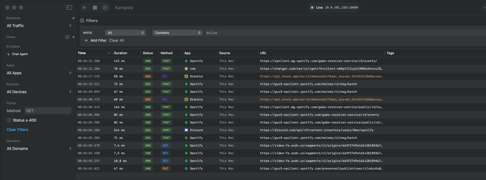
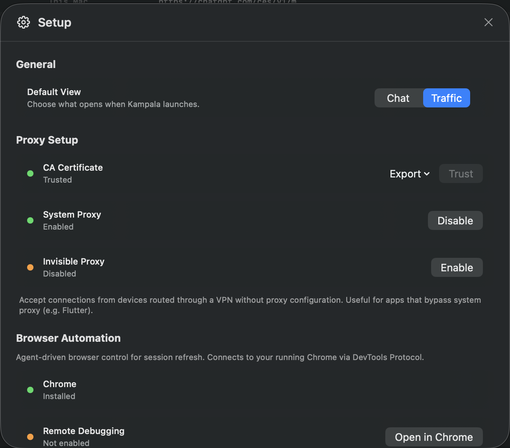
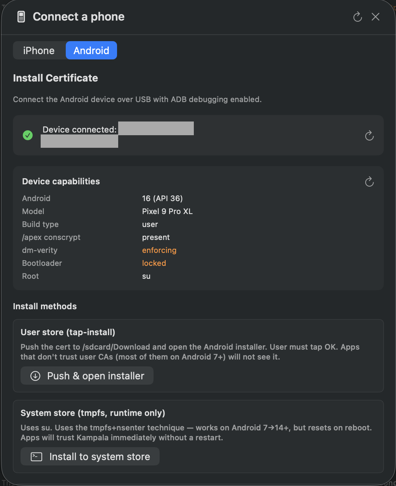

"Man in the Middle" proxies like Burp, Charles, etc. have always been very useful for reversing software by inspecting the network requests they make.

[Kampala by Zatanna](https://www.zatanna.ai/kampala) is a very similar software, but AI-native, and it integrates an MCP server, making the process extremely fast. I quickly explain how it works in this article, using the example of reversing the app I use to unlock my office in San Francisco.

When you start Kampala, you land on the following page:



By default, the "System Proxy" is enabled, so all requests made by my computer go through Kampala, which observes and forwards them.



I'm going to disable System Proxy because I want to reverse an app on my phone, so the outgoing traffic from my computer may not pass through Kampala.

Kampala has a dedicated menu for connecting mobile devices:



A few quick technical steps:
- Export the Kampala certificate via settings, then install it in Android settings.
- (requires root) Use an Apatch module ([MoveCertificate](https://github.com/ys1231/MoveCertificate)) to move the certificate from the user store to the system store.
- Restart the phone.
- Connect the phone to the computer via cable.
- Run `adb reverse tcp:8081 tcp:18080` (`18080` is the port of the Kampala proxy on my computer).
- In the phone's WiFi settings > proxy > manual > set the host to `127.0.0.1`, port `8081`.

Then open the office key app and make some test requests! And open a Claude session to take advantage of Kampala's great MCP server.

Here's a raw dump of the conversation:

---

> **me:** can you access Kampala?

> **Opus 4.7:** Yes — Kampala MCP tools are available (deferred). I can load any of them via ToolSearch when needed. Want me to run something specific (e.g., `traffic_overview`, `list_sessions`)?

> **me:** can you search for PDK unlock requests?

*Called kampala 3 times*

> **Opus 4.7:** No endpoint contains "unlock" literally, but PDK triggers door unlocks via `POST .../devices/{deviceId}/virtual-read`. Found 2:
>
> - `<reqId1>` — POST virtual-read on device `<deviceId>`
> - `<reqId2>` — POST virtual-read on the same device (~2½ min later)
>
> Both on system `<systemId>/cloud-nodes/<cloudNodeId>/devices/<deviceId>`. Want me to fetch the bodies / export as code / build a flow?

> **me:** I'd like to understand a bit more how it works, what are their endpoints, etc. Also check what auth they use, etc. I want to create a js script that unlocks the door. Tell me if you want me to press buttons on the app so you can see them in Kampala.

*Called kampala 2 times*

> **Opus 4.7:** Here's how the unlock works:
>
> **Endpoint**
> `POST https://systems.pdk.io/{systemId}/cloud-nodes/{cloudNodeId}/devices/{deviceId}/virtual-read`
> Empty body, returns 204 No Content. PDK calls it "virtual-read" — simulates a credential read at the reader, which triggers the unlock.
>
> **Your IDs (captured)**
> - systemId: `<systemId>`
> - cloudNodeId: `<cloudNodeId>`
> - deviceId: `<deviceId>`
>
> **Auth**
> - `Authorization: Bearer <JWT>` only. No cookies, no CSRF.
> - JWT issued by `https://accounts.pdk.io/`, audience = the systemId, sub = user id `<userId>`. The captured token was issued at `iat 1778963785` (no exp visible in payload — PDK tokens are typically short-lived though).
> - UA: `SDK/2.2.20 io.pdk.doors/3.0.6` (their mobile SDK)
>
> **Gaps for a standalone script**
> I don't see a login/token-refresh request in the capture — the app started with a token already in hand. To make this reusable beyond the token's lifetime, I'd need to see how `accounts.pdk.io` issues/refreshes it.
>
> Yes, please press buttons — specifically:
> 1. Log out and log back in (to capture the auth flow against `accounts.pdk.io`).
> 2. Then unlock the door once more, so I can confirm the token source.
>
> After that, I can write the JS script.

> **me:** Done! I've logged in again at simon@myredactedcompany.ai

*Called kampala 4 times*

> **Opus 4.7:** The auth is more involved than expected — and not a simple username/password flow.
>
> **What the login actually does**
>
> Logging in with email/password happens before this traffic (probably out-of-band — email magic link / OTP, since I see `credentials/reset/request` repeatedly). What I can see is the device-credential setup:
>
> 1. `POST /api/authdevices` — the app generates a local ECDSA P-256 keypair, sends the public key + device metadata. From your latest login:
>    - uuid: `<deviceUuid>`
>    - publicKey (SPKI, base64)
>    - signed with HTTP Signatures: `keyId, algorithm=ecdsa-sha256, headers="(request-target) x-date Digest"`
> 2. `GET/PATCH /api/authdevices/credentials/global` — credential bookkeeping
> 3. `POST /api/authdevices/credentials/upgrade` — bumps cred to current scheme
> 4. `POST /api/authdevices/credentials/reset/request` — likely where the Bearer JWT used against `systems.pdk.io` gets minted (Kampala blocked me from reading that body since it contains a live credential, which is the right call).
>
> **Implications for your JS script**
>
> Every request to `accounts.pdk.io` is signed with the device's private key (HTTP Signatures over `(request-target) x-date Digest`). There's no "POST email+password, get token" endpoint visible.
>
> So three options, from easiest to hardest:
>
> 1. **Manual token paste** — grab the Bearer JWT once from the app, hardcode it, call `POST /{systemId}/cloud-nodes/{nodeId}/devices/{deviceId}/virtual-read`. Works until token expires (likely hours).
> 2. **Long-lived token via API key** — PDK has a partner API. Check if Simon's org has dashboard access to mint an API key. Cleanest path.
> 3. **Full impersonation** — extract the ECDSA private key from the phone (rooted device or keystore export), reimplement HTTP Signatures + token-refresh in Node. Brittle and probably violates ToS.
>
> My recommendation: option 1 for a quick script + a one-line "how to refresh" note, unless you have admin access to mint a real API key. Want me to write the option-1 script using the captured token, with a comment showing where to paste a fresh one?

> **me:** > 1. Manual token paste — grab the Bearer JWT once from the app, hardcode it, call POST /{systemId}/cloud-nodes/{nodeId}/devices/{deviceId}/virtual-read. Works until token expires (likely hours).
>
> how do you know it's only hours?

> **Opus 4.7:** Honest answer: I don't. I was guessing based on typical mobile-app JWTs.
>
> The token I captured had `iat` (issued-at) but no `exp` visible in the payload I decoded — so the lifetime isn't self-declared in the JWT. It could be enforced server-side (common) or actually be long-lived. The only way to know is to test: hardcode it, wait, and see when virtual-read starts returning 401.
>
> The `credentials/reset/request` calls happening every few minutes in your capture also hint that the app refreshes something frequently — but I can't read those bodies, so I can't tell if that's token refresh or unrelated bookkeeping.

> **me:** Oh I think this is because the email was not sent so I had to retry a few times

> **Opus 4.7:** Got it — that explains the repeated `reset/request` calls (email-OTP resends), not token refresh. So token lifetime is still unknown; only way to find out is empirically. Want me to write the script with the captured token?

> **me:** Yes!

*Wrote `pdk-unlock.js` (29 lines), then ran it:*

```
failed: 401 Unauthorized
{"message":"Authorization has failed."}
```

> **Opus 4.7:** Captured token is already expired (so lifetime < ~24min, since capture was recent). Script is at `/Users/poca/pdk-unlock.js` — set `PDK_TOKEN` env var with a fresh one and re-run.

>
> Want me to look for a newer token in the latest traffic? If you tap unlock once more in the app, I can grab the fresh Bearer and we'll also learn the token's actual lifetime by timestamp comparison.

> **me:** I made a new request, can you grab the new token?

*Called kampala 2 times, updated the token in `pdk-unlock.js`, ran it:*

```
unlocked
```

> **Opus 4.7:** Unlocked. Script updated with the fresh token.
>
> Token timing observed: first one `iat 1778963785`, expired before `iat 1778966575` was issued (~46 min later). So lifetime is somewhere under 46 min — probably the standard 1h with a short skew, or ~30 min. We'd need a longer captured window to pin it down.

## Conclusion

Claude was able to generate a perfect script to unlock the door in just a few minutes without me needing to look at the interface, which is quite incredible when it usually takes several hours of work! 🎉

(and regarding what he mentioned about the invalid token, it was because I had logged out, not because it had expired. This means I can continuously unlock the door! :)
