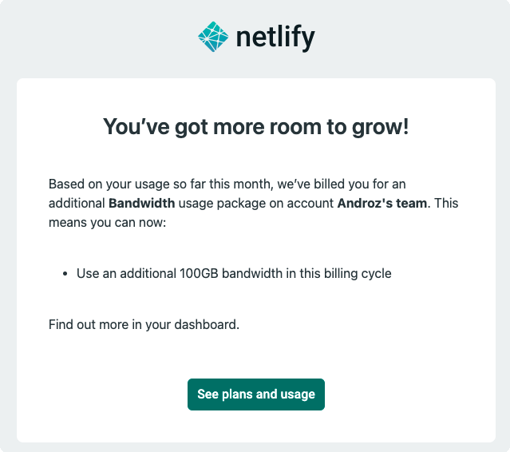

Creating a website quickly is becoming increasingly easy. Thanks to React, Svelte, or Vue, it's possible to create a fairly complex site in just a few hours. But once it's finished, we need to find a way to host it on a server, and that's where making the right choice is crucial.

> This article focuses on Netlify but also applies to other cloud services based on pay-as-you-go (you're charged for what you use), like Firebase. You don't choose what you consume, and consequently, what you pay.

### Netlify, the perfect solution... 

As a developer, Netlify might seem like an excellent choice. Indeed, it's a fantastic tool for publishing side projects easily, **without having to manage a virtual private server (VPS)**, and, most importantly, **without having to build and deploy the application manually** with each change (Netlify automatically deploys after each GitHub commit). All this **for free**.

That's why I've personally deployed on Netlify over the months: a first site, then a second, and now twenty or so small sites on my Netlify account. It's very convenient, I have access to a dashboard with all deployments, and I can manage everything with a very simple interface without having to handle anything on my server. The dream solution.

### ...unless you're planning a vacation.

June 2021. A couple of weeks of vacation where I decide to disconnect almost entirely from all my “pro” social networks. I had just deployed v2 of [Discord Data Package Explorer](https://ddpe.androz2091.fr), hosted on Netlify. No risk of VPS crash, Apache configuration issues, or anything else; I could leave in peace, letting Netlify take care of the rest.

As you might guess, things didn't go as planned.

After a few days, I received this email, then another, and... yet another. In total, Netlify charged me three 100GB bandwidth packages at €20 each **in two weeks**. It turns out several TikTokers made videos about my site, and during that week, it received several hundred thousand requests per day, exceeding the free 100GB limit set by Netlify.

I have the capacity to pay the €60 charged by Netlify. But what would have happened if I'd taken time off for two or three months and the site had continued to draw such a large audience? The bill could quickly exceed €100 or €200 (or much more) per month.

This is why, in my opinion, you must **be extremely cautious** when using Netlify (and all similar solutions, even Cloudflare Pages, which you quickly become dependent on...), and in reality, seek to avoid them as much as possible. Because you're not the one deciding what you'll pay at the end of the month, and Netlify won't patiently wait for your confirmation. The bill can therefore end up being very, very hefty.

### A better solution?

There is no miracle solution that allows you to deploy your applications for free and as easily as Netlify does. Cloudflare Pages is somewhat similar and doesn't have bandwidth limits or auto-billing. However, since their service is new, I wouldn't be surprised if they eventually shift to a billing system like Netlify's, depending on what you consume.

The best solution is probably to manage it yourself, with a VPS and a hook system (an action is taken when a commit is created, including building and deploying your application). The setup is clearly more time-consuming, but I think it's worth it. Take the time and save your money.

Feel free to send me your alternative suggestions to Netlify on [Twitter](https://twitter.com/androz2091) or [Discord](https://androz2091.fr/discord)!
