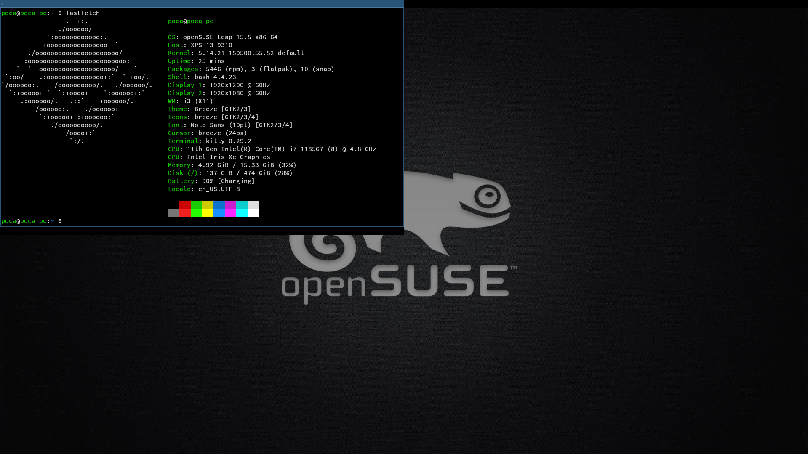
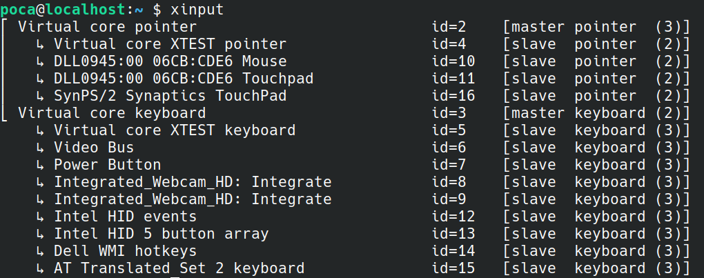
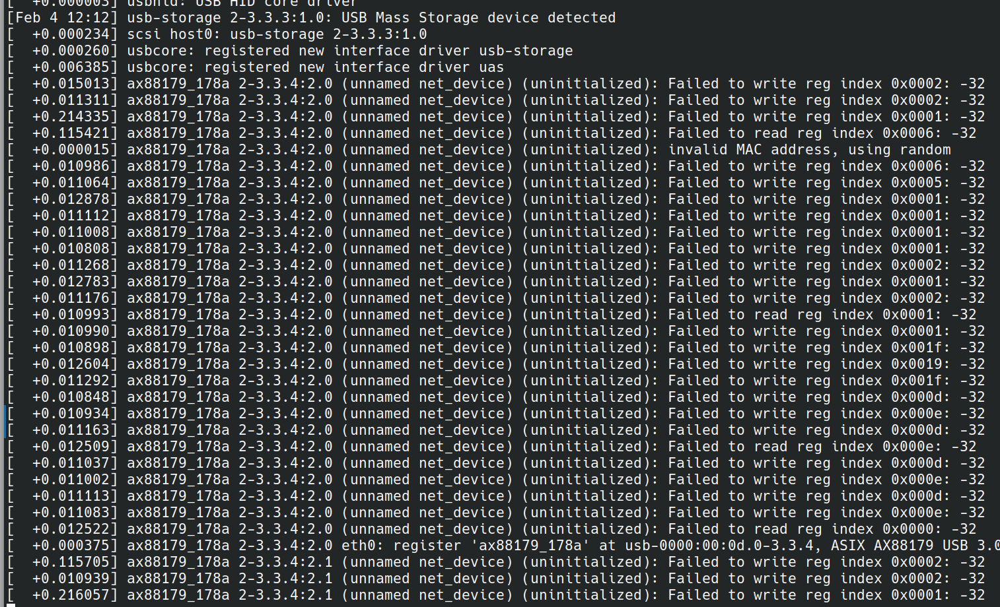

After spending over 6 months on Ubuntu, I decided, after meeting [picnixz](https://github.com/picnixz) (who was a great help :)), to migrate to openSUSE.

This article allows me to jot down the different patches/bugs/useful scripts I encounter (a lot) so I can remember them later (and maybe share my opinion on the distro later).

**Note: these patches work for my Dell XPS 13 9310 computer.**



### Table of Contents

* [OpenSUSE Patches](#patches-opensuse)
* [OpenSUSE Customization](#customisation-dopensuse)

## OpenSUSE Patches

### Patch 1: natural scrolling (on x11)

The natural scrolling on my touchpad would randomly disable after a few restarts. It couldn't be re-enabled via the openSUSE settings interface.



Solution:
* Get the touchpad input name with `xinput`
* Add this line to `.profile`:
```
xinput set-prop "DLL0945:00 06CB:CDE6 Touchpad" "libinput Natural Scrolling Enabled" 1
```

### Patch 2: getting the speakers to work

The speakers wouldn't work (the sound was forcibly muted).

Solution:
* Update the system with `sudo zypper update`
* Install sof-software with `sudo zypper install sof-software`

### Patch 3: getting my Bluetooth headphones to work

My Bluetooth headphones didn't appear in the list of available audio devices.

Solution:
* Update the system with `sudo zypper update`
* Install pipewire-pulseaudio with `sudo zypper install pipewire-pulseaudio`

### Patch 4: getting my USB hub to work

I bought [this USB hub](https://www.amazon.fr/dp/B0CHXZYSMG). But when plugging it in, openSUSE completely freezes and nothing works.



The problem was due to the Ethernet port on the USB hub not being compatible with my computer. Blacklisting it allows the other hub ports to work.

Solution:
* Debug with `sudo dmesg -w -H` (`-w` to follow so you can see logs before freeze, `-H` for readable output).
* Identify the problematic port (here `ax88179_178a`).
* Create a file `/etc/modprobe.d/blacklist-ax88179_178a.conf`
* Write `blacklist ax88179_178a`
* Restart.

### Patch 5: video playback on Firefox

Videos play poorly on Firefox:


Some YouTube videos are smooth, but others are not. The same issue on Discord, attachments don't always play.

Solution: https://opensuse-guide.org/codecs.php

### Patch 6: shortcuts not working well in Logisim

When I pressed CTRL + 1, CTRL + 2, etc., the current tool didn't change. Eventually, I realized it was due to the keyboard layout (switching to US layout in Yast made everything work). Finally, I manually edited the keycodes in... the Logisim source code.

File `src/main/java/com/cburch/logisim/gui/main/KeyboardToolSelection.java`:
```java
final var keyStroke = KeyStroke.getKeyStroke(
  i == 1 ? 150 : i == 2 ? 0 : i == 3 ? 152 : (char) ('0' + i)
, mask);
```
This is really an ugly fix. Knowing I put 0 for tool 2 because some keys are not recognized, luckily only one of the 3 CTRL + 1, CTRL + 2, and CTRL + 3 doesn't work (2) otherwise this technique would not have worked.

Then gradle build and desktop file:
```
[Desktop Entry]
Type=Application
Name=Logisim Evolution
Comment=Launcher for Logisim Evolution
Icon=/path/to/logisim-evolution/artwork/logisim-evolution-icon.svg
Exec=java -jar /path/to/logisim-evolution/build/libs/logisim-evolution-3.9.0dev-all.jar
Terminal=false
Categories=Development;Education;
```

### Patch 7: getting my external monitor to work

(without having to logout/login)

* List devices with `xrandr`.
* Enable external monitor with `xrandr --output DP-1 --auto --right-of eDP-1` or `xrandr --output HDMI --auto --right-of eDP-1`.
* Disable external monitor with `xrandr --output DP-1 --off`.

## OpenSUSE Customization

### i3wm

[Johnny](https://t.me/jo_hnny) greatly helped (and heavily convinced :) me to install i3wm as a window manager.

Here are the modifications made.

#### Taking a screenshot

```sh
bindsym --release $mod+Print exec --no-startup-id "import png:- | xclip -selection clipboard -t image/png"
```

#### Changing brightness

```sh
bindsym XF86MonBrightnessUp exec --no-startup-id brightnessctl set +5%
bindsym XF86MonBrightnessDown exec --no-startup-id brightnessctl set 5%-
```

#### Changing terminal (to Kitty)

```sh
bindsym $mod+Return exec kitty
```

#### Switching the bar to Polybar

```sh
exec_always --no-startup-id $HOME/.config/polybar/launch.sh
```

**Note:** I had a wifi connection issue due to KDE Plasma encrypting passwords, so with i3wm NetworkManager couldn't connect. I fixed this by disabling password encryption.

#### Getting Discord to work with i3wm

Discord wasn't working well by default with i3wm (crash). This problem can be resolved by installing the notification manager dunst.

```sh
sudo zypper install dunst
```

### Script to enhance the shell

This script, which I did not author, enhances the shell interface by adding the current git branch, the status code of the last executed command, etc.

This script should be added to `.bashrc`.

```bash
# PS1 changes (with git branches)
parse_git_branch() {
    if [[ `git branch 2>/dev/null` ]]; then
        local bname
        bname=$(git branch --no-color 2> /dev/null | sed -e '/^[^*]/d' -e 's/* \(.*\)/\1/')
        local rname
        rname=$(git remote 2>/dev/null)
        if [[ $rname =~ 'origin' ]]; then
            printf '(%s)\n' "$bname"
        else
            printf '(%s:%s)\n' "$rname" "$bname"
        fi
    fi
}

update_PS1() {
  if test $? -eq 0 ; then
      local status_=""
  else
      local status_="\001\033[33m\002($?)\001\033[00m\002 "
  fi
    
  local username_="\001\033[01;32m\002\u\001\033[00m\002"
  local hostname_="\001\033[01;32m\002\h\001\033[00m\002"
  local location_="\001\033[01;34m\002\w\001\033[00m\002"

  local branch_="$(parse_git_branch)"
  if test -z "$branch_" ; then
      branch_=" "
  else
      branch_=" \001\033[38;5;1m\002${branch_}\001\033[00m\002 "
  fi  
    
  local prefix_=""
  if ! test -z "$VIRTUAL_ENV" ; then
      prefix_="\001\033[38;5;9m\002[`basename \"$VIRTUAL_ENV\"`]\001\033[00m\002 "
  fi

  export PS1="${prefix_}${username_}@${hostname_}:${location_}${branch_}${status_}\$ "
}

shopt -u promptvars # you might want to disable that with Kitty
PROMPT_COMMAND=update_PS1
```

### Updating Discord

```bash
#!/usr/bin/env bash
#
# Script for updating Discord to its latest version.
#
# Author: Picnix_
# Modified for openSUSE (without dpkg) by: @androz2091
# Date: 2018 (Modified on 2024)

function __log() {
  local state="$1"
  shift
  case "$state" in
    ERROR)   code='\E[0;31m' ;;
    OK)      code='\E[0;32m' ;;
    WARN)    code='\E[0;33m' ;;
    INFO)    code='\E[0;34m' ;;
    ABORT)   code='\E[0;35m' ;;
    PENDING) code='\E[0;36m' ;;
  esac

  local message="${code:-}[$state]\E[0m $@"
  [[ $state == "ERROR" ]] && echo -e "$message" 1>&2 || echo -e "$message"
}

function askif() {
  read -p "$@ ? (Y/n) "
  [[ $REPLY =~ Y|y ]]
}

function kill_discord_process() {
  pidof Discord > /dev/null 2>&1 && killall Discord && __log OK "Discord process killed" || __log ERROR "Failed to kill Discord process"
}

function is_discord_running() {
  pidof Discord > /dev/null 2>&1
}

function is_discord_installed() {
  [[ -d /opt/discord || -L /usr/local/bin/discord ]]
}

function get_remote() {
  local pattern="(http|https)://[a-zA-Z0-9./?=_-]*"
  local URL="https://discordapp.com/api/download?platform=linux&format=tar.gz"
  curl --silent "$URL" | grep -Eo $pattern | sort -u
}

function exec_reinstall() {
  __log PENDING "Removing current installation"
  sudo zypper remove --clean-deps discord > /dev/null 2>&1 || true
  sudo rm -rf /opt/discord
  sudo rm -f /usr/local/bin/discord
  exec_install
}

function exec_install() {
  local temp_dir=$(mktemp -d)
  local dump="${temp_dir}/discord.tar.gz"
  wget -O "$dump" `get_remote` &&
    tar -xzf "$dump" -C "$temp_dir" &&
    sudo mv "${temp_dir}/Discord" /opt/discord &&
    sudo ln -sf /opt/discord/Discord /usr/local/bin/discord &&
    rm -rf "$temp_dir" &&
    __log OK "Installation complete"
}

function main() {
  if is_discord_running; then
    __log WARN "Discord is still running!"
    askif "Kill Discord process" && kill_discord_process
  fi

  if is_discord_installed; then
    askif "Installation found. Remove old version" && exec_reinstall
    __log OK "Process finished"
  else
    askif "No installation found. Install latest version" && exec_install || __log ABORT "Process aborted"
  fi
}

main
```
