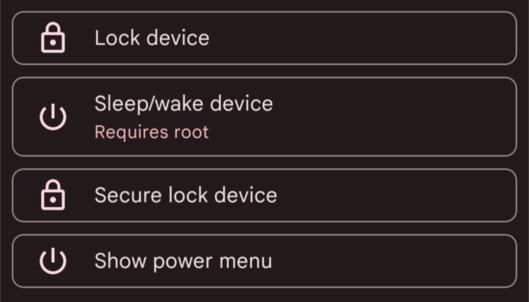
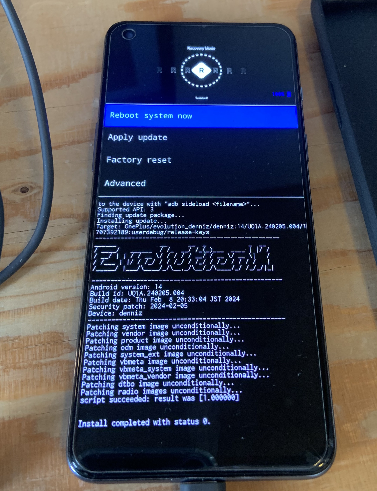
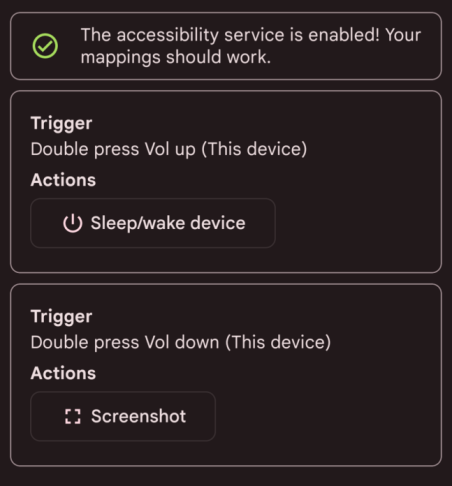

It's been almost 3 months since my smartphone fell into one of the (far too) numerous puddles in the rainy city of Lausanne.

Result: the button to turn the phone on and off no longer works.

But the smartphone's life isn't over yet. Rooting it should allow me to keep a key mapping service active (by bypassing battery optimizations) to turn it on and off by double-pressing the volume up button.

**Screenshot of Key Mapper:**



As I write this, I wonder if I'll be able to root and access fastboot mode without the power button working, but we'll see!

Let's go!

I chose the **Evolution X** ROM (which will also allow me to access Android 14) and **Magisk** for rooting (note: at the end of the post, as a bonus, some useful configs with root).

## Install Android development tools

I'll take this opportunity to note each step of the rooting process for my future self who will have forgotten. I'm on Linux/openSUSE.

```sh
zypper addrepo https://download.opensuse.org/repositories/hardware/15.5/hardware.repo
zypper refresh
zypper install android-tools
```

## Unlock the bootloader

First, we need to **unlock the bootloader**, which is responsible for checking the integrity of the installed OS and then launching it.

### Android 13 → 11 → 13 (OnePlus bs)

Of course... it doesn't work. Error: `the_serial_is_not_match` / `fastboot_unlock_verify fail`. In fact, the bootloader can no longer be unlocked after Android 11. So I have to look for a stock ROM file for a Chinese phone released two years ago. lol. After a long time searching, I finally find [this file](https://community.oneplus.com/thread/1596759).

Be careful, OnePlus provides a file named `oplus_ota_downgrade_EU.zip`, which must be renamed to `oplus_ota_downgrade.zip` before installing it in Settings > Update > Local Install.

### Unlocking with ADB and Fastboot

Next, we need to enable the OEM (Original Equipment Manufacturer) Unlock option, which allows the bootloader to be deactivated.

Alright. Now that we've reverted to Android 11, we can unlock the bootloader.

For this: `adb -d reboot bootloader`. And it works! I was pleasantly surprised that the navigation menus were operated with volume up and volume down instead of the power button (thankfully!).

Next, we need to reboot the phone and redo all the updates to get back to Android 13.

## Flash the Custom ROM

Now, we need to flash the Custom ROM.

I chose Evolution X, which builds on the Pixel Experience by adding many nice options. Huge thanks to **lahaina** who has maintained this ROM for the OnePlus Nord 2 since its release &lt;3

### Boot into FastbootD

We now need to:

* boot the phone with FastbootD, `adb reboot fastboot`.
* flash the ROM's recovery image, `fastboot flash recovery recovery.img`
* reboot into recovery mode
* wipe all data
* click on "Apply Update", then "Apply From ADB".
* sideload the ROM with `adb sideload evolution_denniz-ota-uq1a.240205.004-02092013-OFFICIAL-001.zip`
* reboot!



It's quite satisfying to have gotten this far!

## Flash Magisk

Now, the goal is to have root access. So, we need to:

* get the Magisk APK file from GitHub
* rename it to `magisk.zip` to be able to flash it
* boot into recovery, do an apply update, apply from ADB
* sideload Magisk with `adb sideload magisk.zip`
* reboot!

Note: in Magisk, don't forget to add apps like Fairtiq or payment apps to the deny list to hide the root.

## Configure Key Mapper

Key Mapper can be reconfigured again, with root access, and that's it!



## Bye bye Play Store...

I'm also using this opportunity to configure my phone a bit better than before. In particular, my goal is to no longer rely on the Play Store.

To do this, I followed [Kaki87](https://kaki87.net)'s recommendations :)

I'm using...

### Neo Store

For most apps. It's an alternative client for F-Droid.
It allows me to install:
* Key Mapper
* FastHub RE(vival)
* Aurora Store
* Obtainium
* Element

### Obtainium

This is an app that allows you to directly download apps from the source (like GitHub).
It's handy for apps I want to keep perfectly updated.
It allows me to install:
* Kiwi Browser

### Aurora Store

This one allows me to download everything else. The advantage of root is that it lets it function like Google Play, by installing updates in the background.
It allows me to install:
* Instagram
* Telegram
* Bereal
* etc.
