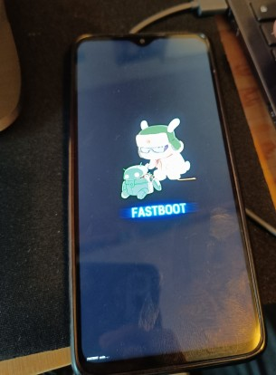
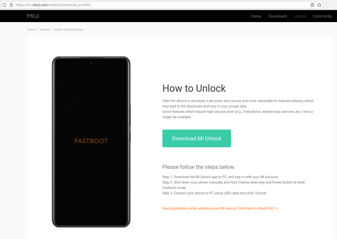
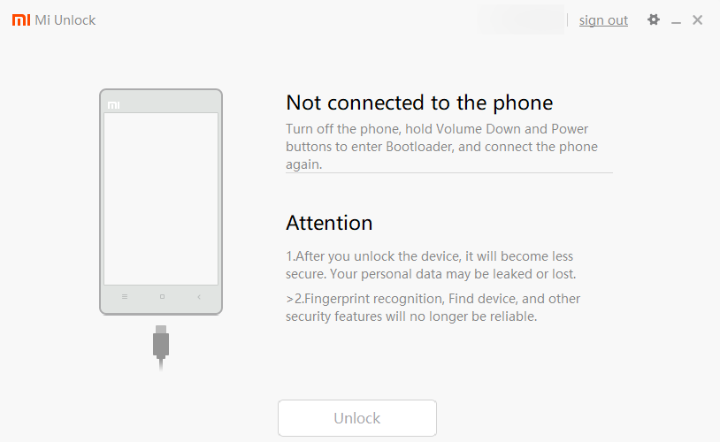
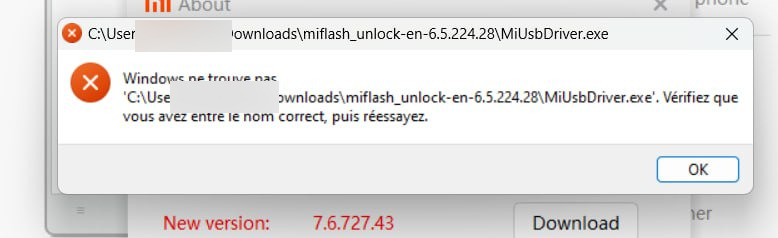
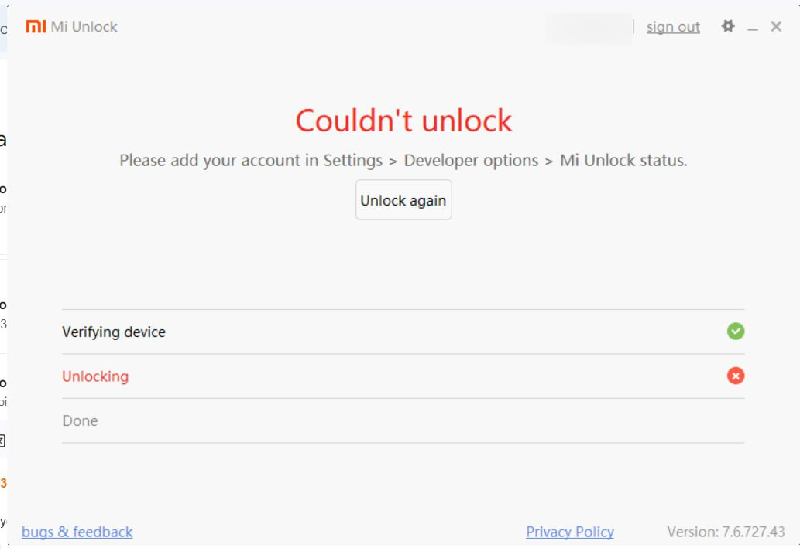
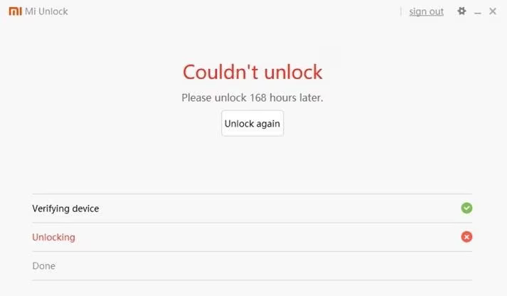
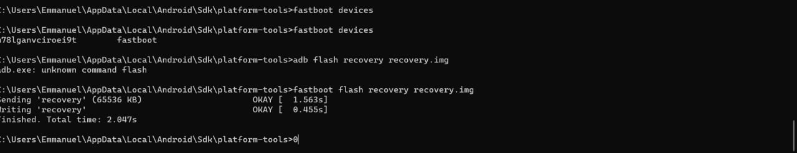
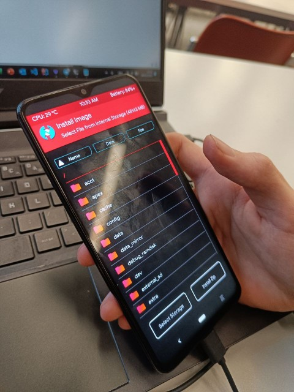

Why does Xiaomi frustrate me? Find the answer in this article which simply explains the procedure I used and the problems encountered while rooting the Xiaomi Redmi Note 8 Pro ;)

(thanks to [Emmanuel](https://fr.linkedin.com/in/emmanuel-omont-37ba272a7) for allowing the rooting of his phone)

## Unlock the Bootloader

With Xiaomi, unlocking the bootloader... is super annoying.

Basically, 4 steps:
* enable USB debugging and OEM Unlock and enter fastboot mode
* create a Xiaomi account
* **set up the damn Mi Unlock Tool**
* wait 168 hours (wtf?) and try again.

### Enable USB Debugging and OEM Unlock

This step is common; you need to enable developer options by tapping "Miui version" 7 times (and not kernel version, that's for another menu).

Then, enable USB debugging and OEM Unlock.

### Log in with your Xiaomi account

Here, you need to create a Xiaomi account and then link it to the phone in "Mi Unlock Status."

### Reboot into Fastboot

Now, we need to reboot into fastboot mode. To do this, turn off the phone and press Volume Down + Power (or `adb reboot bootloader`). You should see a communist tinkering with an Android.

**Note:** to exit Fastboot mode, press and hold the power button for 12-14 seconds.

### Mi Unlock Tool

Then... we need to install the wonderful tool to unlock the bootloader, made by Xiaomi, Mi Unlock Tool **a.k.a Hell**.

#### Download the wrong version of the software

Here’s the first problem. When looking for software developed by Xiaomi, you might think it's logical to download it from Xiaomi's site. **Wrong**. Xiaomi's site indeed appears first in results but only allows downloading version 6.5.

Except when you launch version 6.5, it displays a pop-up asking to download version 7.6. And when you click the link, error 401. Nice.

You might think it works with 6.5, right? Hehehe.

Actually, when logging in with 6.5, Xiaomi asks to add a recovery phone number. But their 6.5 software doesn't allow you to select the national country code (the dropdown is literally non-functional), so it's impossible to add a number.

A logical solution might also be, "Okay, I'll go on the official Xiaomi website online, add a number, then return to the Mi Unlock 6.5 app." But at the time of testing, **impossible** to receive a confirmation SMS from their site. We tried with +336, +3306, another French number starting with 07. In short, impossible.

> Fun fact, Xiaomi states on its site that outside China, only 3 codes per SMS per day. Lol.

#### Download the correct version of the software (non-official site wtf)

Well. We start looking for another version of the software and end up on [xiaomitools.com](https://xiaomitools.com/mi-unlock-tool-en/), which indeed offers version 7.6 for download. It's an absolutely unofficial Turkish site, but since the manufacturer can't provide the right version, we have no choice but to go through this.

When launching the software, we have the same step asking to add a phone number. We enter the number (because here the dropdown works, yay), and... we receive the code. Yes, so the unofficial Mi Unlock Tool from xiaomitools.com allows adding a recovery phone number while Xiaomi's official site doesn't. WTF?

Except here... the phone isn't detected, even in fastboot. **The problem** was that we hadn't installed the drivers (clearly our fault ;).

To install them, click on the little settings icon at the top right, then "check."

Note that on the 6.5 version provided by the manufacturer, we get this error:

Therefore, you must use version 7.6 for this step.

And there... it works!

### Link your account

We had already linked the Xiaomi account to the phone, but Mi Unlock Tool asks us to repeat the operation. Idk why.

Go back to the phone settings > Mi Unlock Status > Link the account works.

And when trying to unlock again in fastboot with Mi Unlock Tool, it works!

Now there's only a 7-day wait... :'(

> ~~**Note:** I found this software in the meantime that might work to bypass the 168 hours (never tested).~~
> ~~https://drfone.wondershare.com/unlock/bypass-168-hours-waiting-time-for-xiaomi-bootloader-unlocking.html~~
> Update: this software no longer works (February 18, 2024 ;)

### 7 days later... flash the recovery!

The bootloader is unlocked (finally!).

Now, a recovery needs to be flashed. We decided to go with the Evolution X ROM, which recommends the [OrangeFox](https://orangefox.download/) recovery.

(the procedure varies depending on the partition system used; we used [TrebleCheck](https://github.com/kevintresuelo/treble)).

Except... it doesn't work. The phone won't boot into the flashed recovery (only into the stock recovery).

About a day passes during which Emmanuel realizes... that his phone is actually a Xiaomi Redmi Note 8 **Pro** (and not a Redmi Note 8...).

This explains why the downloaded recovery file wasn't working.

After some time, [TWRP Begonia](https://twrp.me/xiaomi/xiaomiredminote8pro.html) is flashed and installed!

And after several ROM tests, including PixelElixir, PixelExperience, the phone is finally rooted with Evolution X (the initial choice :)
